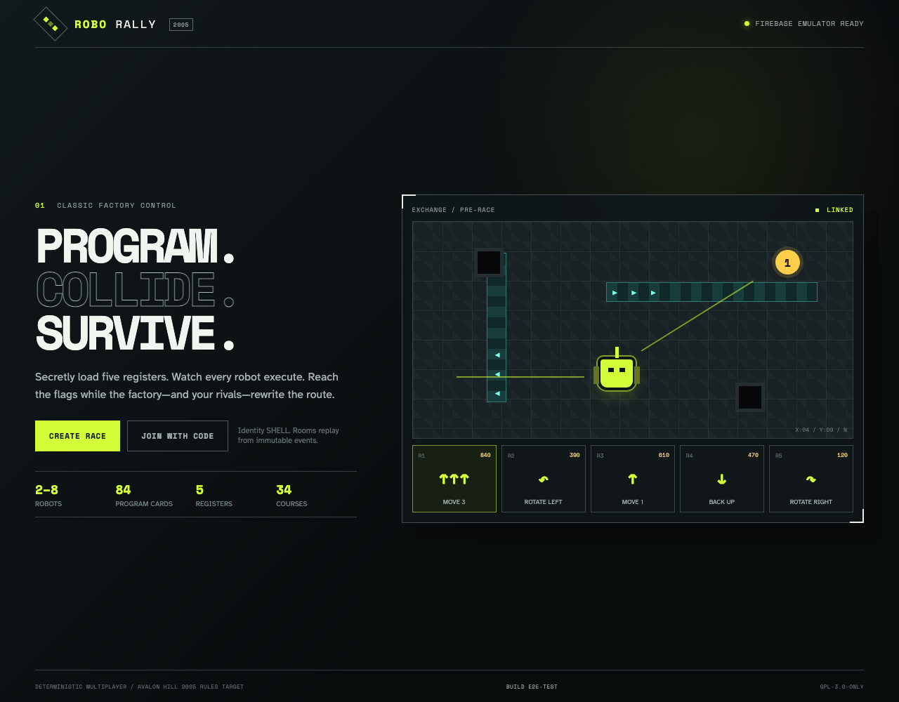

# Application shell and Firebase readiness

The static Robo Rally client loads its factory console and reaches the local Firebase emulators.

## The factory is ready for racers

**Verifications:**

- [x] The page exposes the stable Robo Rally title
- [x] The landing page presents the programming premise and component counts
- [x] Room creation and join actions become available after anonymous authentication
- [x] The client has authenticated and reached the Firebase emulators
- [x] The deterministic build marker and GPL license are visible
