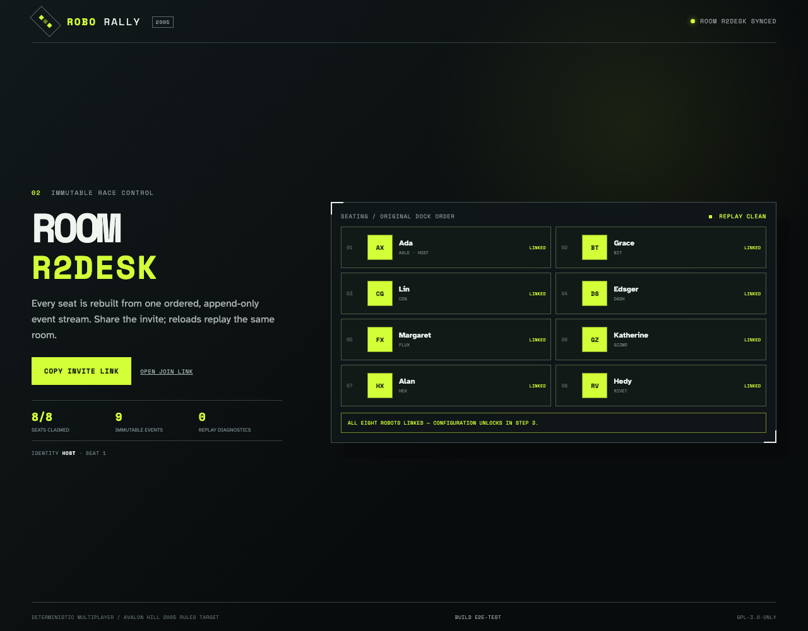

# Create, join, and replay a room

Eight isolated anonymous clients claim unique robots through the real Firestore event stream. Reloading replays the same ordered room.

## Eight unique robots share one replay-clean room

**Verifications:**

- [x] The creator and seven joiners occupy the eight original Dock-order seats
- [x] The room projects nine accepted immutable events with no replay diagnostics
- [x] Reloading a joined client reconstructs both observed players from Firestore
- [x] Claimed robots are unavailable and a ninth client sees a full room
- [x] The creator has a shareable join link and a deterministic emulator identity
