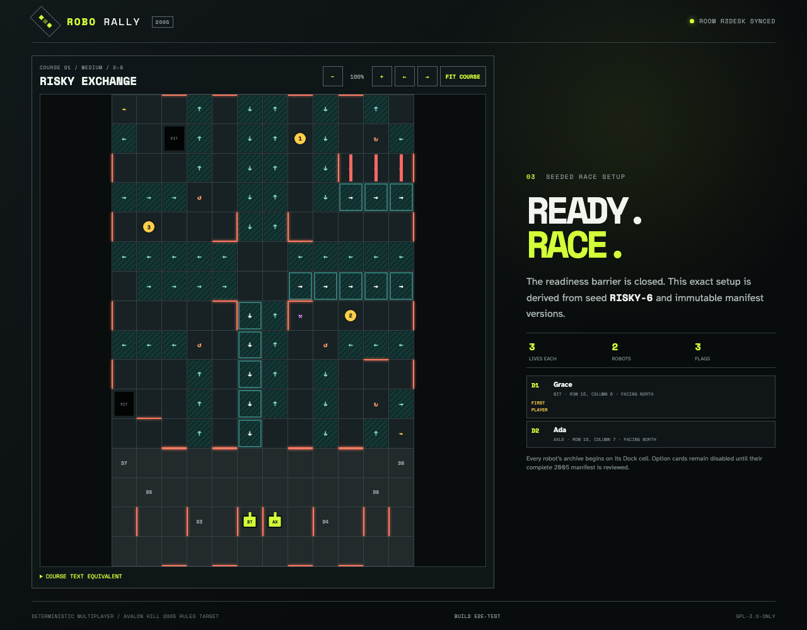

# Configure the reviewed Risky Exchange course

Two isolated players commit a versioned 2005 configuration and readiness events. The resulting board and Dock order are derived only from the fixed seed and reviewed manifests.

## The readiness barrier reveals one exact semantic setup

**Verifications:**

- [x] Seed RISKY-6 selects Grace as first player at Dock 1 and Ada at Dock 2
- [x] Both robots begin with three Lives, face north, and archive on their Dock cells
- [x] The reviewed course exposes all three flags and both starting robots as semantic geometry
- [x] Pan, zoom, and fit controls return the board to a deterministic 100% view
- [x] A coordinate-based text equivalent identifies flags, Docks, and robots
- [x] The observer converges on the same first player and immutable setup
