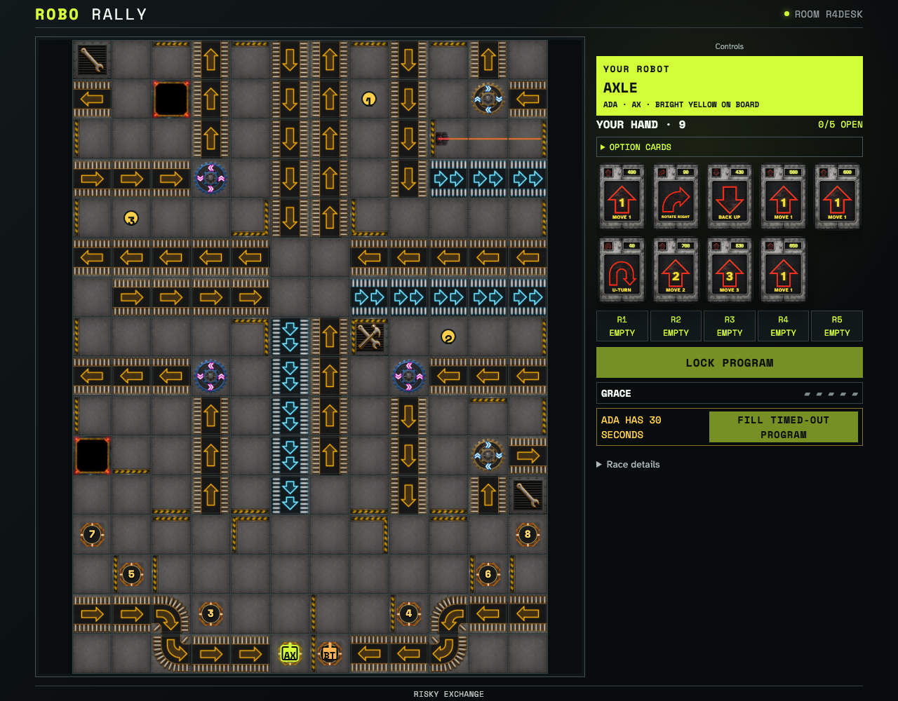
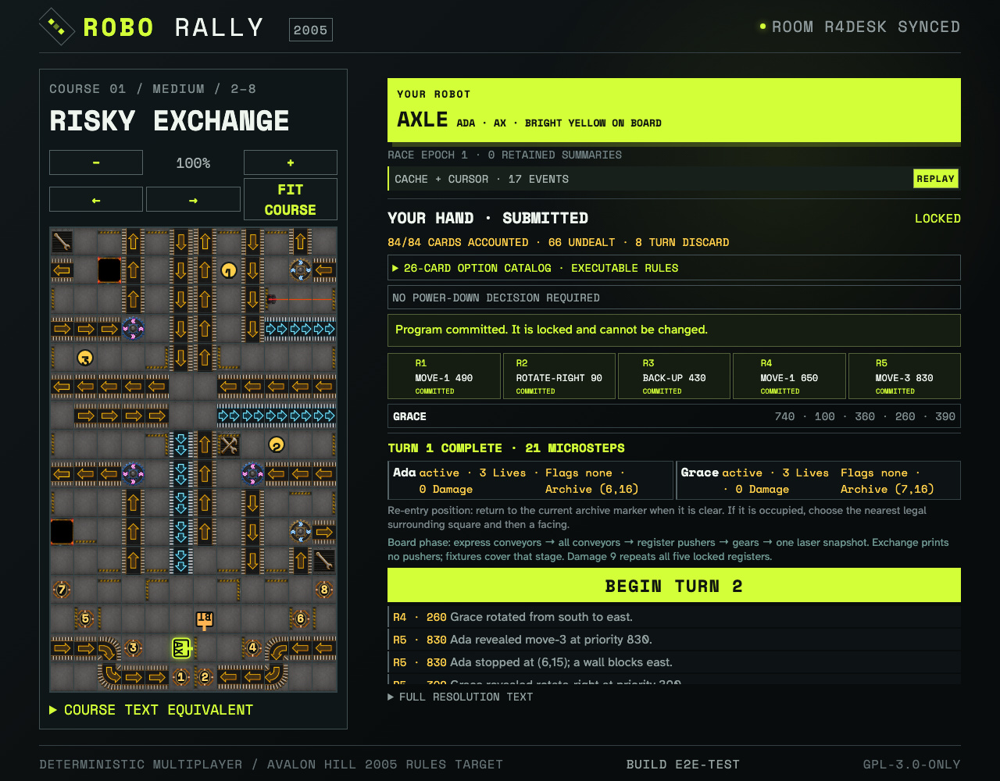

# Deal and commit programs from one shared deck

Two clients receive one seeded round-robin deal. Programs cross the immutable event stream, stay masked to the observer, and a timeout is tested with an explicit emulator timestamp rather than a sleep.

## The first immutable submission stays face down to its observer

**Verifications:**

- [x] Both hands came from one 84-card deal with 66 cards left undealt
- [x] The submitter can inspect all five locked registers but cannot edit or resubmit
- [x] The observer sees five face-down registers and no card priorities
- [x] The last programmer receives the active canonical deadline

## An explicit canonical timestamp enables deterministic timeout fill

**Verifications:**

- [x] The timeout claim preserves chosen registers and fills only empty slots
- [x] The closed barrier reveals numeric priorities to both clients
- [x] Every Program card remains in exactly one canonical zone after cleanup
- [x] Reloading the submitter replays the committed program without reopening it
