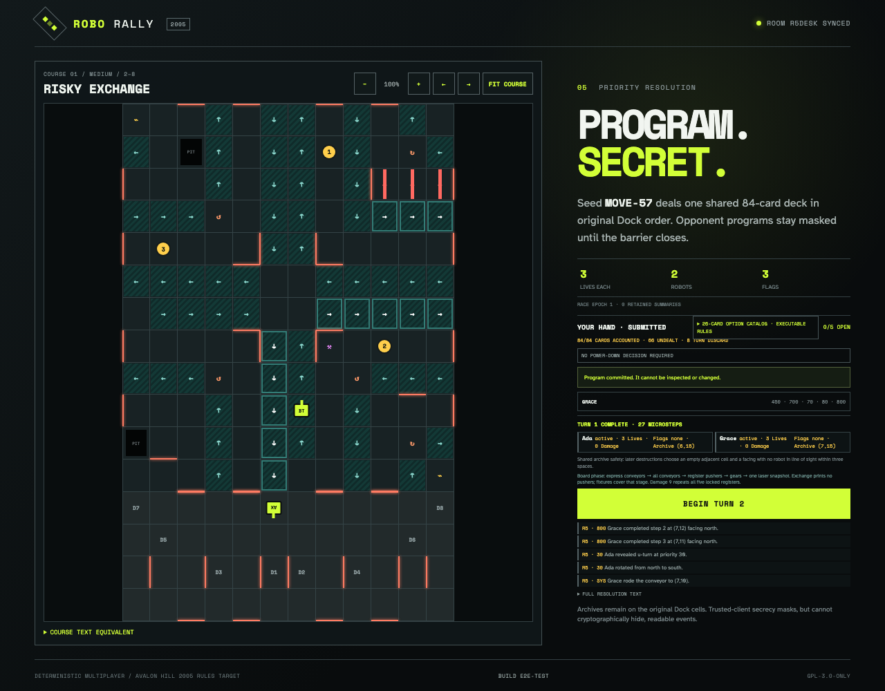

# Resolve Program priority movement and walls

Two ordinary five-card programs cover every 2005 instruction class. A large synchronized countdown introduces five visible register animations before the deterministic trace proves descending priority, stepwise movement, an open board seam, and a wall that blocks from either side.

## All seven instructions resolve into one wall-safe final projection

**Verifications:**

- [x] The full-screen countdown announces that all Programs are locked
- [x] Production playback reserves three seconds for every register
- [x] Both robot tokens use the animated board layer during playback
- [x] Register cards resolve from highest unique priority to lowest
- [x] The wall between Dock 1 and Dock 2 stops eastward movement at (6,15)
- [x] Move 2 and Move 3 execute one space at a time across the open factory seam
- [x] Move 1, Move 2, Move 3, Back Up, both rotations, and U-Turn all execute
- [x] Both clients converge on the same final robot coordinates and facings
- [x] Reduced-motion mode disables trace animations without skipping resolution
