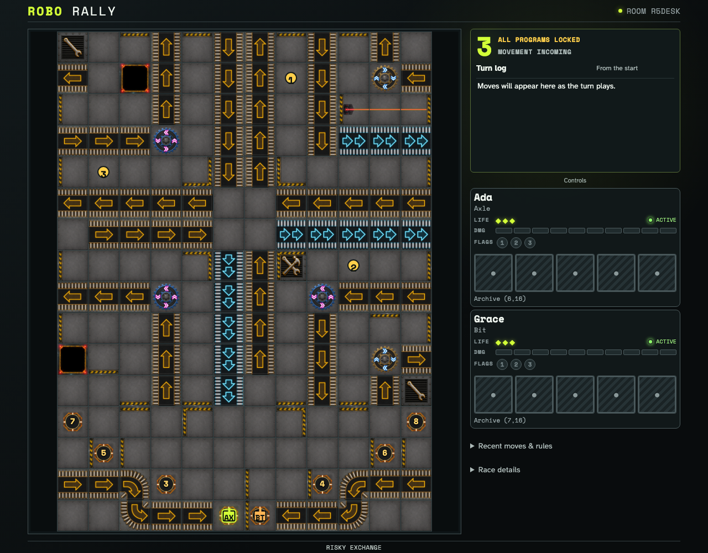
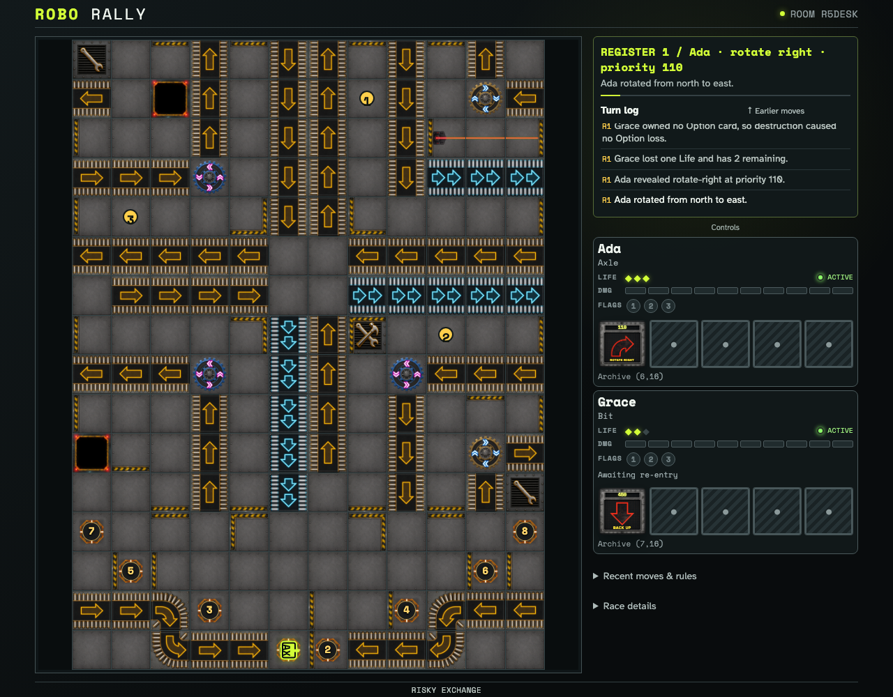
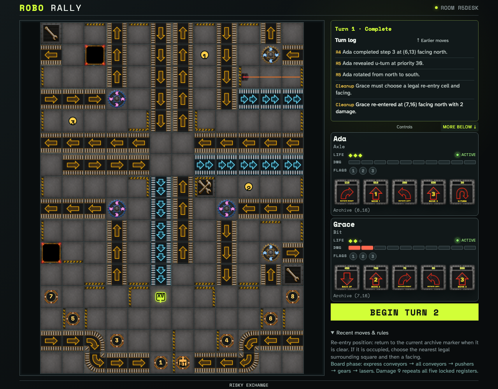

# Resolve Program priority movement and walls

Two ordinary five-card programs cover every 2005 instruction class. A synchronized countdown, beside the board on desktop, introduces priority-ordered Program card, conveyor, and factory-element animations for all five registers before the deterministic trace proves descending priority, stepwise movement, an open board seam, and a wall that blocks from either side.

## The movement countdown stays beside the unobstructed board

**Verifications:**

- [x] The countdown fits inside the right column and never overlaps the board

## The current instruction and accumulated moves share the right column

**Verifications:**

- [x] The current step is readable beside the board and earlier moves remain in the log

## All seven instructions resolve into one wall-safe final projection

**Verifications:**

- [x] The synchronized countdown announces that all Programs are locked
- [x] Each Program card gets two seconds and each ordered factory stage gets one
- [x] Both robot tokens use the animated board layer during playback
- [x] Register cards resolve from highest unique priority to lowest
- [x] The wall between Dock 1 and Dock 2 stops eastward movement at (6,16)
- [x] Move 2 and Move 3 execute one space at a time across the open factory seam
- [x] Move 1, Move 2, Move 3, Back Up, both rotations, and U-Turn all execute
- [x] Both clients converge on the same final robot coordinates and facings
- [x] Reduced-motion mode disables trace animations without skipping resolution
