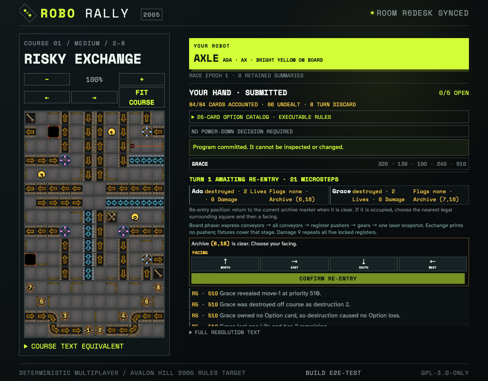
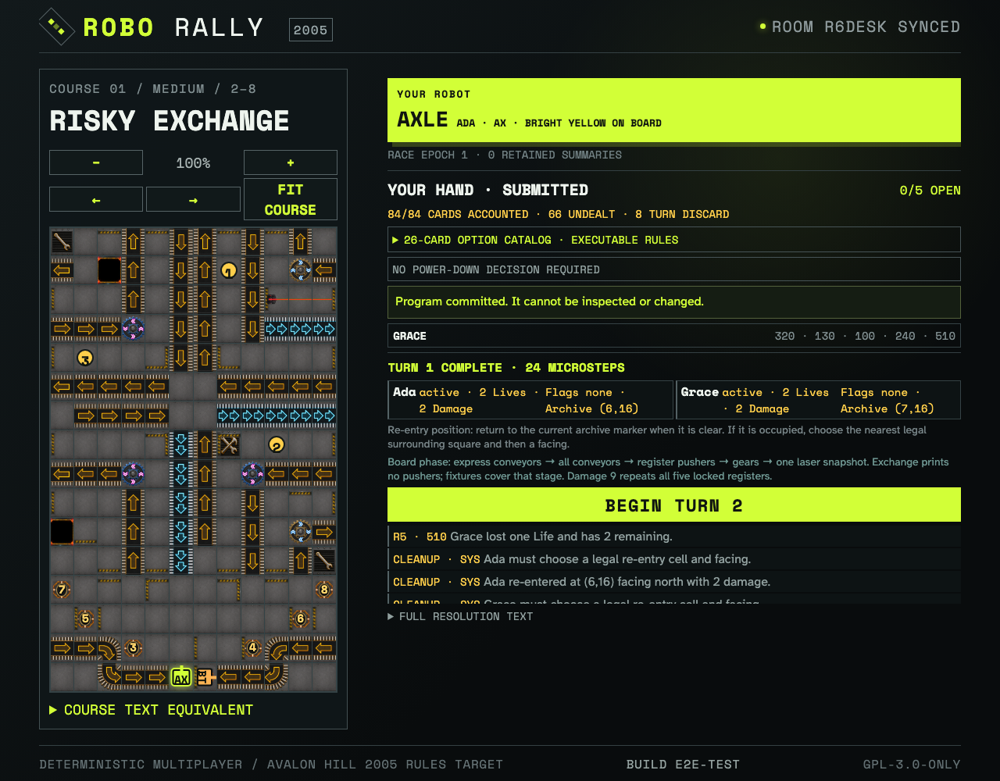

# Push, destroy, spend Lives, and re-enter

Two ordinary immutable Programs form a deterministic push chain. One robot is pushed off course, the pusher follows it over the edge, and both owners answer cleanup re-entry choices in destruction order.

## The Docking Bay B route sends both robots off course in destruction order

**Verifications:**

- [x] Grace pushes Ada repeatedly before Ada is destroyed off course first
- [x] Each destruction runs the Option-loss hook and spends exactly one Life
- [x] Destroyed robots leave the board immediately
- [x] Only the first destroyed robot owner receives the first re-entry control

## Both owners re-enter on their archives with two damage

**Verifications:**

- [x] Destruction order authorizes Ada before Grace
- [x] Each returning robot has two damage and two remaining Lives
- [x] Both clients converge on the chosen cells and facings
- [x] The UI explains the occupied-archive nearest-placement rule
