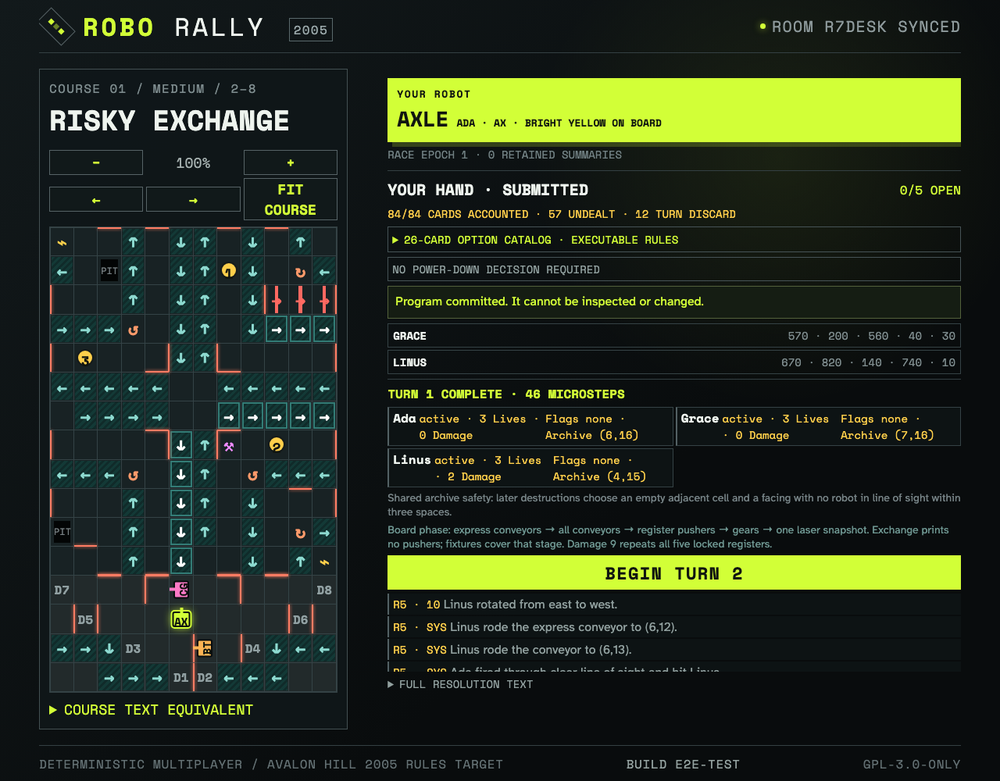

# Resolve conveyors, conflicts, pushers, and gears

Three ordinary Programs reach normal and express conveyors, a counterclockwise gear, and a simultaneous occupancy dependency. The same atomic board solver also has generic register-pusher and curve fixtures because reviewed Exchange prints neither pushers nor curved belts.

## Express, normal, conflict, and gear microsteps converge for all racers

**Verifications:**

- [x] Linus rides a normal conveyor onto a counterclockwise gear
- [x] An express substep hands Linus to the normal-conveyor substep
- [x] Docking Bay B resolves the conveyor chain without a conflicting rider
- [x] All clients converge on the atomic final cells and facings
- [x] The selected course truthfully reports zero printed pushers
