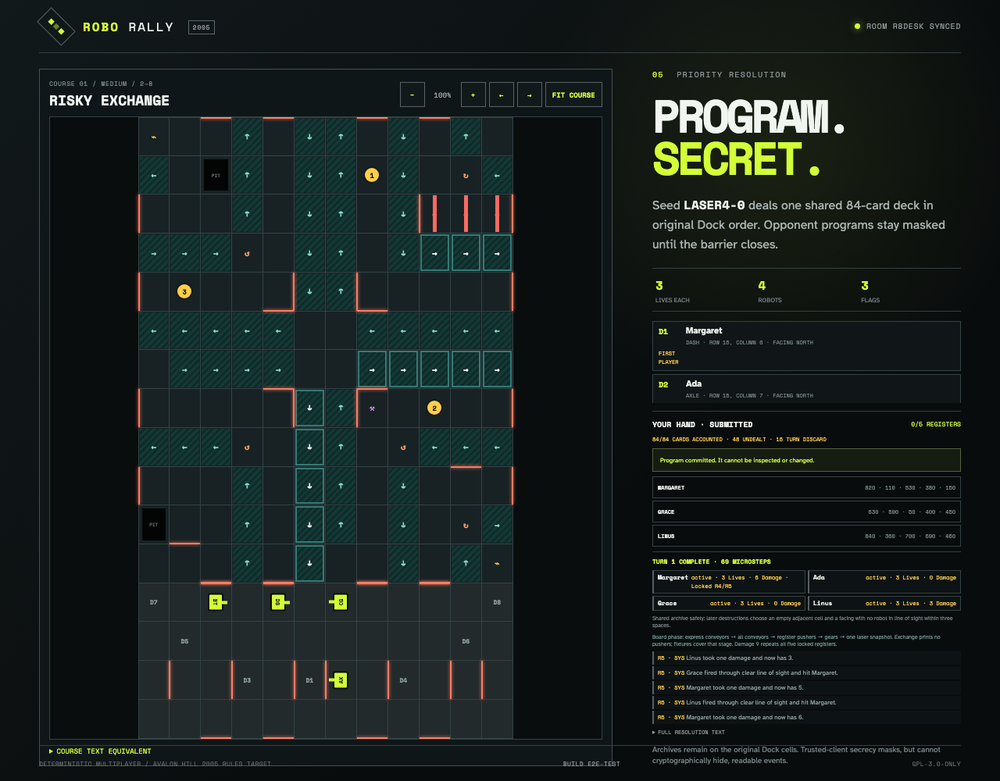

# Resolve lasers, damage, and locked registers

Four ordinary Programs create repeated unobstructed robot-laser snapshots. Margaret receives six damage, locking registers 4 and 5 with their exact card IDs; owner and observer clients converge on the same public result.

## One snapshot per register locks Margaret’s final two registers

**Verifications:**

- [x] Robot rays stop at the first visible target after board movement
- [x] Multiple rays use the same target snapshot before damage is applied
- [x] Six damage locks registers 4 and 5 with their revealed cards retained
- [x] Owner and observer views converge on public damage and lock state
- [x] The UI exposes the fully locked repeat invariant
