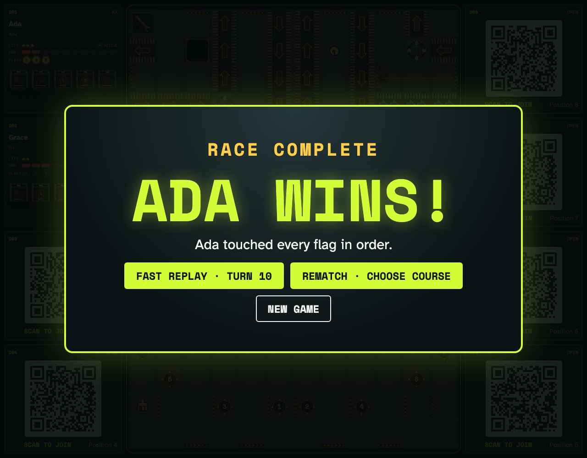
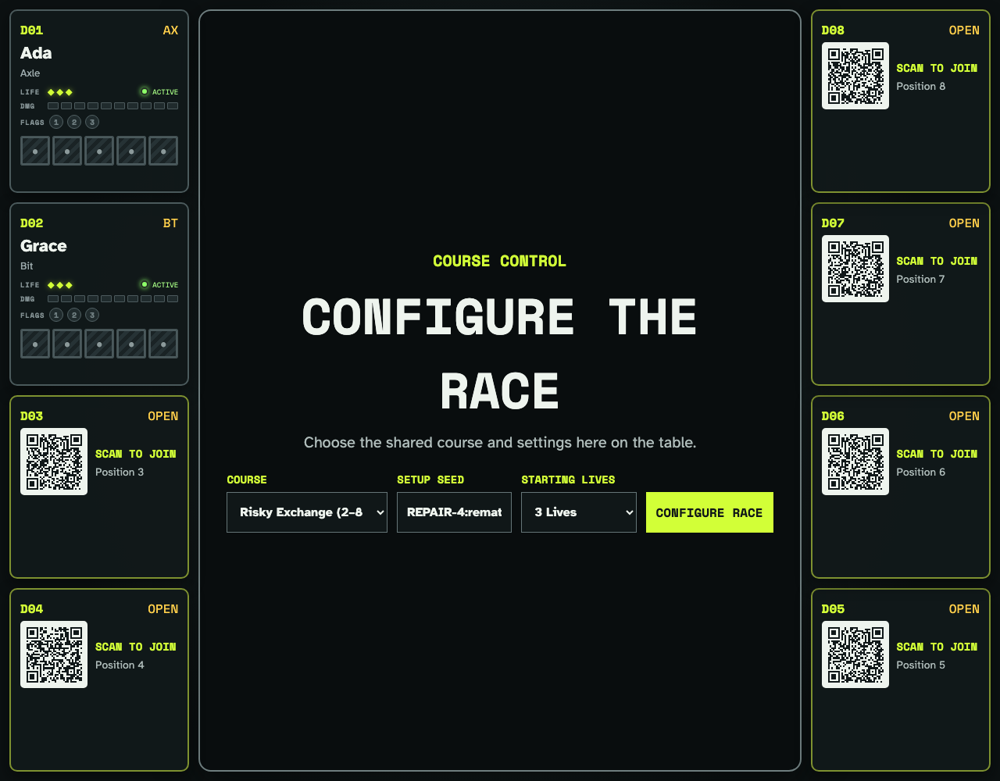

# Finish a race through flags, archives, repairs, and rematch

Two real clients play ten deterministic turns. Ada archives on a repair site, touches all three flags in order, wins from ordinary Program submissions, and a separately authenticated tabletop creates a fresh rematch room that both connected controllers follow automatically.

## Register 5 reaches a repair site and moves the Archive before cleanup

**Verifications:**

- [x] The robot state exposes the new repair-site Archive
- [x] Repair happens once during cleanup, after the per-register Archive update

## Ordered flags persist while another robot completes owner-authored re-entry

**Verifications:**

- [x] Ada has Flags 1 and 2 and archives on Flag 2
- [x] Grace re-enters with two damage and both clients converge

## Flag 3 ends the race with a shared immutable summary

**Verifications:**

- [x] The final ordered flag ends resolution immediately
- [x] Owner and observer see the same winner summary

## The tabletop unmistakably announces the completed race

**Verifications:**

- [x] The winner overlay offers rematch configuration and a genuinely fresh game
- [x] The final player panel retains all three touched flags

## Rematch moves the retained racers and controllers to fresh configuration

**Verifications:**

- [x] The table can choose a new board before the next race
- [x] Both controllers follow the new room while their seats and the six open QR positions persist
