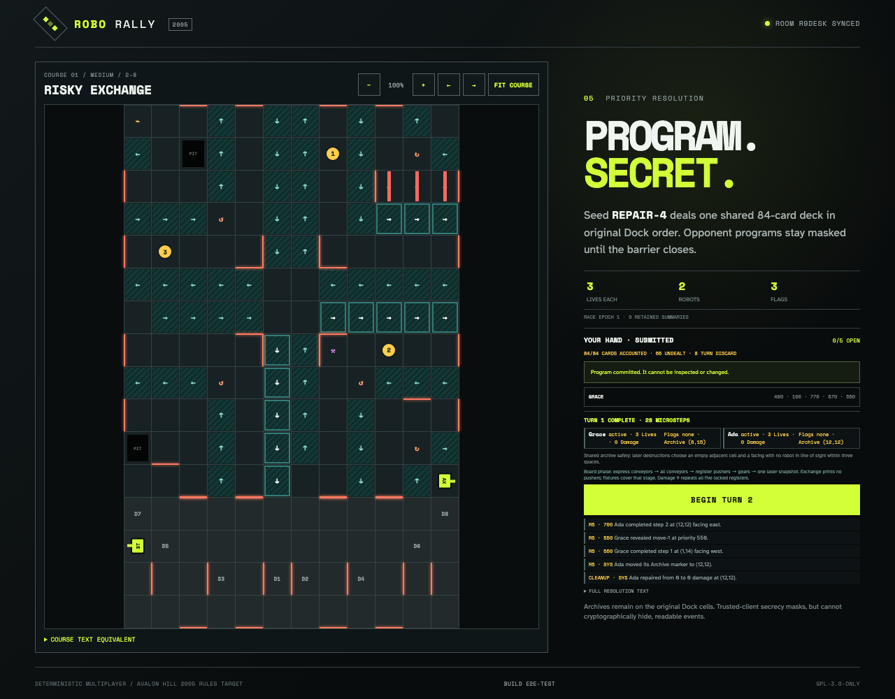
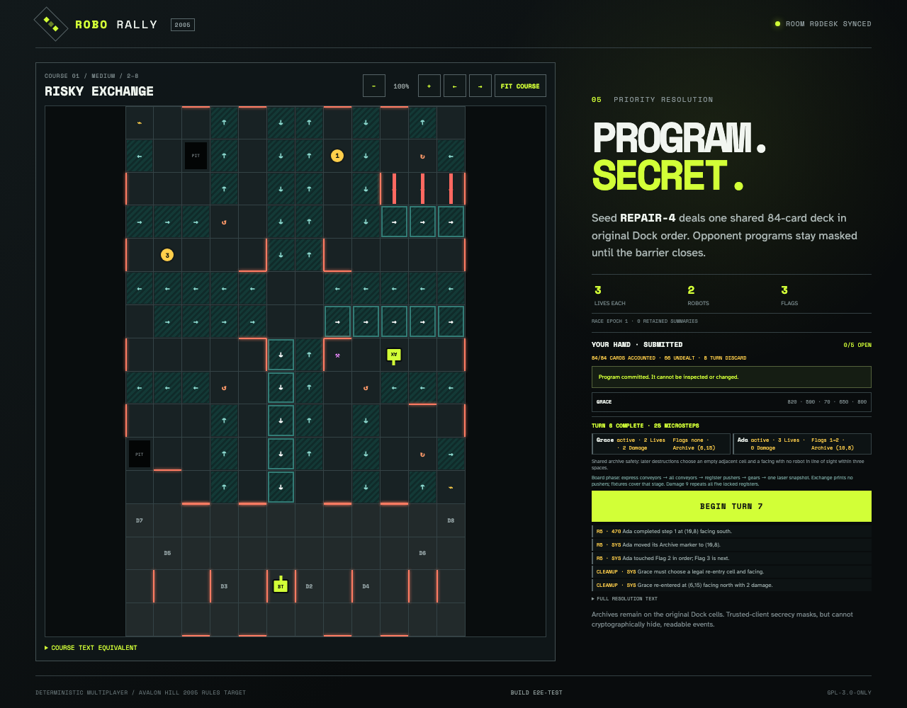
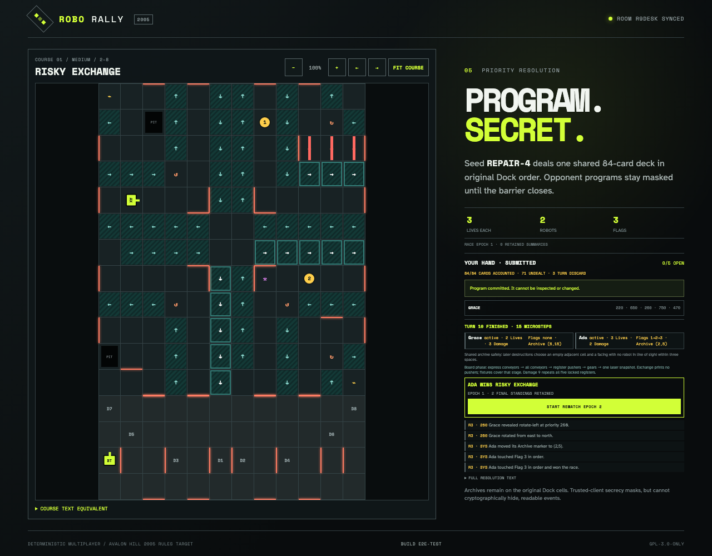
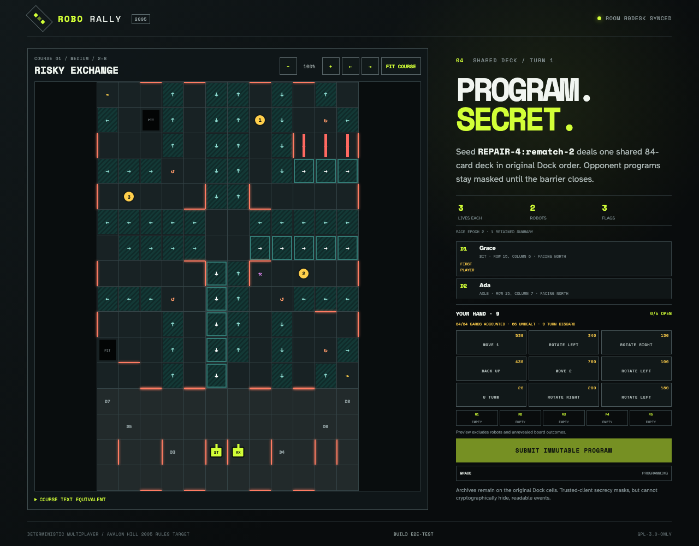

# Finish a race through flags, archives, repairs, and rematch

Two real clients play ten deterministic turns. Ada archives on a repair site, touches all three flags in order, wins from ordinary Program submissions, retains an immutable summary, and starts a fresh race epoch.

## Register 5 reaches a repair site and moves the Archive before cleanup

**Verifications:**

- [x] The robot state exposes the new repair-site Archive
- [x] Repair happens once during cleanup, after the per-register Archive update

## Ordered flags persist while another robot completes owner-authored re-entry

**Verifications:**

- [x] Ada has Flags 1 and 2 and archives on Flag 2
- [x] Grace re-enters with two damage and both clients converge

## Flag 3 ends the race with a shared immutable summary

**Verifications:**

- [x] The final ordered flag ends resolution immediately
- [x] Owner and observer see the same winner summary

## The host starts a fresh epoch without mutating the retained summary

**Verifications:**

- [x] Both clients receive a fresh Turn 1 hand
- [x] The completed race remains counted as an immutable prior summary
