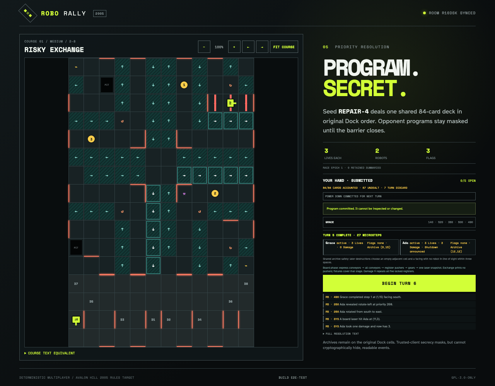
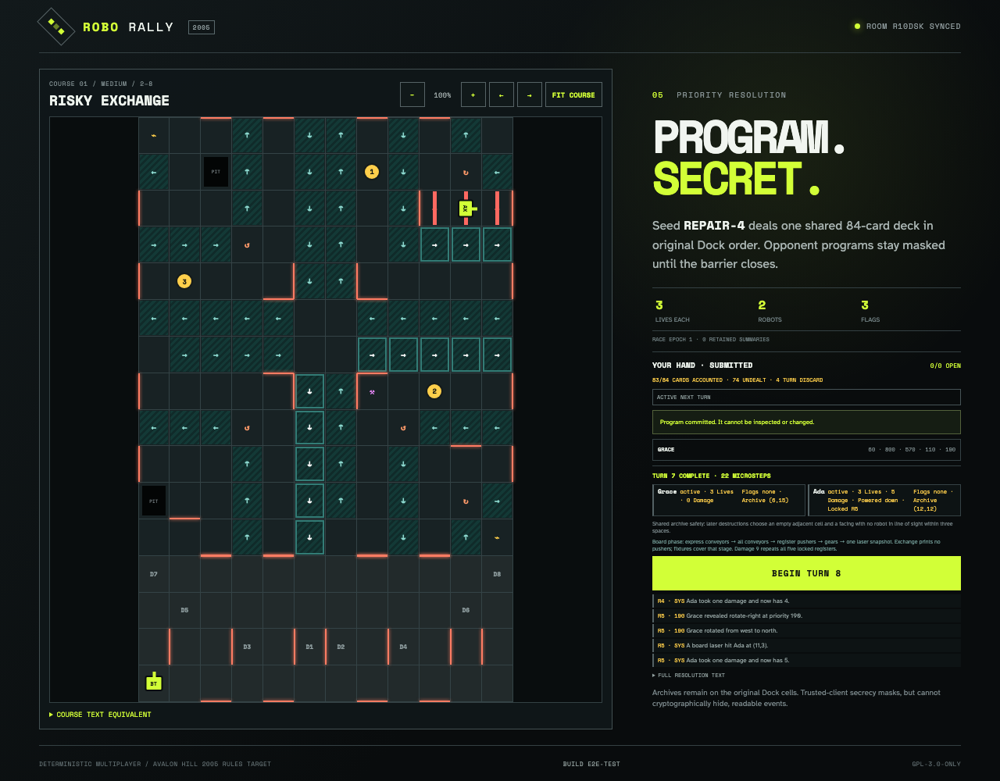
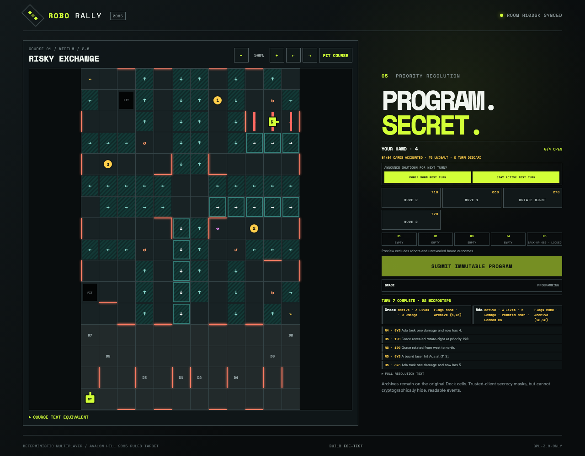

# Complete an ordered, consecutive power down

Two real clients play eight deterministic turns. Ada announces after taking damage and in original Dock order, clears damage, skips programming and robot fire, remains vulnerable to factory lasers, receives exact random locks while shut down, continues once, and powers up with the new lock retained.

## The next-turn shutdown announcement survives ordinary resolution

**Verifications:**

- [x] Ada is damaged before making a committed shutdown announcement
- [x] The observer sees the same public announcement

## A powered-down robot skips programming but remains a factory target

**Verifications:**

- [x] Beginning the shutdown cleared prior damage before five board-laser hits
- [x] The random lock reserves the exact Turn 6 card

## Continuing shutdown clears the old lock before factory damage creates a new one

**Verifications:**

- [x] The second shutdown turn again starts from zero and ends at five damage
- [x] Ada has chosen to power up after this consecutive shutdown turn

## Powering up restores programming with damage and the new random lock retained

**Verifications:**

- [x] Ada receives four cards for four open registers at five damage
- [x] Register 5 retains the exact Turn 7 random card
- [x] Both clients converged before the next ordered announcement barrier
