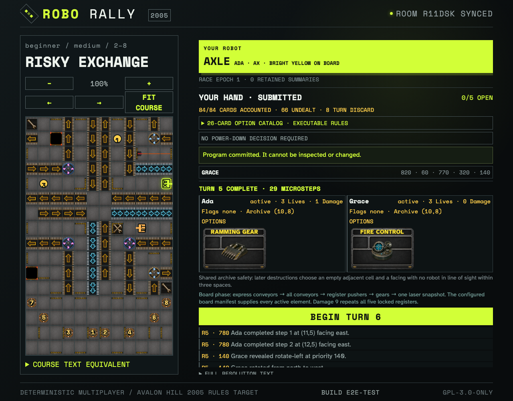

# Draw and commit face-up Options

Two ordinary clients reach the crossed repair site on successive turns, draw from one deterministic Option deck, and then close the shared decision barrier in original Dock order.

## Successive crossed-site cleanup draws are public and leave the deck without replacement

**Verifications:**

- [x] Ada and Grace each own one visibly named graphical Option
- [x] The observer sees the same face-up ownership

## Two simultaneous owners close a replay-safe finite barrier in original Dock order

**Verifications:**

- [x] Both clients converge only after Ada then Grace commit
- [x] Unspent graphical Options remain face up after a pass
