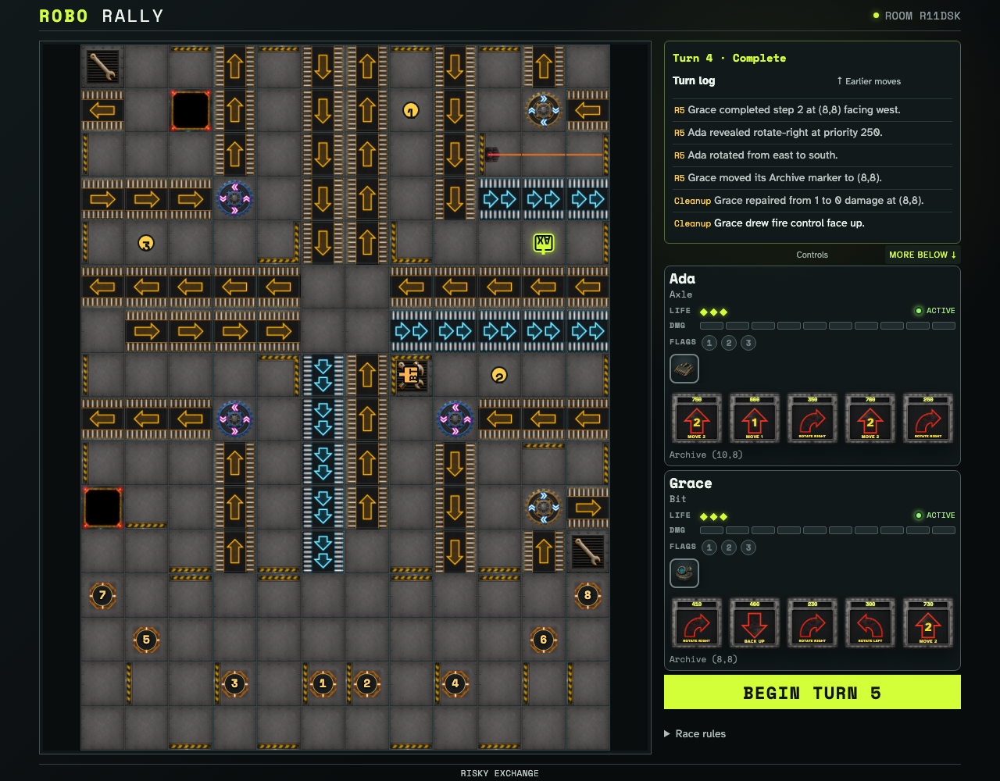
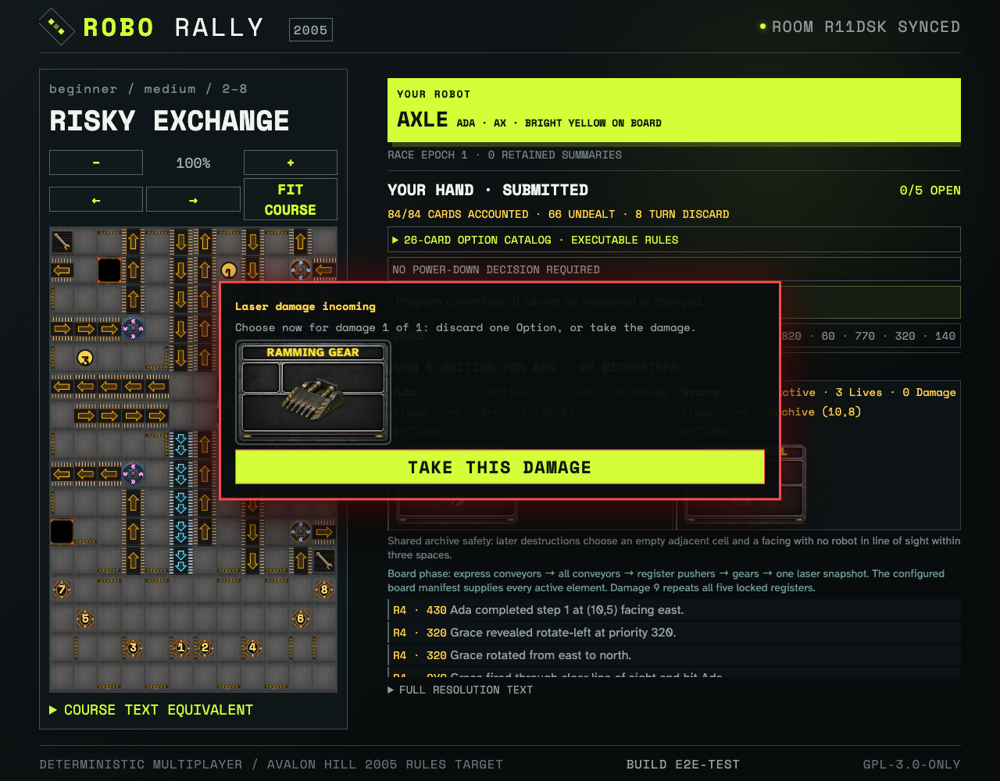
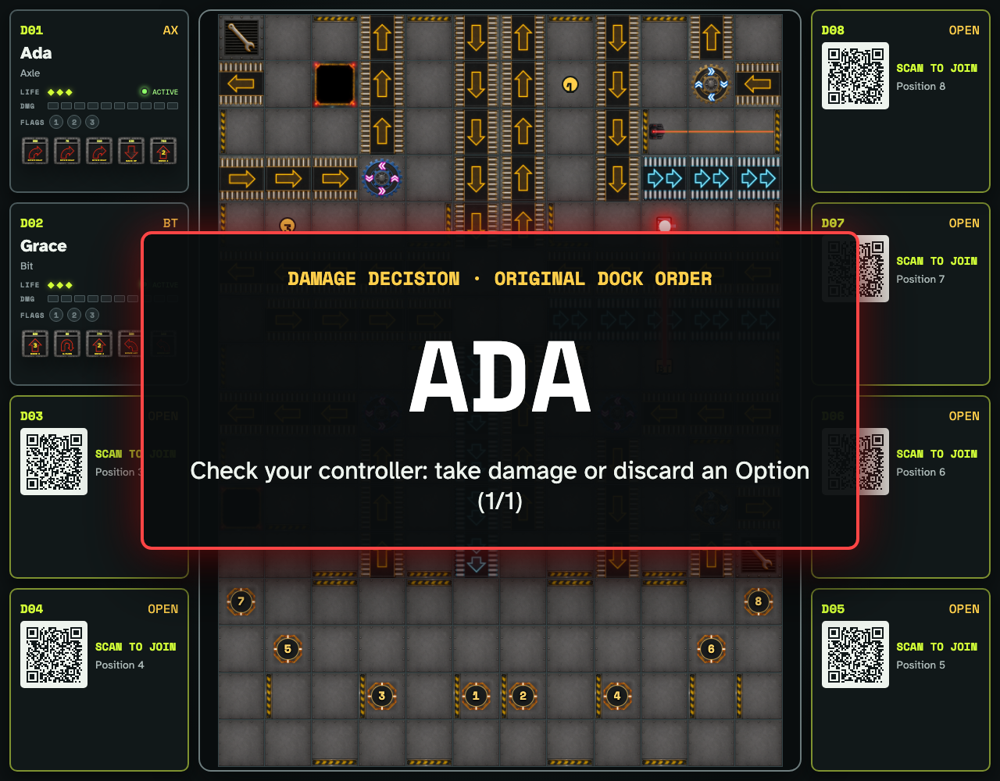
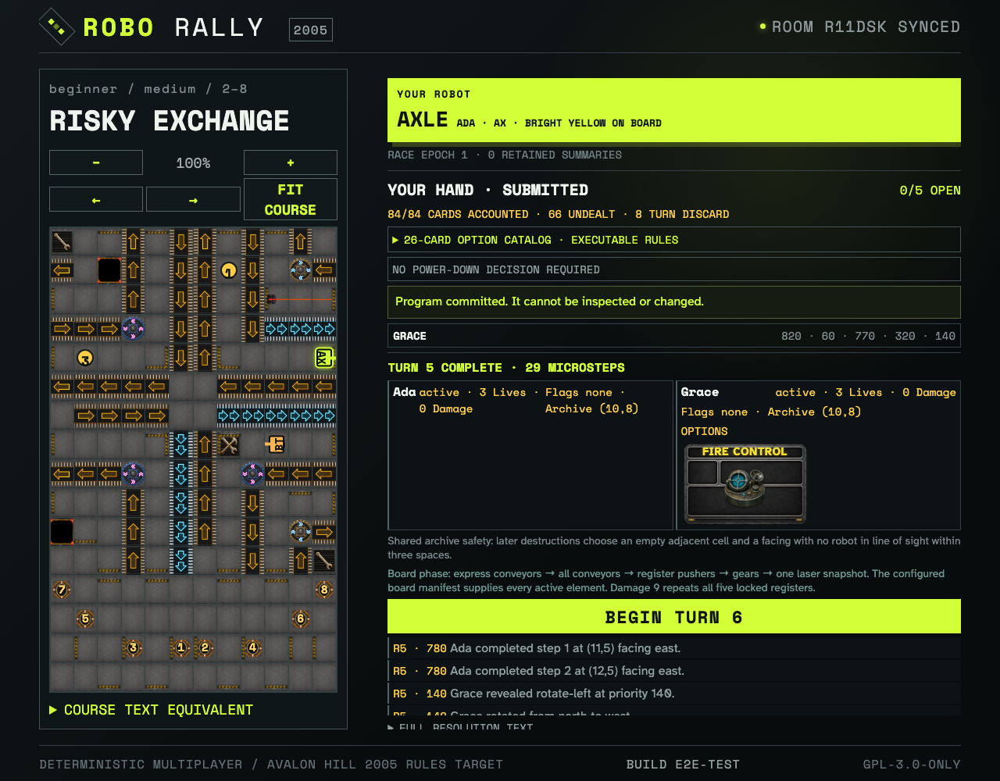

# Draw and retain face-up Options

Two ordinary clients reach the crossed repair site on successive turns, draw from one deterministic Option deck, and retain those cards until an actual execution-time choice occurs.

## Successive crossed-site cleanup draws are public and leave the deck without replacement

**Verifications:**

- [x] Ada and Grace each own one visibly named graphical Option
- [x] The observer sees the same face-up ownership

## Laser damage pauses execution and prompts the affected player at impact time

**Verifications:**

- [x] Ada sees the exact pending damage point and her owned Options
- [x] Grace sees that Ada is the player currently being prompted

## The shared tabletop keeps the successful beam visible and names the prompted player

**Verifications:**

- [x] The tabletop prominently identifies Ada as the current responder
- [x] The successful robot laser remains visible beneath the decision prompt

## Owning Options no longer creates an up-front planning barrier

**Verifications:**

- [x] Both clients converge without precommitting future Option use
- [x] Graphical Options remain face up until their actual timing window
