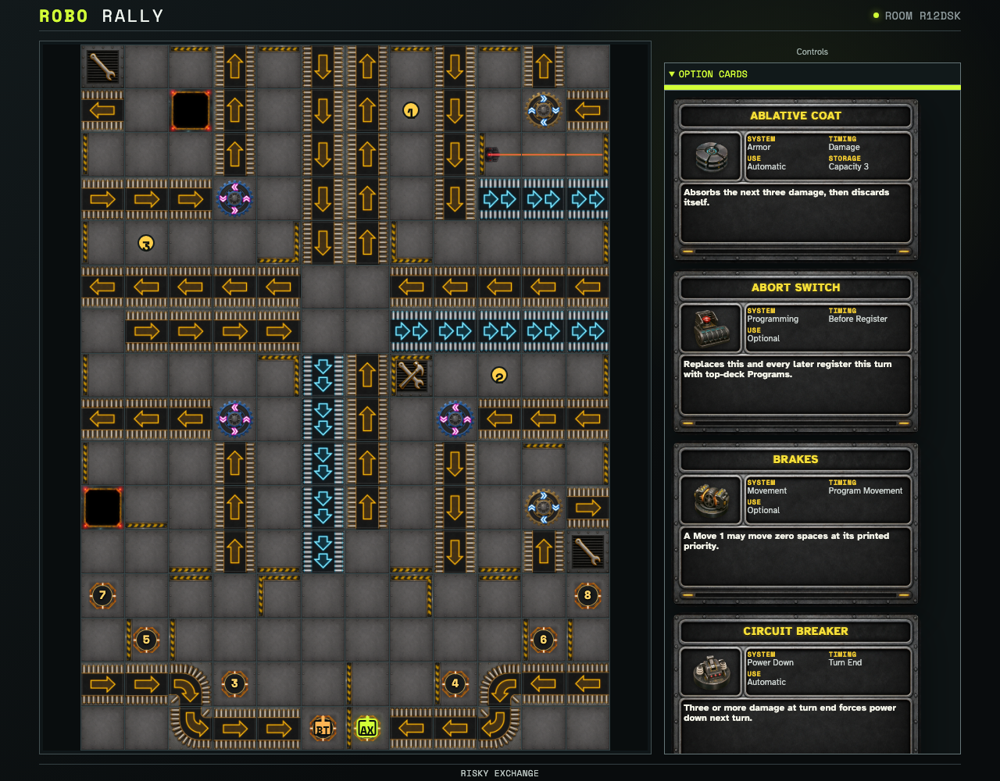

# Inspect all 26 executable Option cards

The in-product 2005 catalog is generated from the same versioned manifest used by the reducer. Every card exposes its timing class and concise behavior; exhaustive pure fixtures execute each active effect and explicit non-activation cases.

## The reviewed 2005 Option deck is complete and inspectable

**Verifications:**

- [x] Exactly 26 uniquely identified card behaviors are rendered
- [x] The edition-specific Crab Legs and Dual Processor cards are present
- [x] Cards from a different Option inventory are absent
