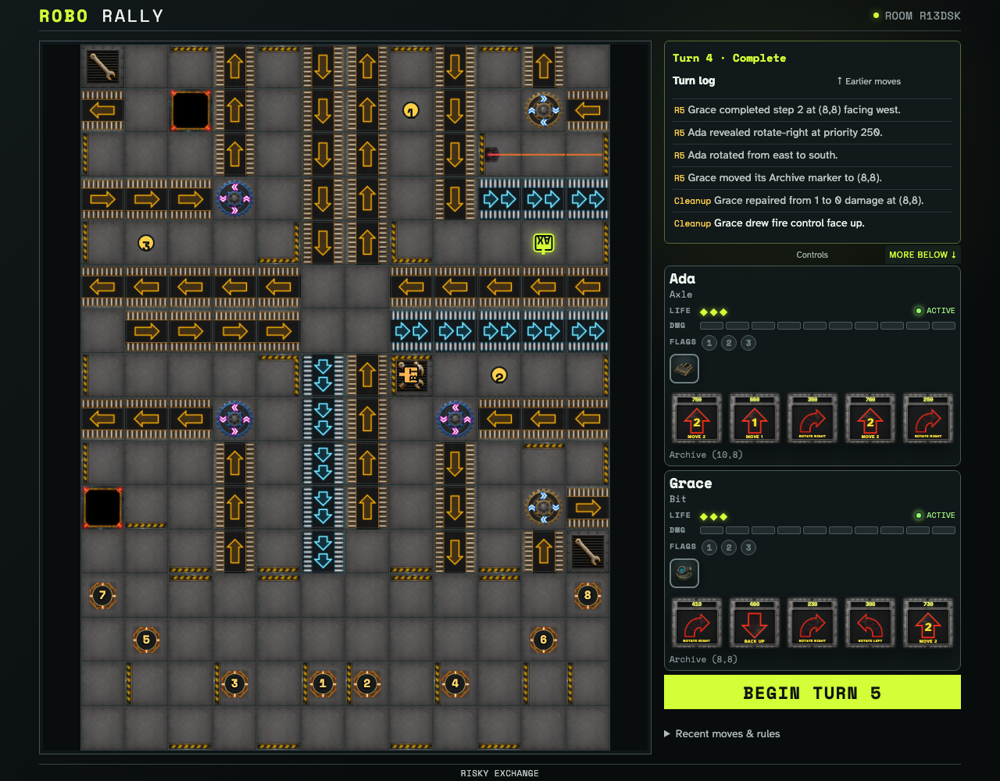
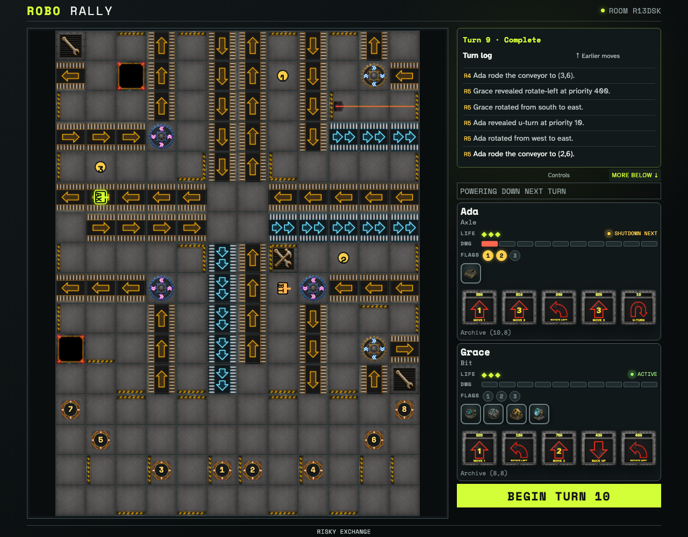
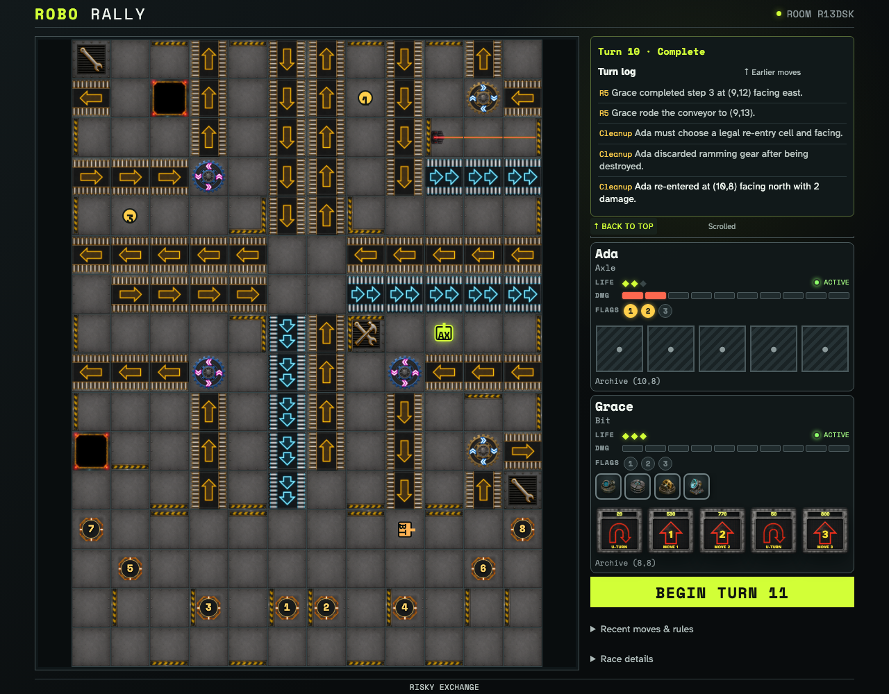
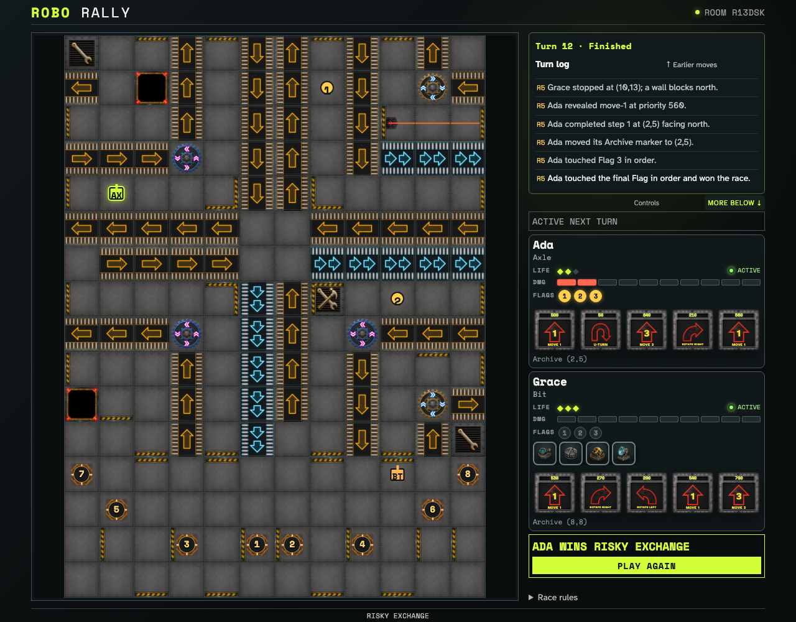

# Complete a production Risky Exchange race

Two ordinary browser clients play twelve hand-constrained turns through crossed-site Options, collisions, laser damage, an announced shutdown, destruction and re-entry, all three flags, immutable victory, and rematch.

## Both robots carry public face-up Options into the long race

**Verifications:**

- [x] Successive crossed-site draws are retained

## Ada announces a shutdown as part of the production race

**Verifications:**

- [x] The original-Dock response is retained through resolution

## The production race spends a Life and resumes through ordinary re-entry

**Verifications:**

- [x] Ada returned with one fewer Life and the race continued

## The hand-constrained race reaches Flag 3 and freezes its summary

**Verifications:**

- [x] Ada touched all flags in order and won on Turn 12
- [x] Both clients share the immutable summary
