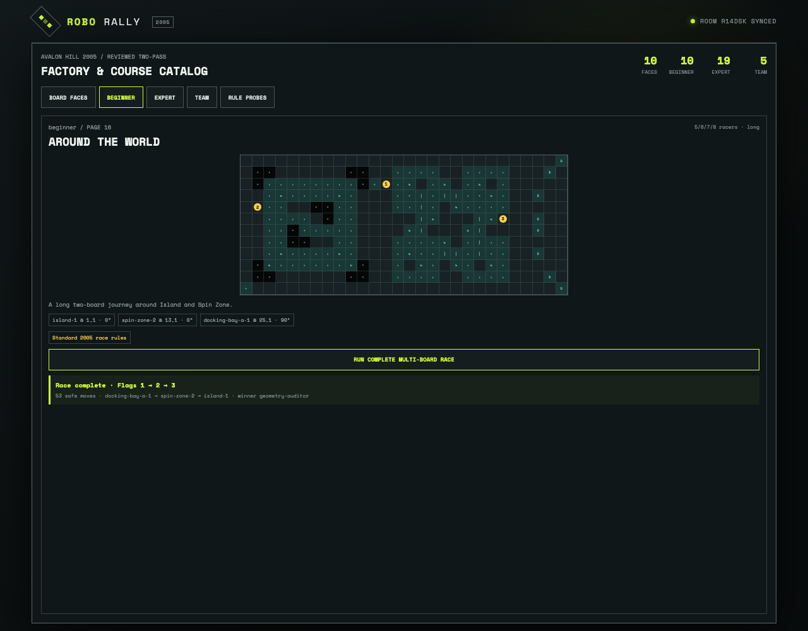

# Review every 2005 board face and finish a multi-board beginner race

The browser renders all ten golden semantic faces and all ten printed beginner diagrams. Around the World is compiled from rotated board instances; an ordinary control runs a wall- and pit-safe race from Dock 1 through Flags 1–3.

## Every beginner asset is reviewed and the multi-board route completes

**Verifications:**

- [x] All ten reviewed board-face previews are generated from reducer geometry
- [x] All ten published beginner diagrams are selectable
- [x] Around the World crosses Docking Bay, Spin Zone, and Island in printed flag order
