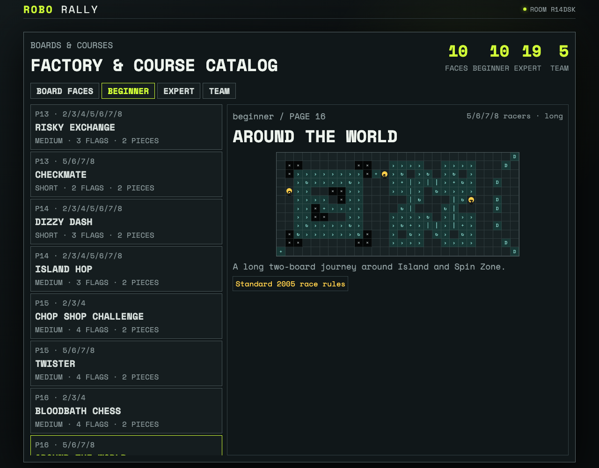

# Explore every board and beginner course

Players browse ten board previews and ten beginner courses, then inspect Around the World and its three flags.

## The catalog shows the selected beginner course and its flags

**Verifications:**

- [x] All ten board previews are available
- [x] All ten published beginner diagrams are selectable
- [x] Around the World shows its three flags without developer test controls
