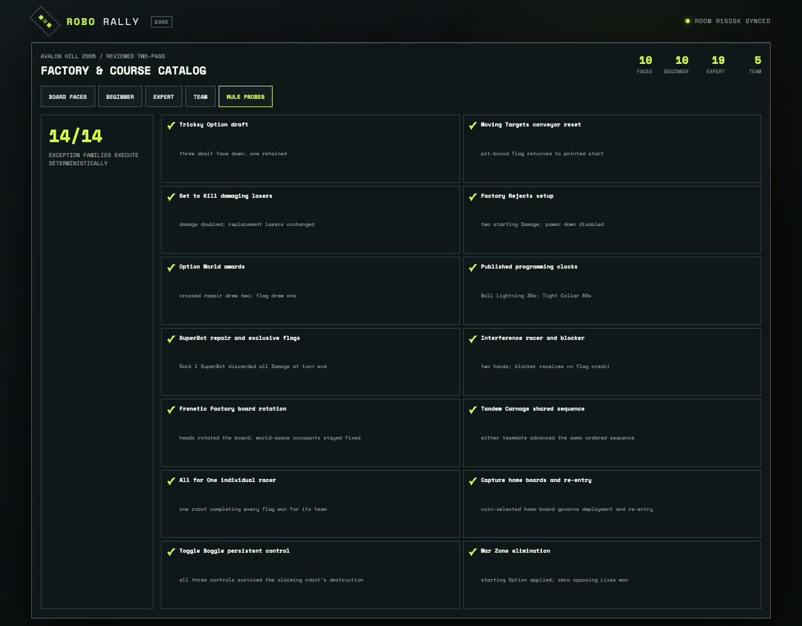

# Inspect every expert/team course and execute every exception family

All 34 printed course diagrams share one reviewed manifest. Fourteen named probes execute timed programming, moving flags, laser and Option variants, SuperBot, dual robots, rotating boards, team progress, capture, toggle control, and elimination rules.

## The published catalog and every exceptional rule family pass in product

**Verifications:**

- [x] The inventory contains 10 beginner, 19 expert, and 5 team courses
- [x] Every exceptional rule probe is executable and passing
- [x] Alternative victories and multi-robot/team setup remain edition-specific
