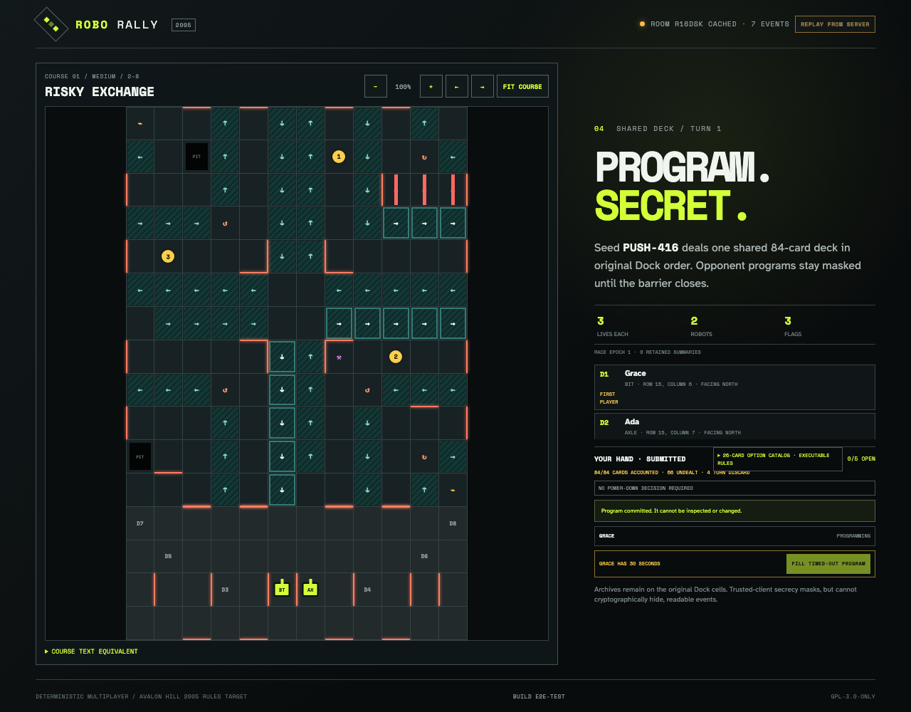
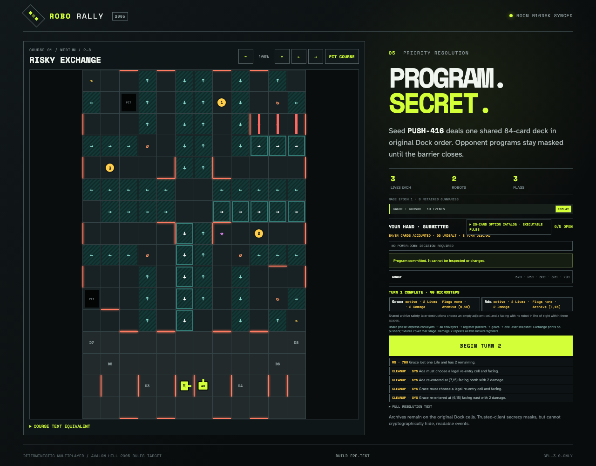
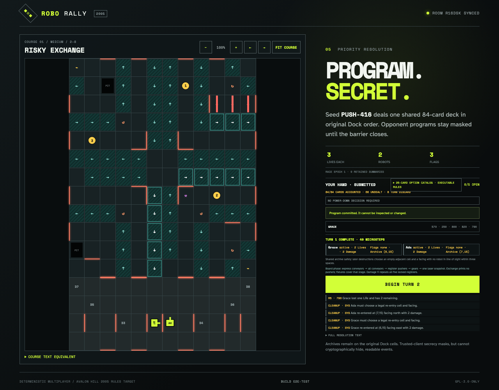

# Reconnect cache, cursor, conflicts, and pending resolution

A player commits an ordinary Program, loses the network while the barrier closes, then converges on an owner-only re-entry. Reloading rehydrates the exact cached prefix before the Firestore cursor supplies its delta; both owners finish ordered re-entry through normal controls.

## The disconnected player remains on the last server-confirmed prefix

**Verifications:**

- [x] The offline client retains seven confirmed immutable events
- [x] The connected peer closes the simultaneous barrier and reaches pending re-entry
- [x] Scratch replay is unavailable until transport returns, preserving the cache

## Cached replay plus cursor delta converges with scratch Firestore replay

**Verifications:**

- [x] Reload visibly reports cache-plus-cursor hydration
- [x] Both owner-authored re-entry choices survive the reconnect boundary
- [x] Both clients project the same completed turn and event count

## An explicit scratch replay preserves the converged race

**Verifications:**

- [x] The player can discard the compatible cache and read the complete server stream
- [x] Scratch replay produces the same completed turn and robot coordinates
