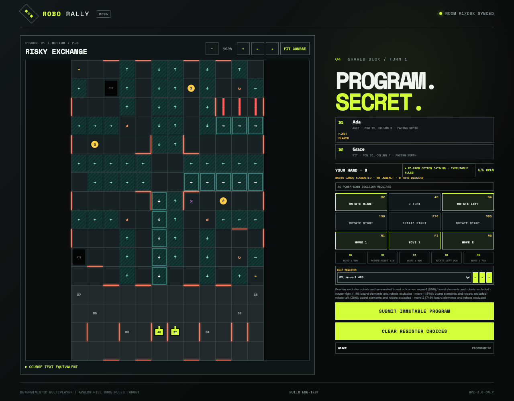
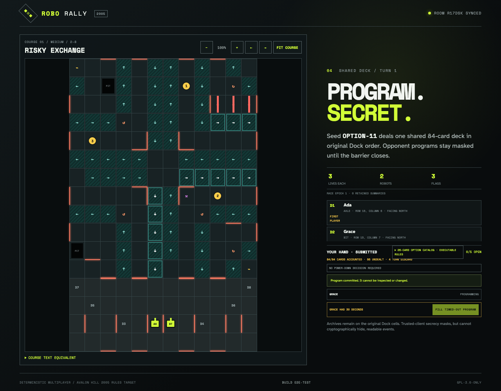
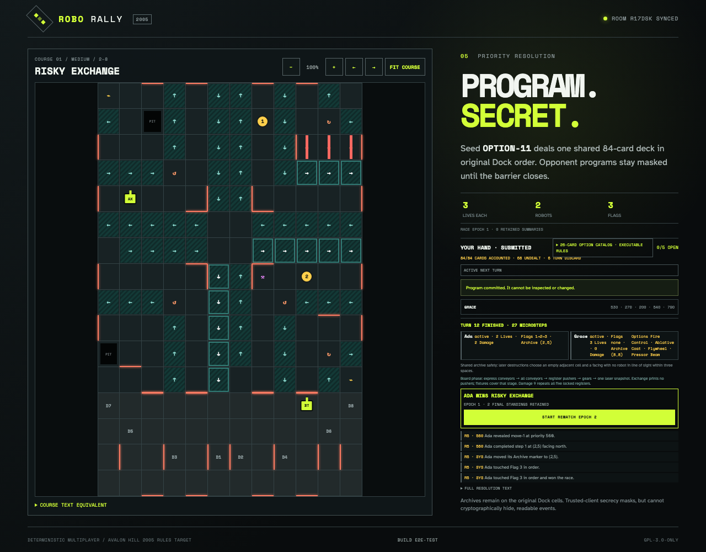

# Responsive accessible complete race

Two ordinary clients complete the production twelve-turn race at phone portrait, phone landscape, tablet, and desktop sizes. The first turn proves board-grid navigation, focus transfer, keyboard and pointer register ordering, textual countdowns, non-color selection cues, reduced motion, and live resolution semantics.

## The complete race begins with equivalent non-pointer and pointer controls

**Verifications:**

- [x] Arrow-key board navigation exposes a selected semantic grid cell
- [x] Keyboard reordering and the pointer-friendly toolbar preserve the exact Program

## Submission exposes an equivalent textual deadline and state cue

**Verifications:**

- [x] The last programmer receives a textual thirty-second alternative
- [x] Immutable submission is communicated in text, independent of color

## The accessible production race reaches its immutable winner

**Verifications:**

- [x] All target viewports reach Flag 3 through twelve ordinary turns
- [x] Actor and observer share the same immutable winner summary
- [x] The viewport has no clipped or overlapping interactive controls
