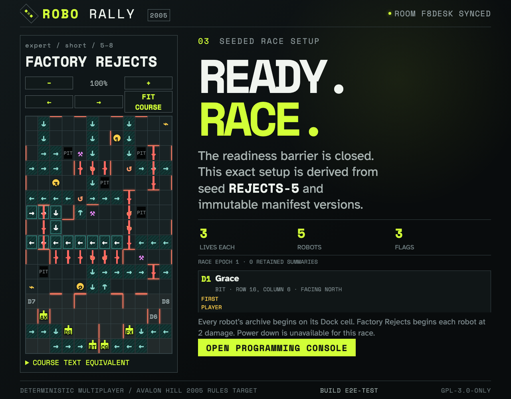
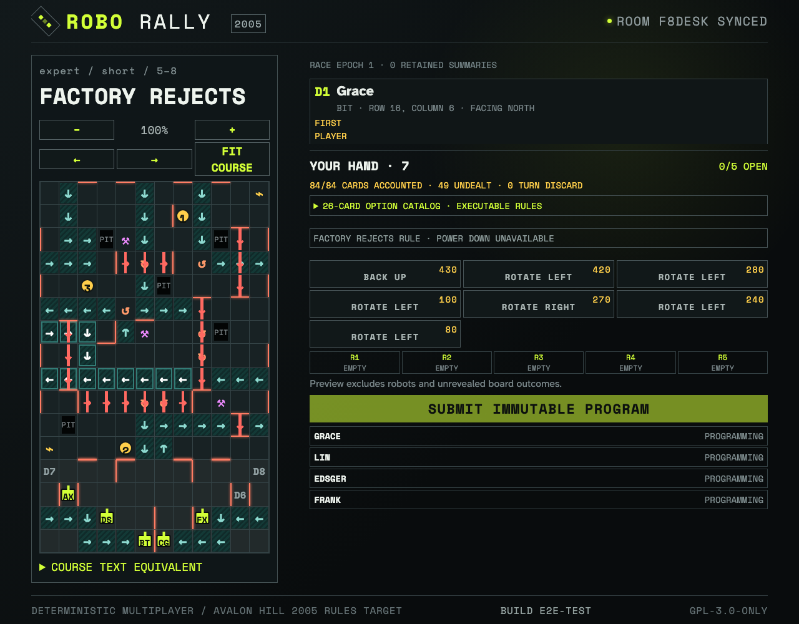

# Play the Factory Rejects scenario

Five isolated players select the reviewed expert course. The immutable setup compiles Chop Shop with Docking Bay B, deals damage-reduced hands, and removes power down.

## Factory Rejects compiles its own board and setup rules

**Verifications:**

- [x] The immutable setup identifies Factory Rejects and its two starting damage
- [x] Chop Shop, Docking Bay B, all three flags, and all five robots render from compiled geometry
- [x] Every observer converges on the same course and five-robot setup

## Starting damage changes programming and removes power down

**Verifications:**

- [x] Starting at two damage deals every player seven Program cards
- [x] The power-down decision control is replaced by the scenario prohibition
- [x] Every observer receives the same damage-reduced seven-card hand
