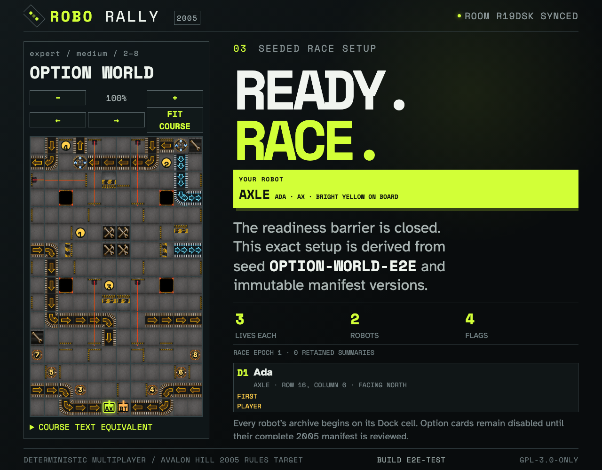

# Option World playable scenario

Two isolated players configure the reviewed 2005 Option World course. The rendered scenario exposes four ordered flags, four crossed repair/Option sites, and both robots on the complete manifest.

## Both players enter the complete four-flag Option World course

**Verifications:**

- [x] The host sees all four crossed repair/Option sites and all four flags
- [x] Both robots render on the configured course
- [x] The guest converges on the same Option World geometry
