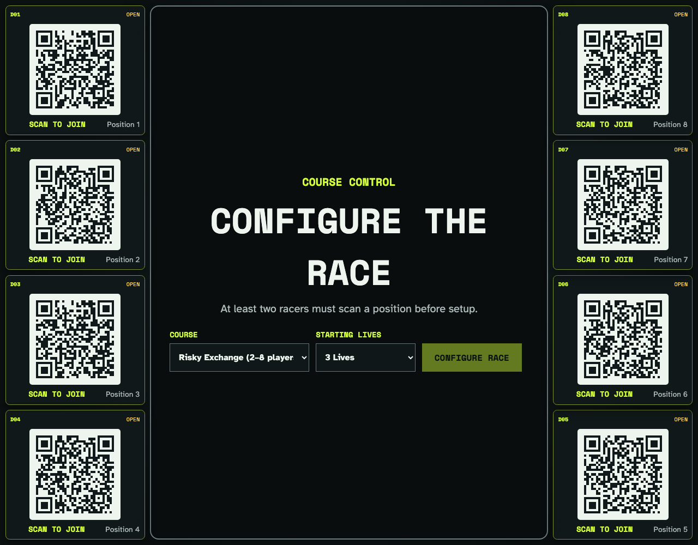
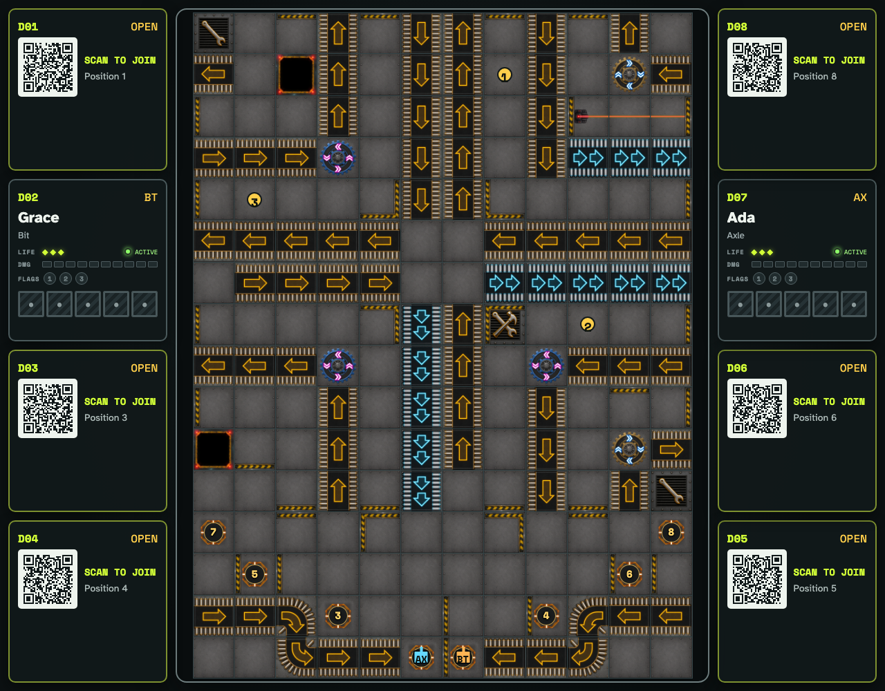
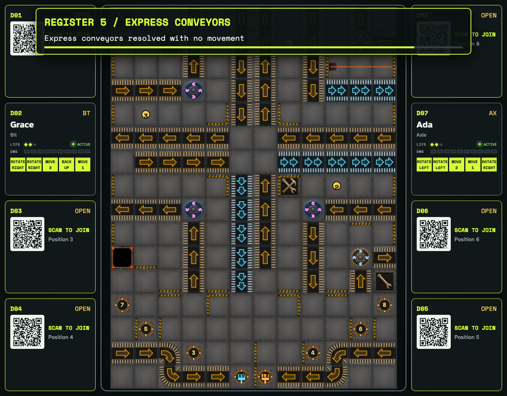
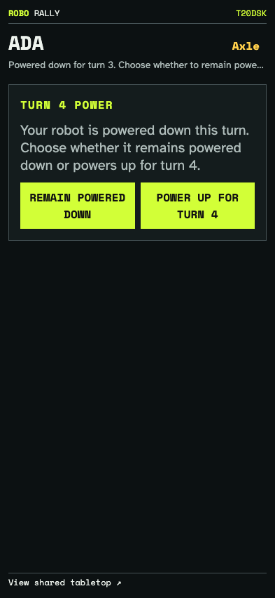

# Tabletop QR joining and configuration

The shared display creates a fresh room, exposes eight position-specific QR joins, owns race configuration, renders the course and public player state, and animates Program execution while phones retain private choices.

## A fresh tabletop exposes eight QR positions and owns configuration

**Verifications:**

- [x] Eight open positions expose seat-specific QR join links
- [x] Course configuration belongs to a headerless, fixed, non-scrolling tabletop viewport

## Joined players surround the fully visible configured course

**Verifications:**

- [x] Each scanned phone occupies the physical position encoded by its QR link
- [x] The course fills its center viewport with square, fully visible cells
- [x] Claimed positions show public Life, damage, and power tracks
- [x] Private phones receive Program decks without course controls
- [x] Private Program controllers fill the phone viewport and support touch dragging without scrolling

## The tabletop reveals both Programs during staged register playback

**Verifications:**

- [x] All ten Program cards are face up while register playback remains visible

## A private controller handles its next-turn power choice without a Program hand

**Verifications:**

- [x] A powered-down controller can remain shut down or return active without exposing a hand
