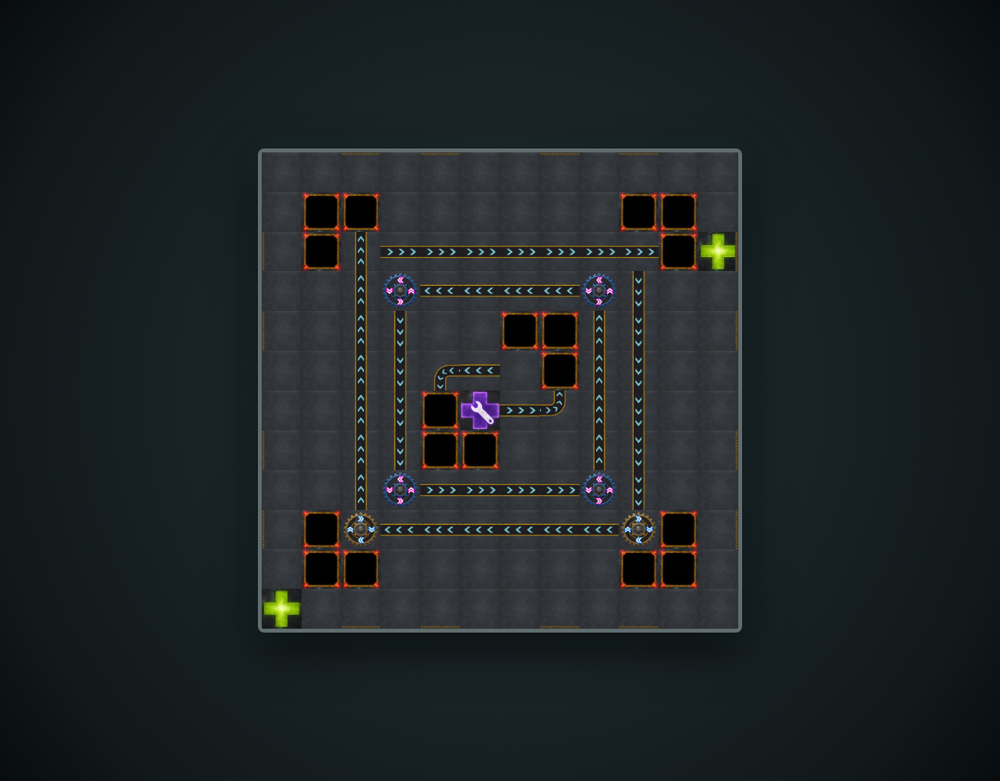
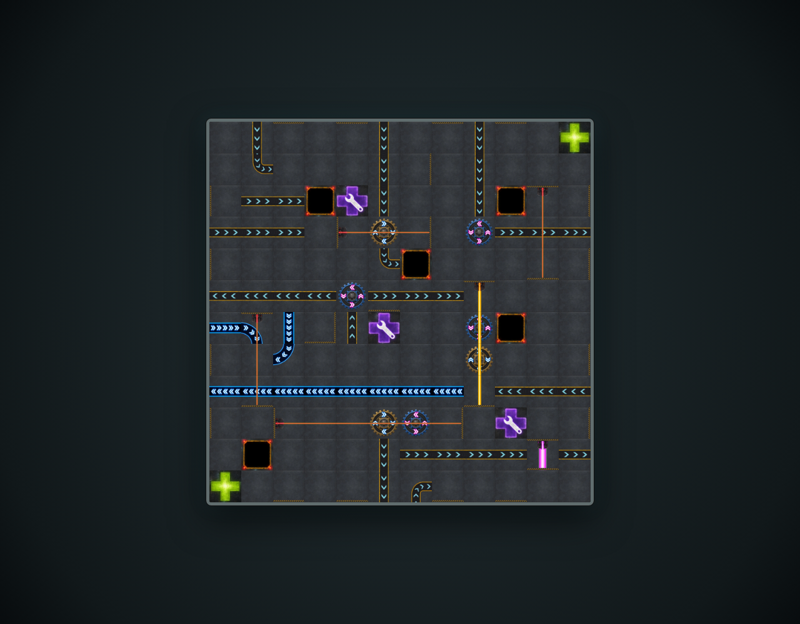
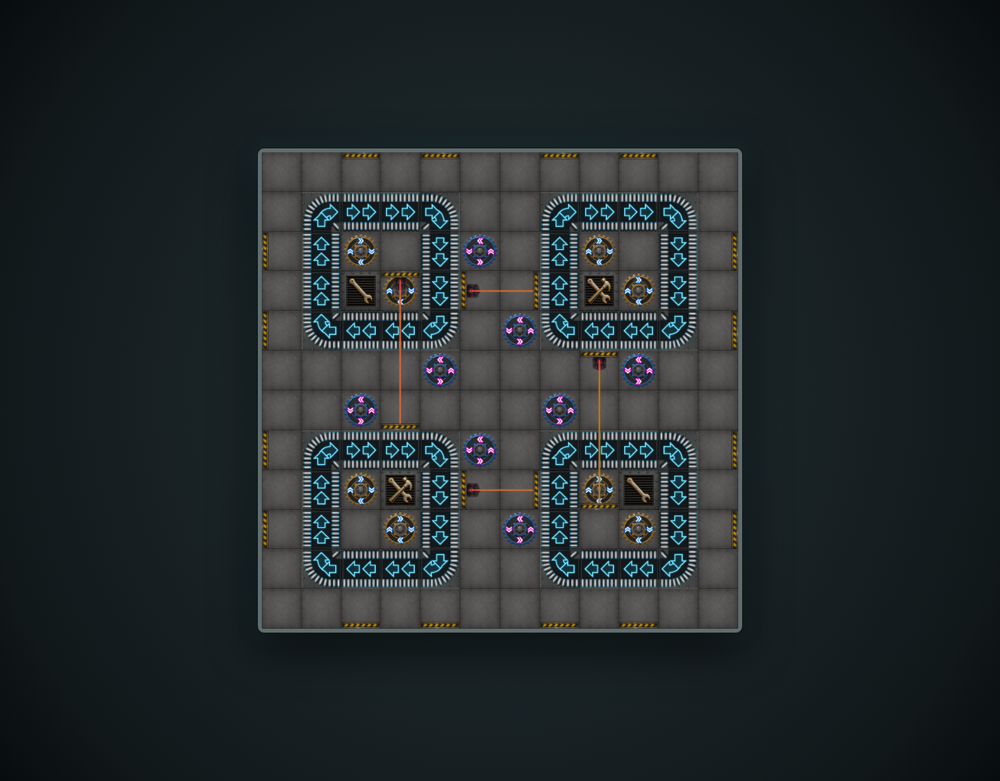
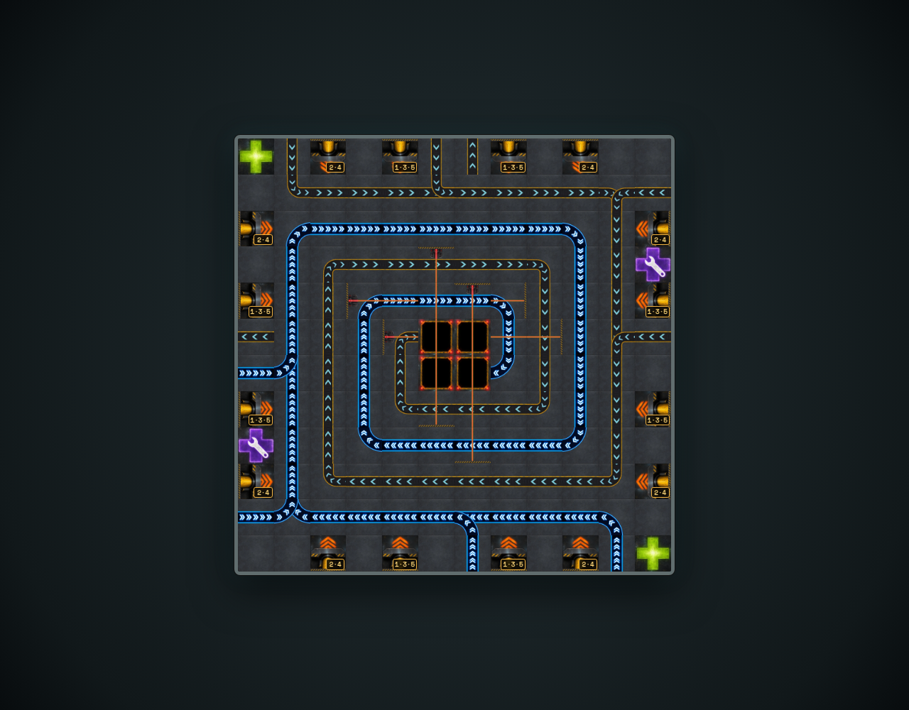
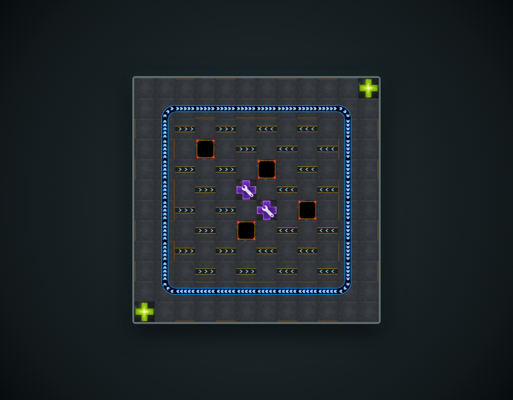
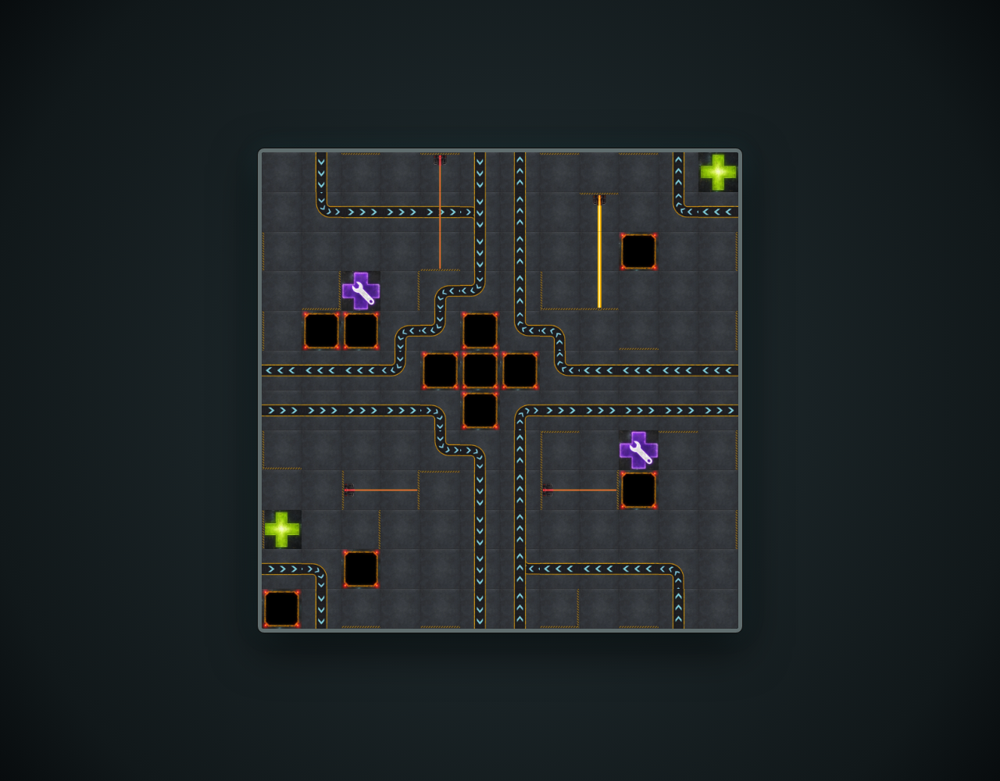
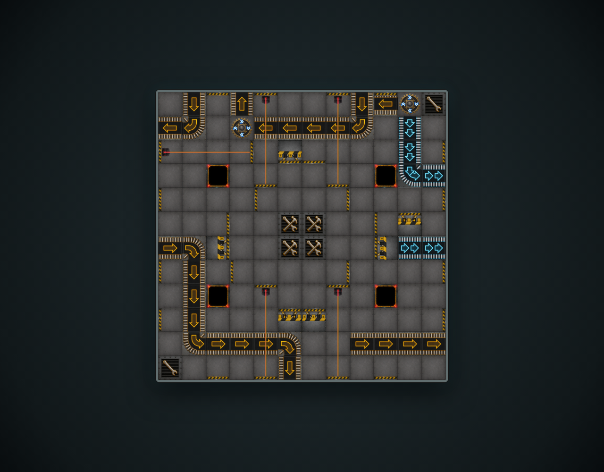
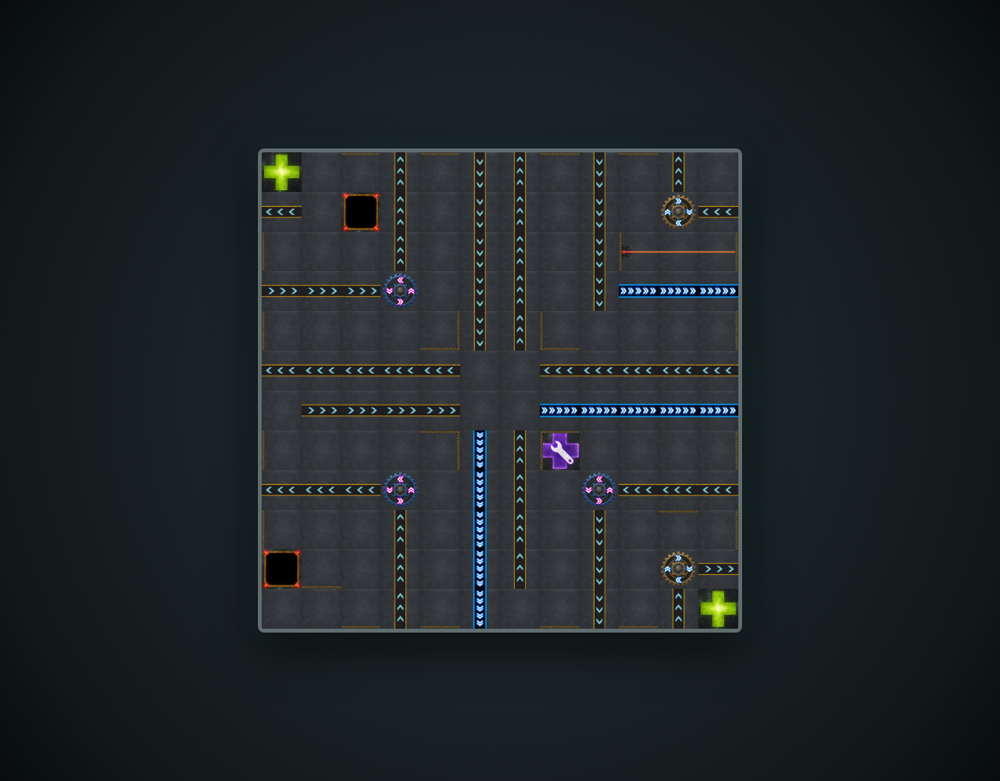
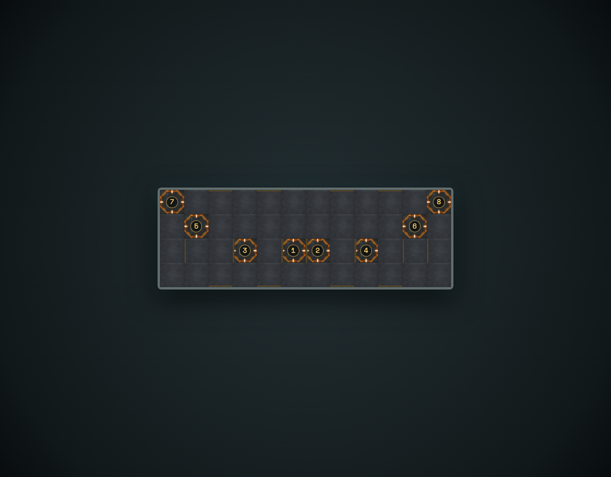
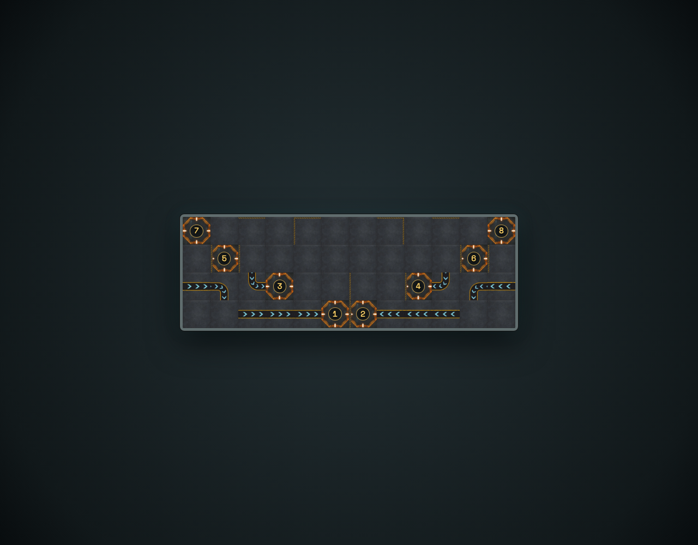

# Generated artwork for every 2005 board face

Each standalone board route renders the reviewed semantic manifest with the generated industrial raster tile family. Every board is captured independently so the artwork and its placement can be reviewed at a glance.

## island uses the generated square tile artwork

**Verifications:**

- [x] The /boards/island route identifies the intended reviewed board face
- [x] The 12 × 12 manifest renders all 144 cells
- [x] Every cell is square and every generated raster asset is fully loaded

## chop shop uses the generated square tile artwork

**Verifications:**

- [x] The /boards/chop-shop route identifies the intended reviewed board face
- [x] The 12 × 12 manifest renders all 144 cells
- [x] Every cell is square and every generated raster asset is fully loaded

## spin zone uses the generated square tile artwork

**Verifications:**

- [x] The /boards/spin-zone route identifies the intended reviewed board face
- [x] The 12 × 12 manifest renders all 144 cells
- [x] Every cell is square and every generated raster asset is fully loaded

## maelstrom uses the generated square tile artwork

**Verifications:**

- [x] The /boards/maelstrom route identifies the intended reviewed board face
- [x] The 12 × 12 manifest renders all 144 cells
- [x] Every cell is square and every generated raster asset is fully loaded

## chess uses the generated square tile artwork

**Verifications:**

- [x] The /boards/chess route identifies the intended reviewed board face
- [x] The 12 × 12 manifest renders all 144 cells
- [x] Every cell is square and every generated raster asset is fully loaded

## cross uses the generated square tile artwork

**Verifications:**

- [x] The /boards/cross route identifies the intended reviewed board face
- [x] The 12 × 12 manifest renders all 144 cells
- [x] Every cell is square and every generated raster asset is fully loaded

## vault uses the generated square tile artwork

**Verifications:**

- [x] The /boards/vault route identifies the intended reviewed board face
- [x] The 12 × 12 manifest renders all 144 cells
- [x] Every cell is square and every generated raster asset is fully loaded

## exchange uses the generated square tile artwork

**Verifications:**

- [x] The /boards/exchange route identifies the intended reviewed board face
- [x] The 12 × 12 manifest renders all 144 cells
- [x] Every cell is square and every generated raster asset is fully loaded

## docking bay a uses the generated square tile artwork

**Verifications:**

- [x] The /boards/docking-bay-a route identifies the intended reviewed board face
- [x] The 12 × 4 manifest renders all 48 cells
- [x] Every cell is square and every generated raster asset is fully loaded

## docking bay b uses the generated square tile artwork

**Verifications:**

- [x] The /boards/docking-bay-b route identifies the intended reviewed board face
- [x] The 12 × 4 manifest renders all 48 cells
- [x] Every cell is square and every generated raster asset is fully loaded
