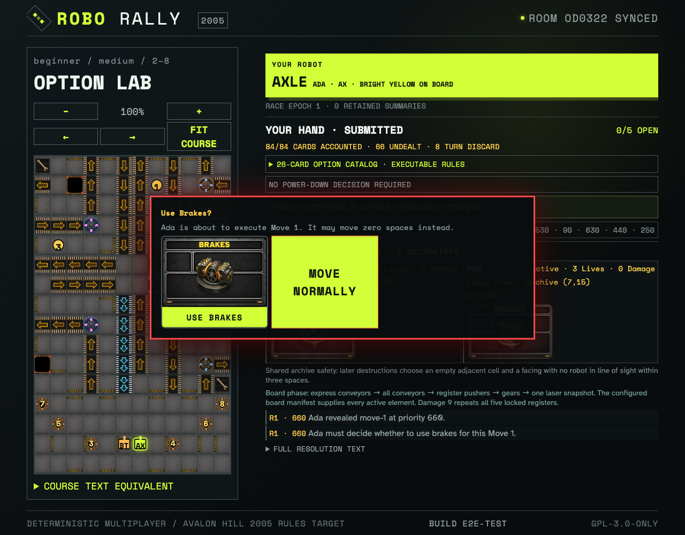
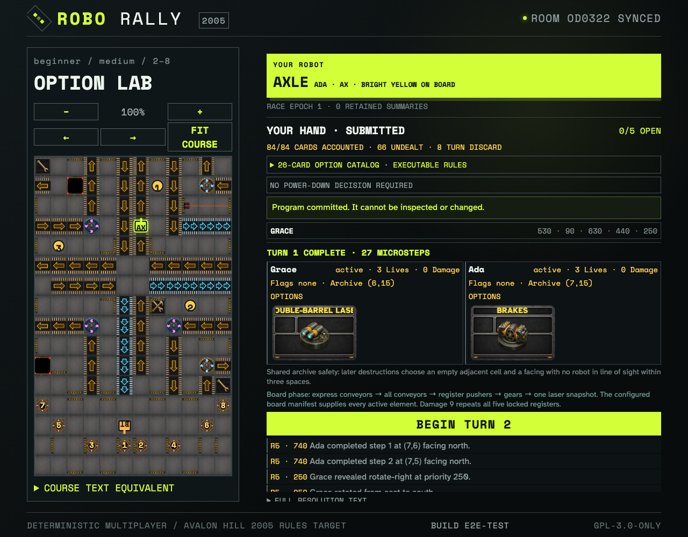

# Brakes execution decision

A robot that owns Brakes reaches its actual Move 1 timing window before choosing whether to move zero spaces. The immutable choice is replayed for both clients.

## Brakes pauses the printed Move 1 at its execution priority

**Verifications:**

- [x] The owning player can use Brakes or execute Move 1 normally
- [x] The observer sees the Dock-ordered responder

## The persisted activation resolves as Move 0 without consuming Brakes

**Verifications:**

- [x] Both clients replay the zero-space movement
- [x] Brakes remains owned after use
