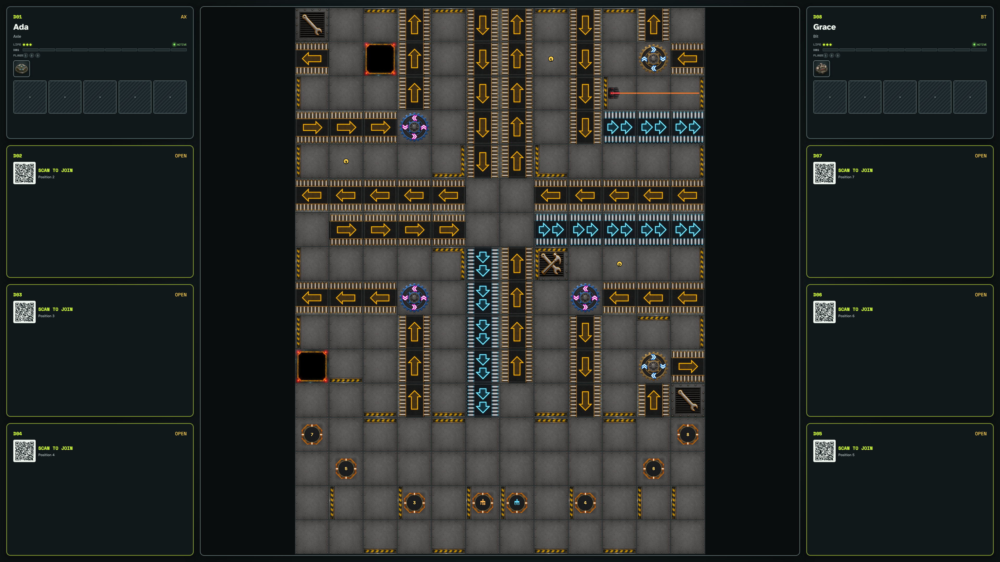
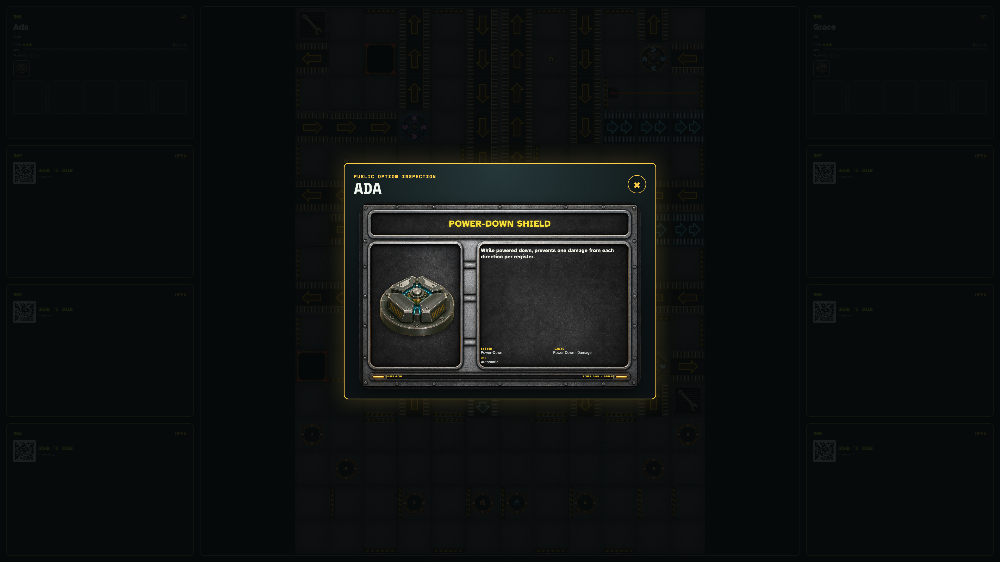

# 4K tabletop player and Option layout

A 3840×2160 tabletop uses the available display width for public player seats. Each starting Option appears as a tappable icon, and selecting one opens a legible shared card inspector.

## Wide 4K player seats expose each public Option as an icon

**Verifications:**

- [x] Side seats expand well beyond the old narrow desktop cap
- [x] Every player starting Option is visible as an individual control
- [x] The 4K shared display remains fixed and non-scrolling

## Tapping an Option icon opens its full card on the shared display

**Verifications:**

- [x] The inspector identifies the owning player and selected Option
- [x] The full Option card is large enough to read from the tabletop
