# Complete tabletop race with private phone controllers

A shared tabletop and two isolated 393×852 touch controllers play every round of a deterministic 12-turn race. Every user action has its own screenshot so programming, power choices, Options, destruction, re-entry, playback, and victory remain visually reviewable throughout the complete game.

## The tabletop opens room F24DSK

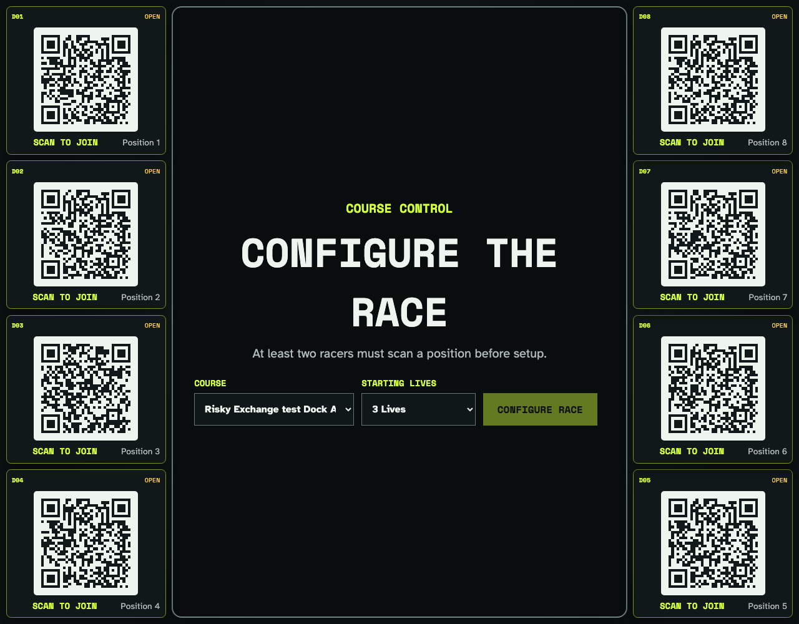

**Verifications:**

- [x] The complete tabletop configuration and all position QR codes fit the shared display

## Ada opens the private Position 1 controller

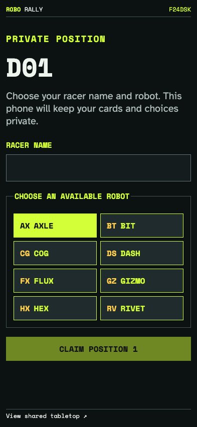

**Verifications:**

- [x] The entire private join form is usable at 393×852 without scrolling

## Ada enters her racer name

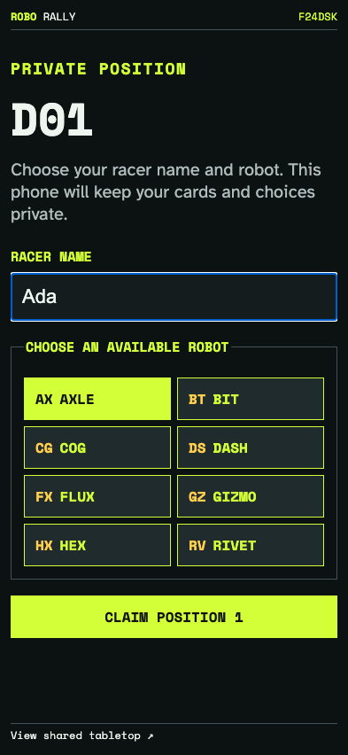

**Verifications:**

- [x] The entered racer name remains visible alongside all available robots

## Ada selects Axle

**Verifications:**

- [x] Axle is visibly selected and the position claim remains available

## Ada claims Position 1

**Verifications:**

- [x] The selected name, robot, and Position 1 claim action are all visible

## Grace opens the private Position 2 controller

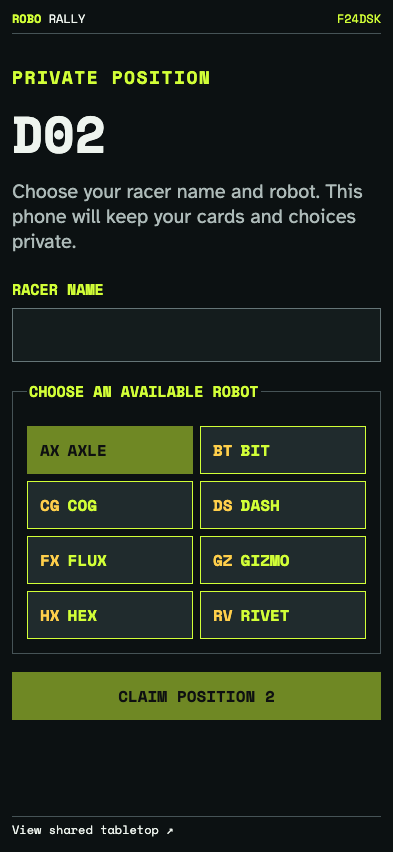

**Verifications:**

- [x] The second private join form is complete and unobstructed at phone size

## Grace enters her racer name

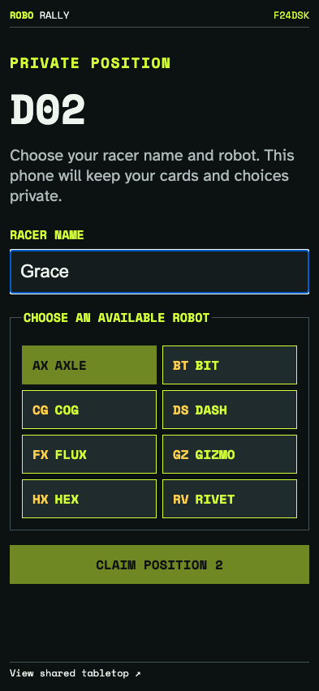

**Verifications:**

- [x] The second racer name remains visible alongside the available robots

## Grace selects Bit

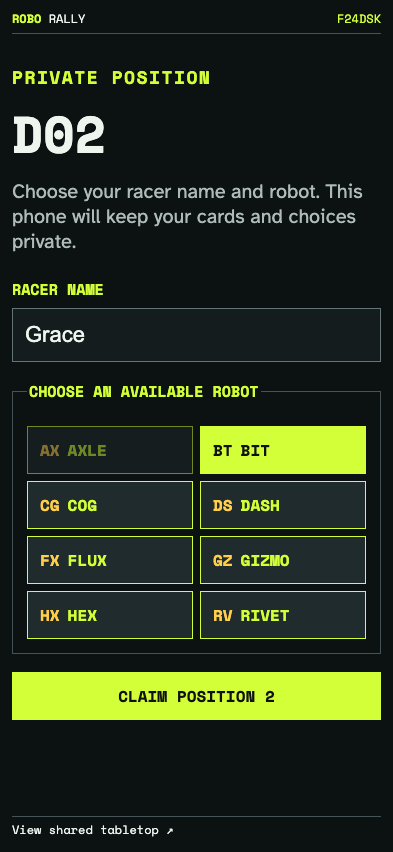

**Verifications:**

- [x] Bit is visibly selected and the position claim remains available

## Grace claims Position 2

**Verifications:**

- [x] The selected name, robot, and Position 2 claim action are all visible

## The tabletop selects the deterministic Risky Exchange test course

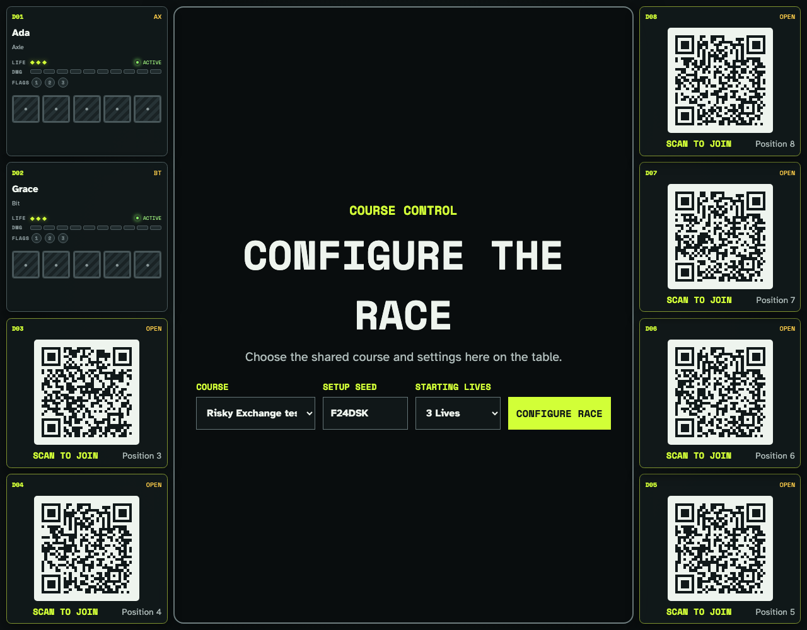

**Verifications:**

- [x] The selected full-race course is visible in the shared configuration

## The tabletop enters the deterministic full-race seed

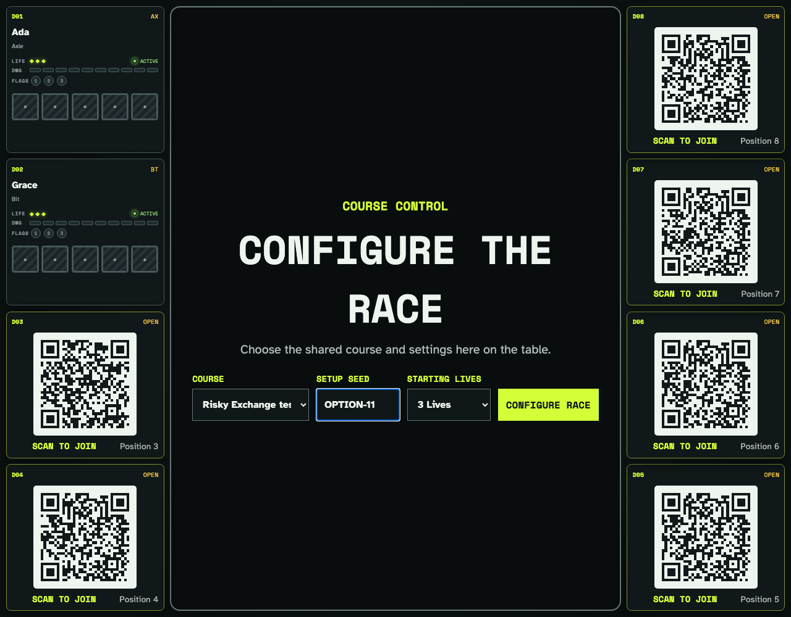

**Verifications:**

- [x] The OPTION-11 seed is visible before configuration is committed

## The tabletop configures the race

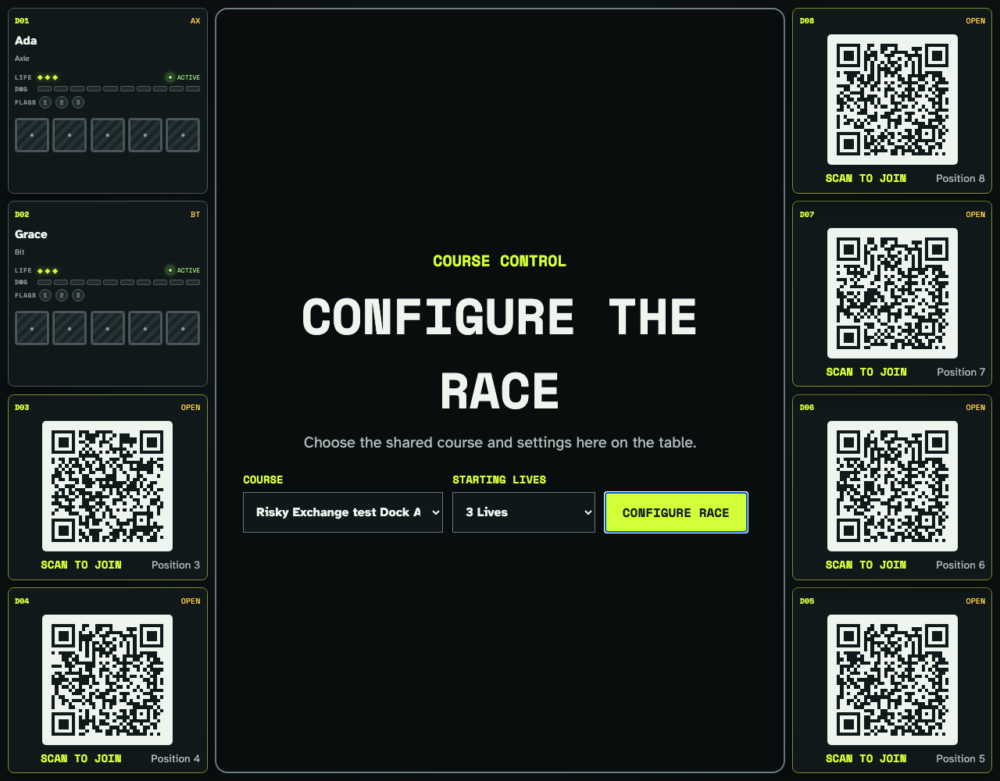

**Verifications:**

- [x] The course, seed, player count, and configuration action are simultaneously visible

## Ada confirms readiness

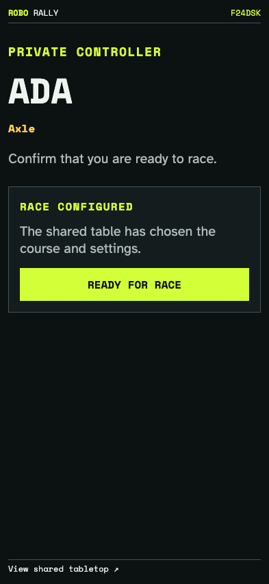

**Verifications:**

- [x] The configured-race summary and ready action fit the private phone display

## Grace confirms readiness

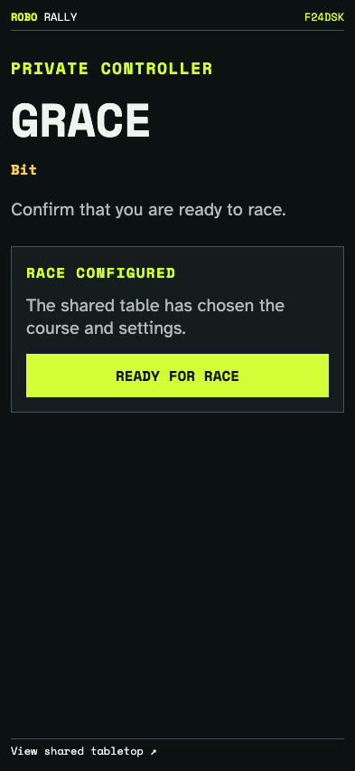

**Verifications:**

- [x] The configured-race summary and ready action fit the private phone display

## Ada chooses Register 1: move-1 priority 500

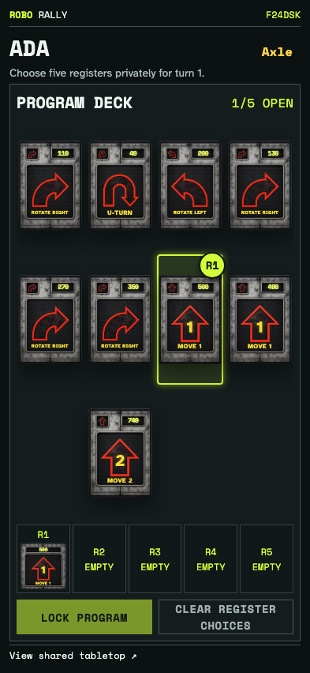

**Verifications:**

- [x] Turn 1 Register 1 visibly contains move-1 priority 500, with the complete hand still inside the phone viewport

## Ada chooses Register 2: rotate-right priority 110

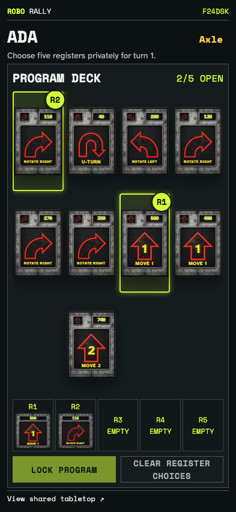

**Verifications:**

- [x] Turn 1 Register 2 visibly contains rotate-right priority 110, with the complete hand still inside the phone viewport

## Ada chooses Register 3: move-1 priority 490

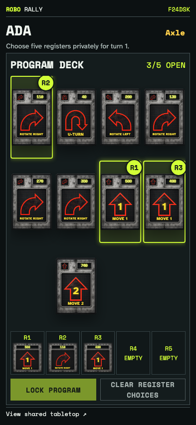

**Verifications:**

- [x] Turn 1 Register 3 visibly contains move-1 priority 490, with the complete hand still inside the phone viewport

## Ada chooses Register 4: rotate-left priority 200

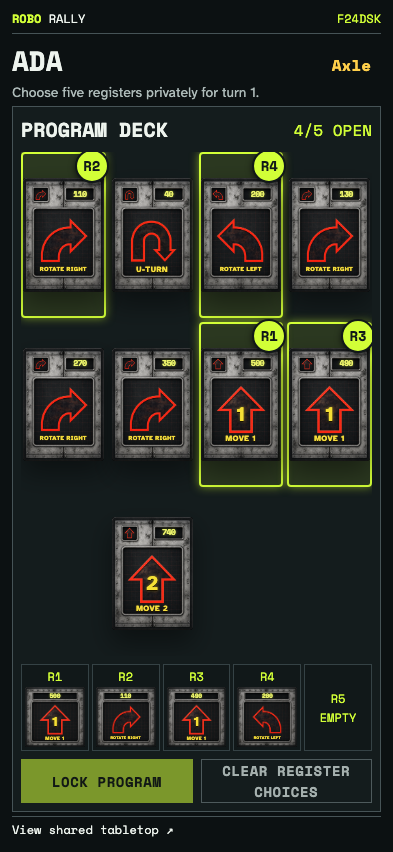

**Verifications:**

- [x] Turn 1 Register 4 visibly contains rotate-left priority 200, with the complete hand still inside the phone viewport

## Ada chooses Register 5: move-2 priority 740

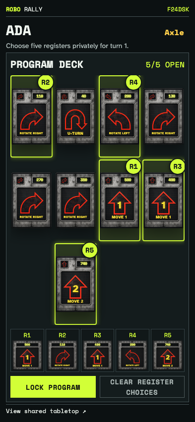

**Verifications:**

- [x] Turn 1 Register 5 visibly contains move-2 priority 740, with the complete hand still inside the phone viewport

## Ada locks the Turn 1 program

**Verifications:**

- [x] All five Turn 1 registers are visible and the lock action is available without scrolling

## Grace chooses Register 1: back-up priority 480

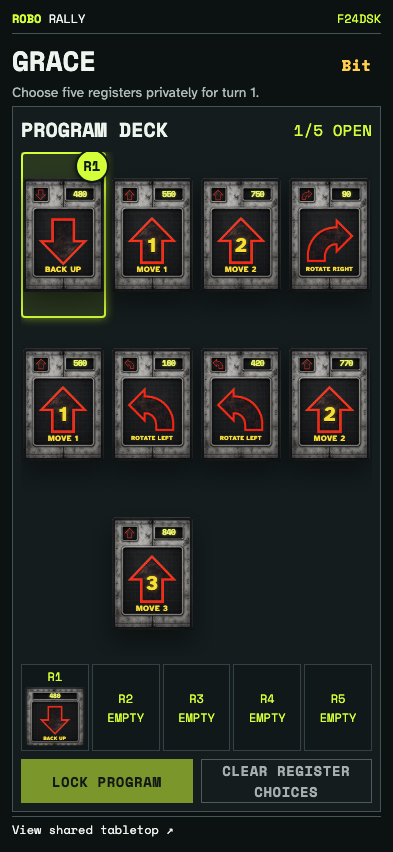

**Verifications:**

- [x] Turn 1 Register 1 visibly contains back-up priority 480, with the complete hand still inside the phone viewport

## Grace chooses Register 2: move-1 priority 550

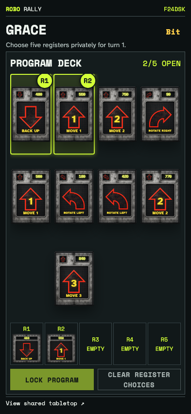

**Verifications:**

- [x] Turn 1 Register 2 visibly contains move-1 priority 550, with the complete hand still inside the phone viewport

## Grace chooses Register 3: move-2 priority 750

**Verifications:**

- [x] Turn 1 Register 3 visibly contains move-2 priority 750, with the complete hand still inside the phone viewport

## Grace chooses Register 4: rotate-right priority 90

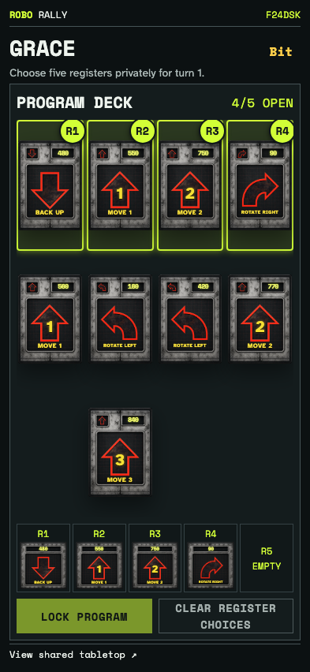

**Verifications:**

- [x] Turn 1 Register 4 visibly contains rotate-right priority 90, with the complete hand still inside the phone viewport

## Grace chooses Register 5: move-1 priority 560

**Verifications:**

- [x] Turn 1 Register 5 visibly contains move-1 priority 560, with the complete hand still inside the phone viewport

## Grace locks the Turn 1 program

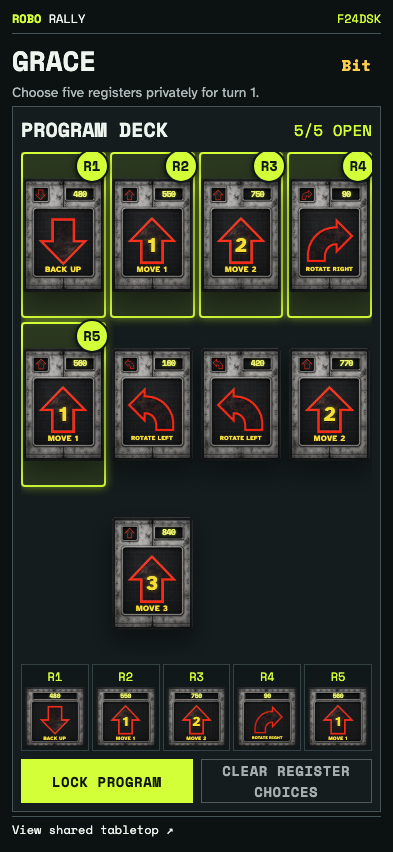

**Verifications:**

- [x] All five Turn 1 registers are visible and the lock action is available without scrolling

## The tabletop completes Turn 1 playback

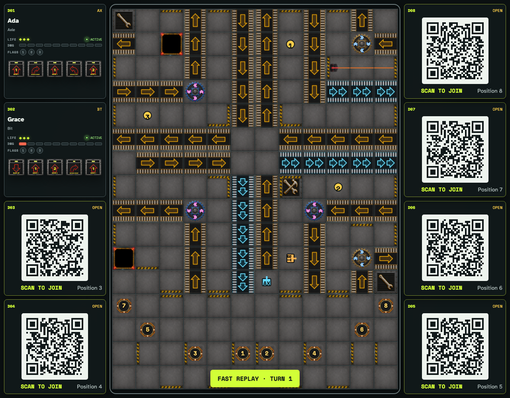

**Verifications:**

- [x] The Turn 1 board result and every public player state are visible before Turn 2

## Ada opens the private Turn 2 hand

**Verifications:**

- [x] Turn 2 remains closed until Ada explicitly opens the next private hand

## Grace opens the private Turn 2 hand

**Verifications:**

- [x] Turn 2 remains closed until Grace explicitly opens the next private hand

## Ada chooses Register 1: rotate-left priority 340

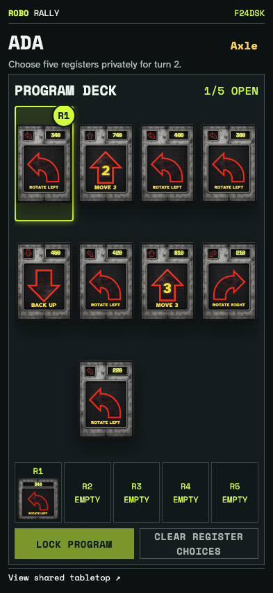

**Verifications:**

- [x] Turn 2 Register 1 visibly contains rotate-left priority 340, with the complete hand still inside the phone viewport

## Ada chooses Register 2: back-up priority 450

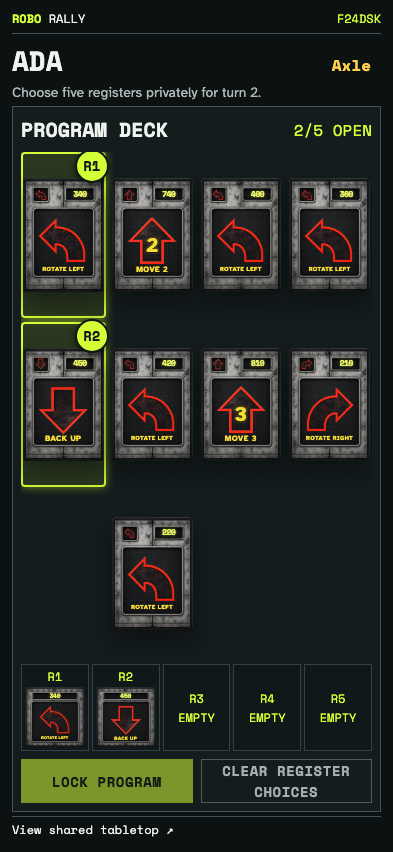

**Verifications:**

- [x] Turn 2 Register 2 visibly contains back-up priority 450, with the complete hand still inside the phone viewport

## Ada chooses Register 3: rotate-right priority 210

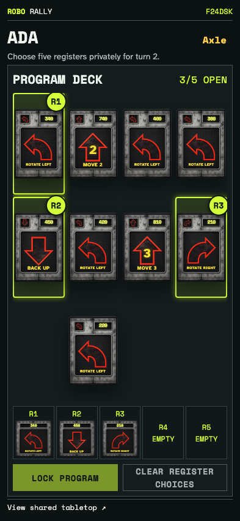

**Verifications:**

- [x] Turn 2 Register 3 visibly contains rotate-right priority 210, with the complete hand still inside the phone viewport

## Ada chooses Register 4: move-2 priority 740

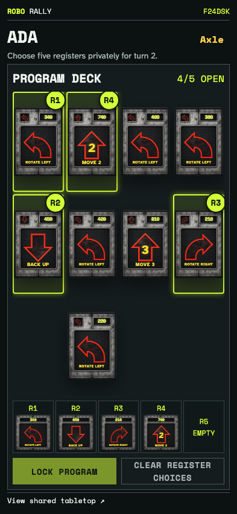

**Verifications:**

- [x] Turn 2 Register 4 visibly contains move-2 priority 740, with the complete hand still inside the phone viewport

## Ada chooses Register 5: move-3 priority 810

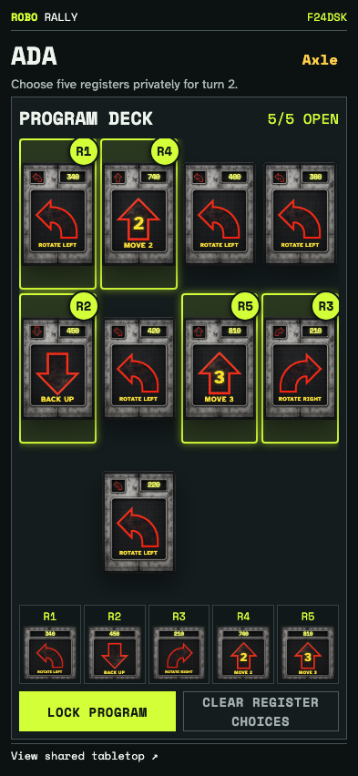

**Verifications:**

- [x] Turn 2 Register 5 visibly contains move-3 priority 810, with the complete hand still inside the phone viewport

## Ada locks the Turn 2 program

**Verifications:**

- [x] All five Turn 2 registers are visible and the lock action is available without scrolling

## Grace chooses Register 1: move-1 priority 540

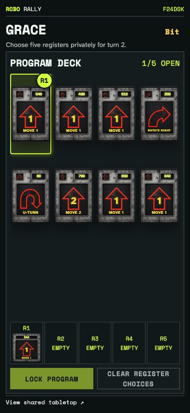

**Verifications:**

- [x] Turn 2 Register 1 visibly contains move-1 priority 540, with the complete hand still inside the phone viewport

## Grace chooses Register 2: move-1 priority 490

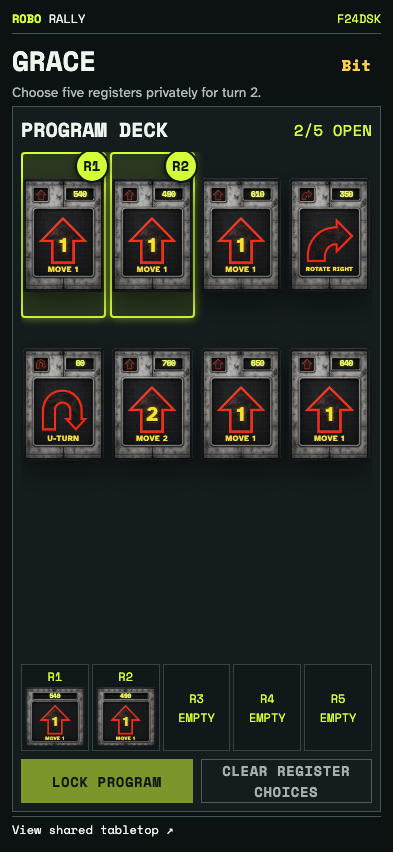

**Verifications:**

- [x] Turn 2 Register 2 visibly contains move-1 priority 490, with the complete hand still inside the phone viewport

## Grace chooses Register 3: move-1 priority 610

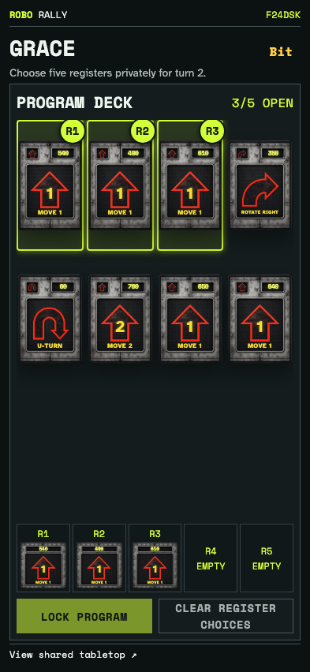

**Verifications:**

- [x] Turn 2 Register 3 visibly contains move-1 priority 610, with the complete hand still inside the phone viewport

## Grace chooses Register 4: rotate-right priority 350

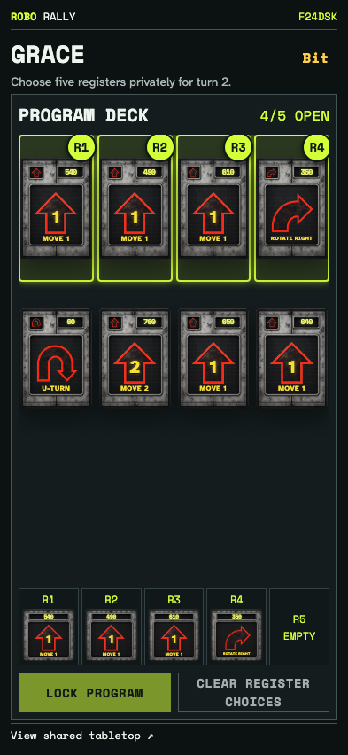

**Verifications:**

- [x] Turn 2 Register 4 visibly contains rotate-right priority 350, with the complete hand still inside the phone viewport

## Grace chooses Register 5: u-turn priority 60

**Verifications:**

- [x] Turn 2 Register 5 visibly contains u-turn priority 60, with the complete hand still inside the phone viewport

## Grace locks the Turn 2 program

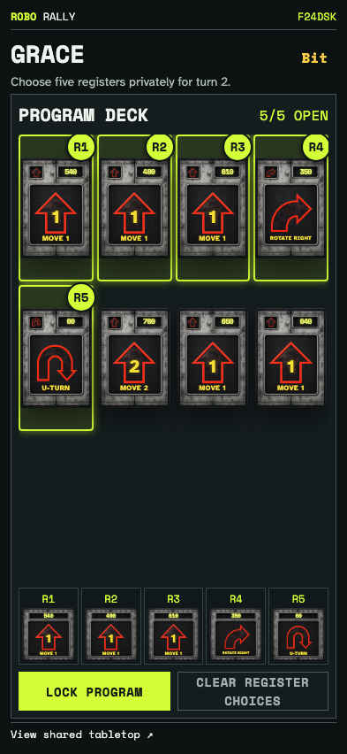

**Verifications:**

- [x] All five Turn 2 registers are visible and the lock action is available without scrolling

## Grace chooses STAY ACTIVE after Turn 2 programming

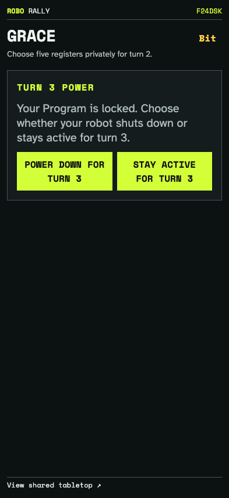

**Verifications:**

- [x] The Turn 2 power choice is legible, unobstructed, and STAY ACTIVE is available

## The tabletop completes Turn 2 playback

**Verifications:**

- [x] The Turn 2 board result and every public player state are visible before Turn 3

## Ada opens the private Turn 3 hand

**Verifications:**

- [x] Turn 3 remains closed until Ada explicitly opens the next private hand

## Grace opens the private Turn 3 hand

**Verifications:**

- [x] Turn 3 remains closed until Grace explicitly opens the next private hand

## Ada chooses Register 1: move-1 priority 520

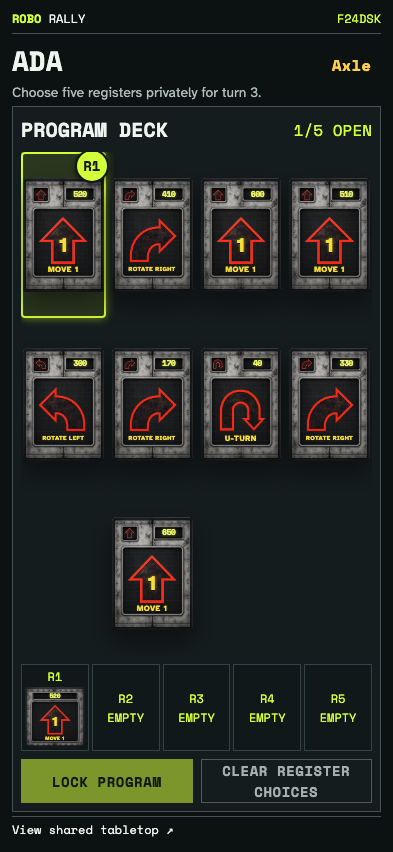

**Verifications:**

- [x] Turn 3 Register 1 visibly contains move-1 priority 520, with the complete hand still inside the phone viewport

## Ada chooses Register 2: rotate-right priority 410

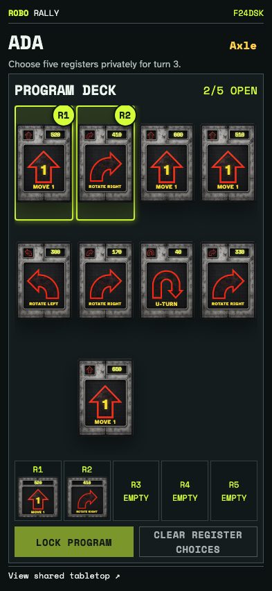

**Verifications:**

- [x] Turn 3 Register 2 visibly contains rotate-right priority 410, with the complete hand still inside the phone viewport

## Ada chooses Register 3: move-1 priority 600

**Verifications:**

- [x] Turn 3 Register 3 visibly contains move-1 priority 600, with the complete hand still inside the phone viewport

## Ada chooses Register 4: move-1 priority 510

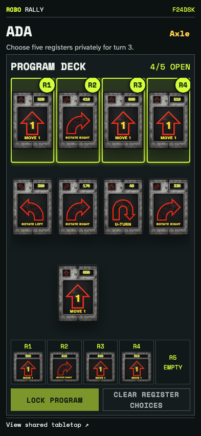

**Verifications:**

- [x] Turn 3 Register 4 visibly contains move-1 priority 510, with the complete hand still inside the phone viewport

## Ada chooses Register 5: rotate-left priority 300

**Verifications:**

- [x] Turn 3 Register 5 visibly contains rotate-left priority 300, with the complete hand still inside the phone viewport

## Ada locks the Turn 3 program

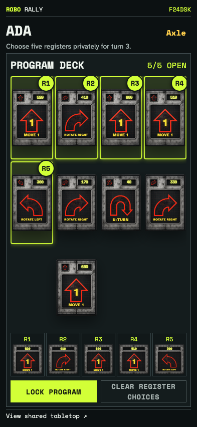

**Verifications:**

- [x] All five Turn 3 registers are visible and the lock action is available without scrolling

## Grace chooses Register 1: move-1 priority 610

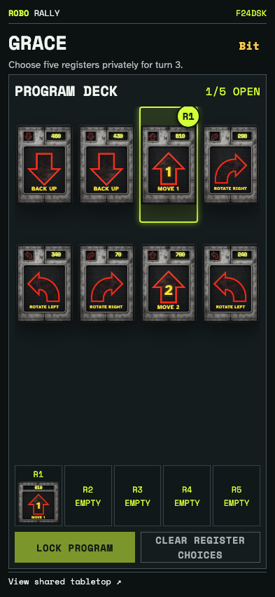

**Verifications:**

- [x] Turn 3 Register 1 visibly contains move-1 priority 610, with the complete hand still inside the phone viewport

## Grace chooses Register 2: rotate-right priority 290

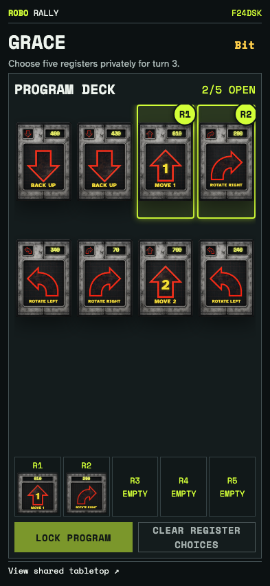

**Verifications:**

- [x] Turn 3 Register 2 visibly contains rotate-right priority 290, with the complete hand still inside the phone viewport

## Grace chooses Register 3: move-2 priority 700

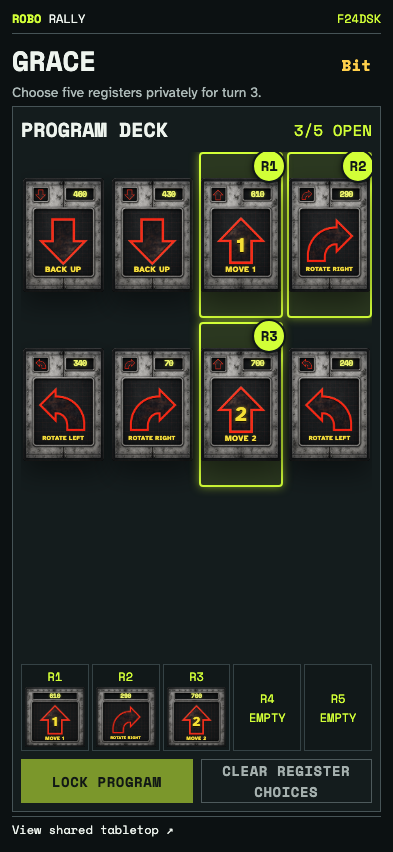

**Verifications:**

- [x] Turn 3 Register 3 visibly contains move-2 priority 700, with the complete hand still inside the phone viewport

## Grace chooses Register 4: back-up priority 460

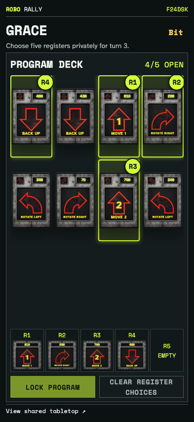

**Verifications:**

- [x] Turn 3 Register 4 visibly contains back-up priority 460, with the complete hand still inside the phone viewport

## Grace chooses Register 5: back-up priority 430

**Verifications:**

- [x] Turn 3 Register 5 visibly contains back-up priority 430, with the complete hand still inside the phone viewport

## Grace locks the Turn 3 program

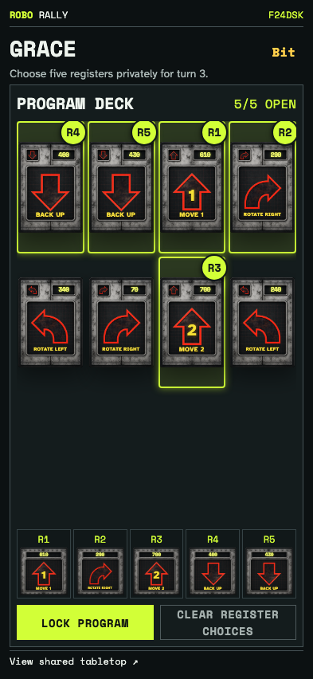

**Verifications:**

- [x] All five Turn 3 registers are visible and the lock action is available without scrolling

## Grace chooses STAY ACTIVE after Turn 3 programming

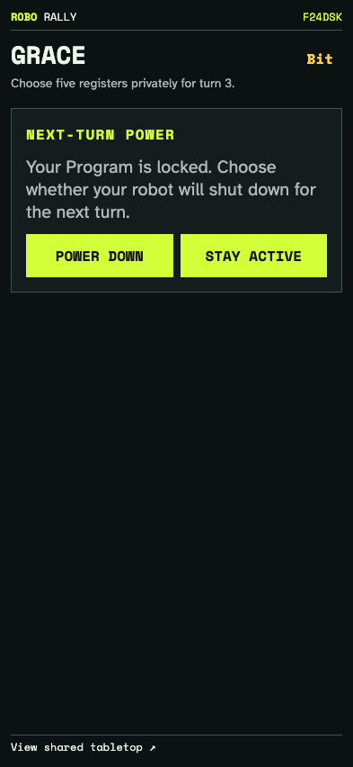

**Verifications:**

- [x] The Turn 3 power choice is legible, unobstructed, and STAY ACTIVE is available

## The tabletop completes Turn 3 playback

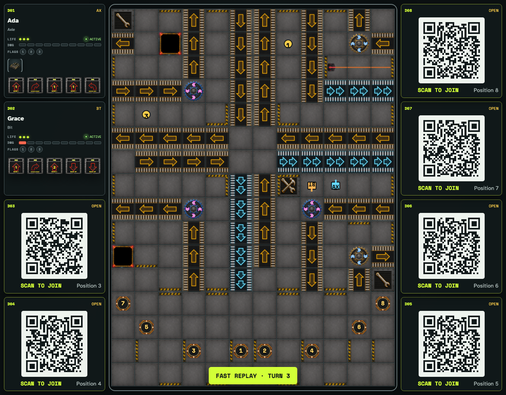

**Verifications:**

- [x] The Turn 3 board result and every public player state are visible before Turn 4

## Ada opens the private Turn 4 hand

**Verifications:**

- [x] Turn 4 remains closed until Ada explicitly opens the next private hand

## Grace opens the private Turn 4 hand

**Verifications:**

- [x] Turn 4 remains closed until Grace explicitly opens the next private hand

## Ada chooses Register 1: move-2 priority 750

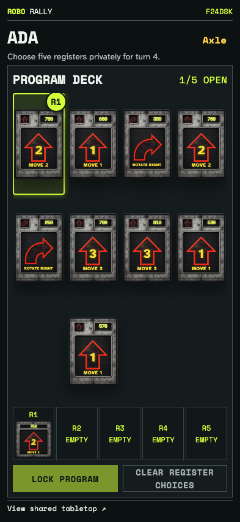

**Verifications:**

- [x] Turn 4 Register 1 visibly contains move-2 priority 750, with the complete hand still inside the phone viewport

## Ada chooses Register 2: move-1 priority 660

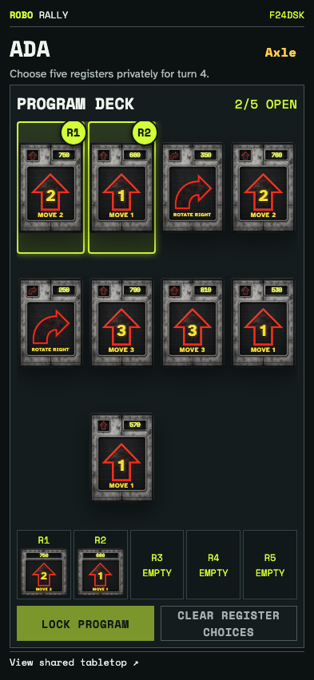

**Verifications:**

- [x] Turn 4 Register 2 visibly contains move-1 priority 660, with the complete hand still inside the phone viewport

## Ada chooses Register 3: rotate-right priority 350

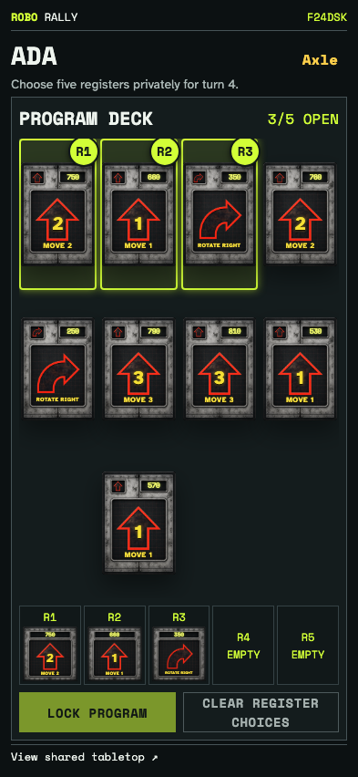

**Verifications:**

- [x] Turn 4 Register 3 visibly contains rotate-right priority 350, with the complete hand still inside the phone viewport

## Ada chooses Register 4: move-2 priority 760

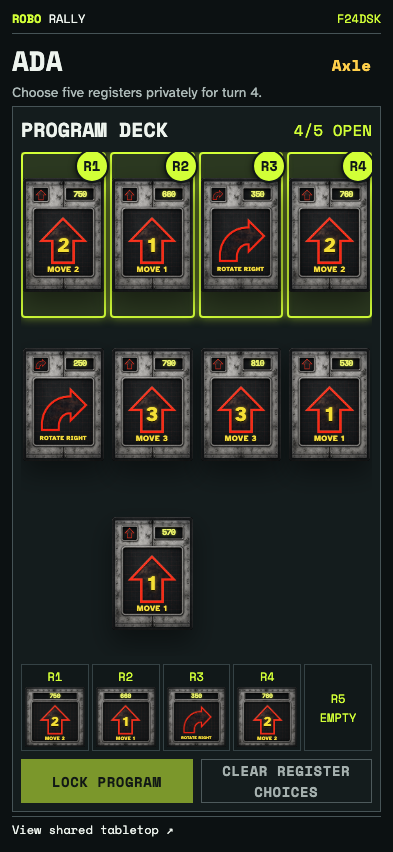

**Verifications:**

- [x] Turn 4 Register 4 visibly contains move-2 priority 760, with the complete hand still inside the phone viewport

## Ada chooses Register 5: rotate-right priority 250

**Verifications:**

- [x] Turn 4 Register 5 visibly contains rotate-right priority 250, with the complete hand still inside the phone viewport

## Ada locks the Turn 4 program

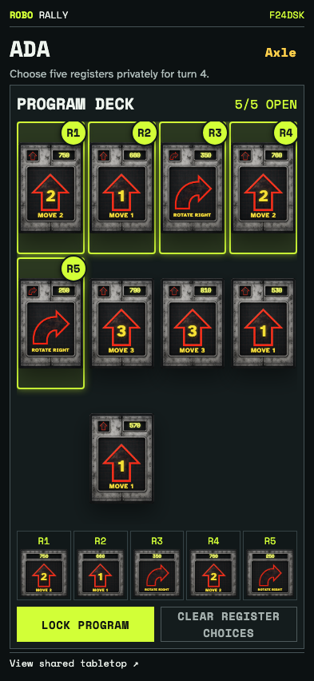

**Verifications:**

- [x] All five Turn 4 registers are visible and the lock action is available without scrolling

## Grace chooses Register 1: rotate-right priority 410

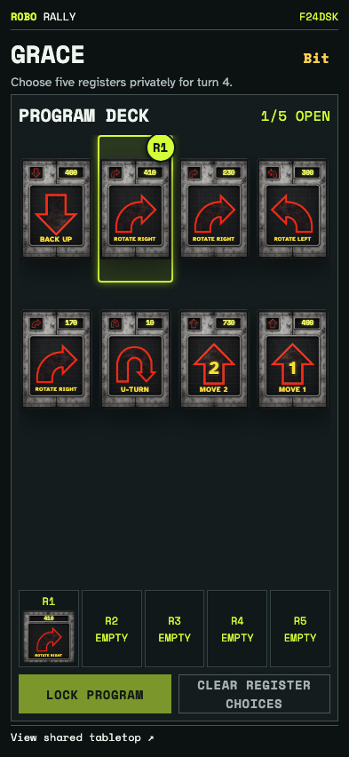

**Verifications:**

- [x] Turn 4 Register 1 visibly contains rotate-right priority 410, with the complete hand still inside the phone viewport

## Grace chooses Register 2: back-up priority 460

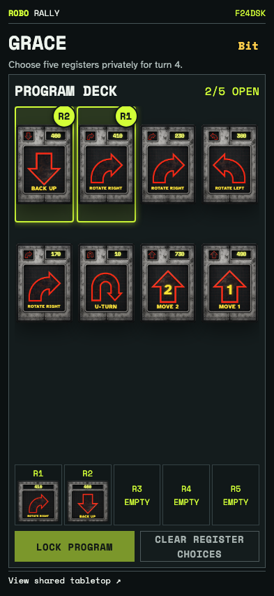

**Verifications:**

- [x] Turn 4 Register 2 visibly contains back-up priority 460, with the complete hand still inside the phone viewport

## Grace chooses Register 3: rotate-right priority 230

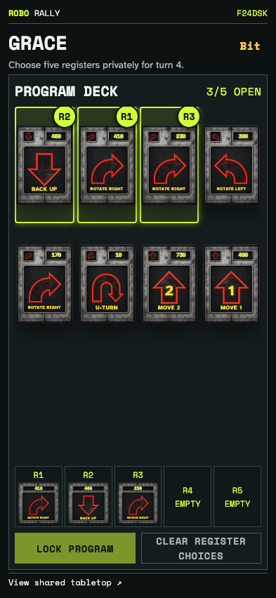

**Verifications:**

- [x] Turn 4 Register 3 visibly contains rotate-right priority 230, with the complete hand still inside the phone viewport

## Grace chooses Register 4: rotate-left priority 300

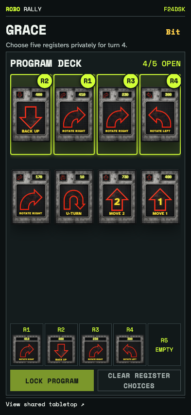

**Verifications:**

- [x] Turn 4 Register 4 visibly contains rotate-left priority 300, with the complete hand still inside the phone viewport

## Grace chooses Register 5: move-2 priority 730

**Verifications:**

- [x] Turn 4 Register 5 visibly contains move-2 priority 730, with the complete hand still inside the phone viewport

## Grace locks the Turn 4 program

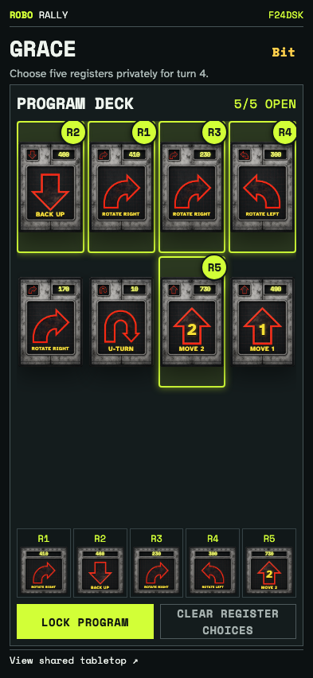

**Verifications:**

- [x] All five Turn 4 registers are visible and the lock action is available without scrolling

## Grace chooses STAY ACTIVE after Turn 4 programming

**Verifications:**

- [x] The Turn 4 power choice is legible, unobstructed, and STAY ACTIVE is available

## The tabletop completes Turn 4 playback

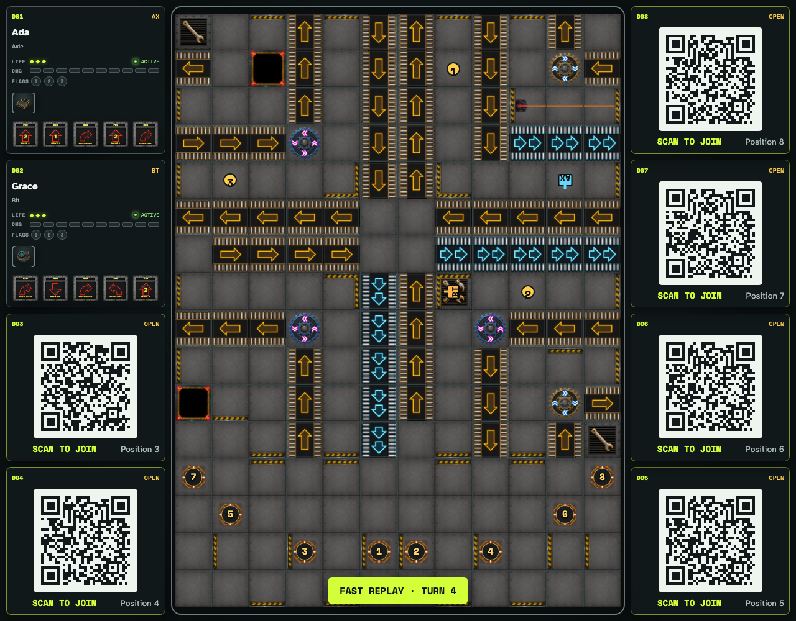

**Verifications:**

- [x] The Turn 4 board result and every public player state are visible before Turn 5

## Ada opens the private Turn 5 hand

**Verifications:**

- [x] Turn 5 remains closed until Ada explicitly opens the next private hand

## Grace opens the private Turn 5 hand

**Verifications:**

- [x] Turn 5 remains closed until Grace explicitly opens the next private hand

## Ada chooses Register 1: rotate-right priority 350

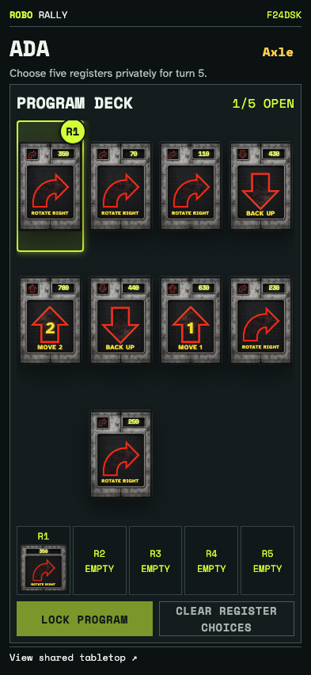

**Verifications:**

- [x] Turn 5 Register 1 visibly contains rotate-right priority 350, with the complete hand still inside the phone viewport

## Ada chooses Register 2: rotate-right priority 70

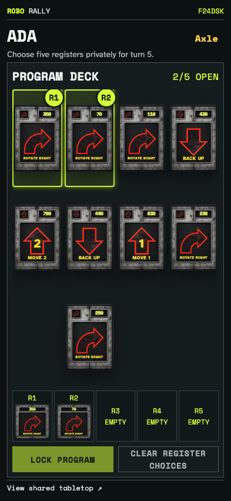

**Verifications:**

- [x] Turn 5 Register 2 visibly contains rotate-right priority 70, with the complete hand still inside the phone viewport

## Ada chooses Register 3: move-2 priority 780

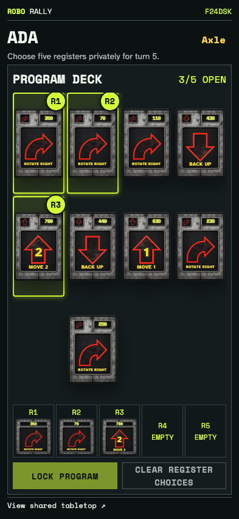

**Verifications:**

- [x] Turn 5 Register 3 visibly contains move-2 priority 780, with the complete hand still inside the phone viewport

## Ada chooses Register 4: move-1 priority 630

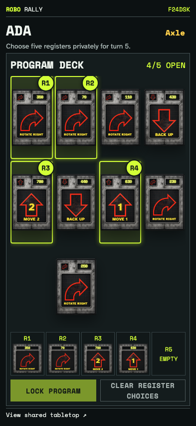

**Verifications:**

- [x] Turn 5 Register 4 visibly contains move-1 priority 630, with the complete hand still inside the phone viewport

## Ada chooses Register 5: back-up priority 430

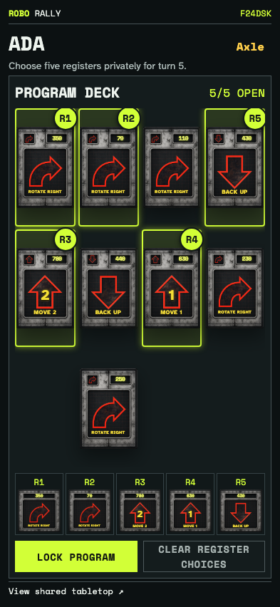

**Verifications:**

- [x] Turn 5 Register 5 visibly contains back-up priority 430, with the complete hand still inside the phone viewport

## Ada locks the Turn 5 program

**Verifications:**

- [x] All five Turn 5 registers are visible and the lock action is available without scrolling

## Grace chooses Register 1: move-3 priority 820

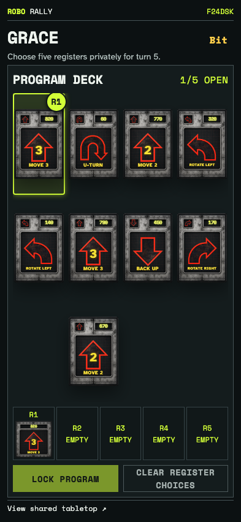

**Verifications:**

- [x] Turn 5 Register 1 visibly contains move-3 priority 820, with the complete hand still inside the phone viewport

## Grace chooses Register 2: u-turn priority 60

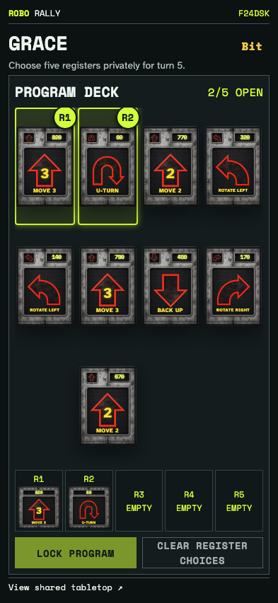

**Verifications:**

- [x] Turn 5 Register 2 visibly contains u-turn priority 60, with the complete hand still inside the phone viewport

## Grace chooses Register 3: move-2 priority 770

**Verifications:**

- [x] Turn 5 Register 3 visibly contains move-2 priority 770, with the complete hand still inside the phone viewport

## Grace chooses Register 4: rotate-left priority 320

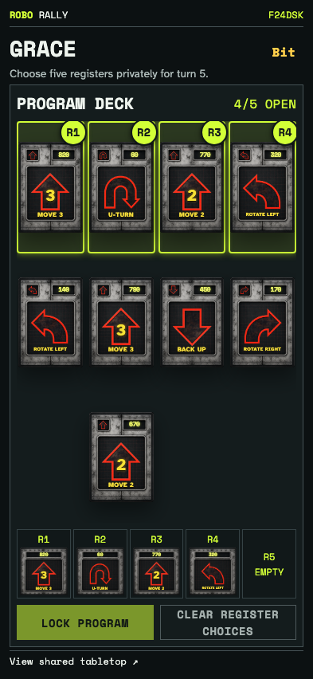

**Verifications:**

- [x] Turn 5 Register 4 visibly contains rotate-left priority 320, with the complete hand still inside the phone viewport

## Grace chooses Register 5: rotate-left priority 140

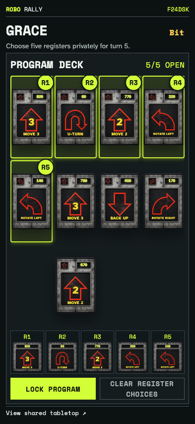

**Verifications:**

- [x] Turn 5 Register 5 visibly contains rotate-left priority 140, with the complete hand still inside the phone viewport

## Grace locks the Turn 5 program

**Verifications:**

- [x] All five Turn 5 registers are visible and the lock action is available without scrolling

## Ada chooses to take the incoming damage

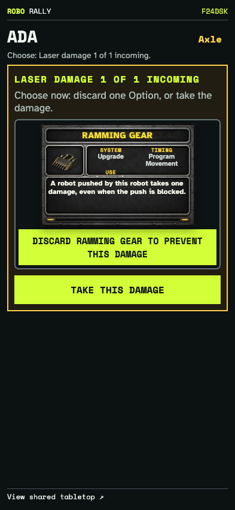

**Verifications:**

- [x] The complete damage-prevention decision and its Option choices are visible before damage is accepted

## The tabletop completes Turn 5 playback

**Verifications:**

- [x] The Turn 5 board result and every public player state are visible before Turn 6

## Ada opens the private Turn 6 hand

**Verifications:**

- [x] Turn 6 remains closed until Ada explicitly opens the next private hand

## Grace opens the private Turn 6 hand

**Verifications:**

- [x] Turn 6 remains closed until Grace explicitly opens the next private hand

## Ada chooses Register 1: u-turn priority 60

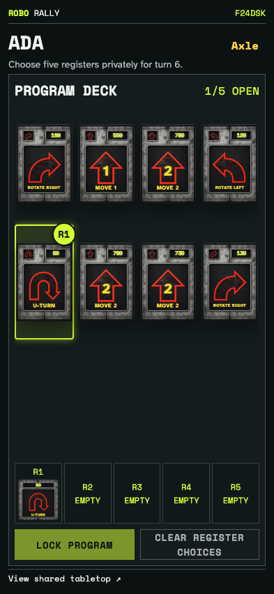

**Verifications:**

- [x] Turn 6 Register 1 visibly contains u-turn priority 60, with the complete hand still inside the phone viewport

## Ada chooses Register 2: move-2 priority 780

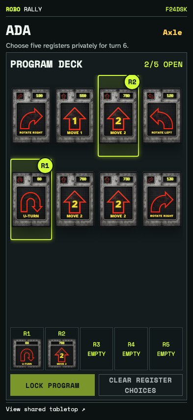

**Verifications:**

- [x] Turn 6 Register 2 visibly contains move-2 priority 780, with the complete hand still inside the phone viewport

## Ada chooses Register 3: rotate-left priority 120

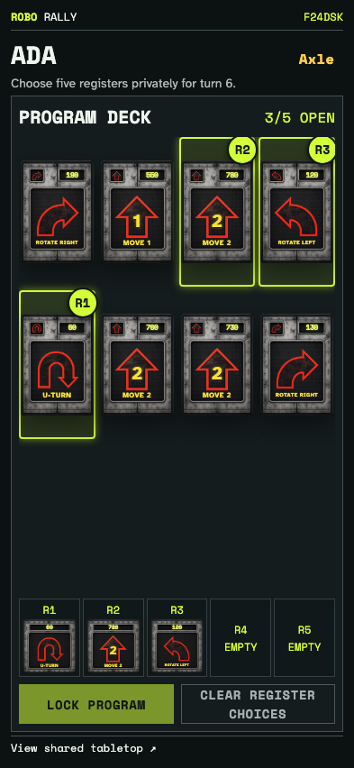

**Verifications:**

- [x] Turn 6 Register 3 visibly contains rotate-left priority 120, with the complete hand still inside the phone viewport

## Ada chooses Register 4: move-1 priority 550

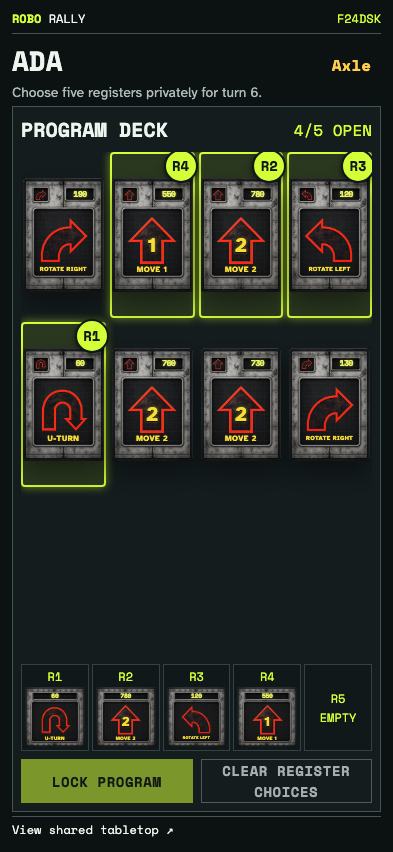

**Verifications:**

- [x] Turn 6 Register 4 visibly contains move-1 priority 550, with the complete hand still inside the phone viewport

## Ada chooses Register 5: move-2 priority 760

**Verifications:**

- [x] Turn 6 Register 5 visibly contains move-2 priority 760, with the complete hand still inside the phone viewport

## Ada locks the Turn 6 program

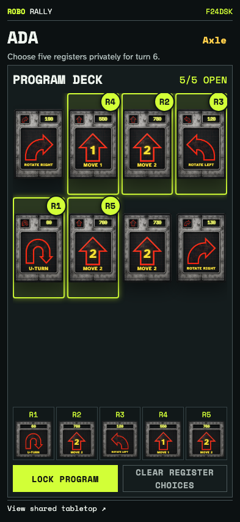

**Verifications:**

- [x] All five Turn 6 registers are visible and the lock action is available without scrolling

## Grace chooses Register 1: move-2 priority 750

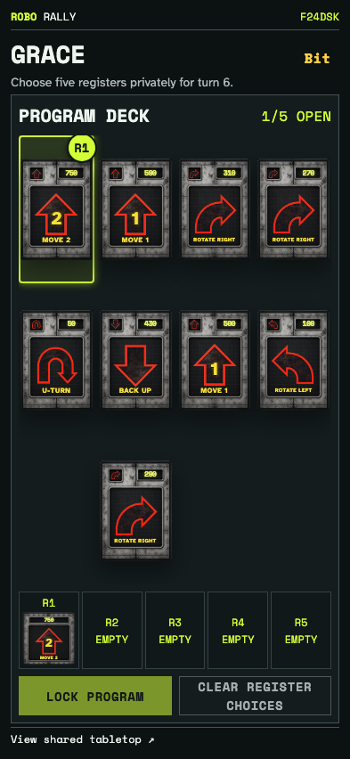

**Verifications:**

- [x] Turn 6 Register 1 visibly contains move-2 priority 750, with the complete hand still inside the phone viewport

## Grace chooses Register 2: move-1 priority 590

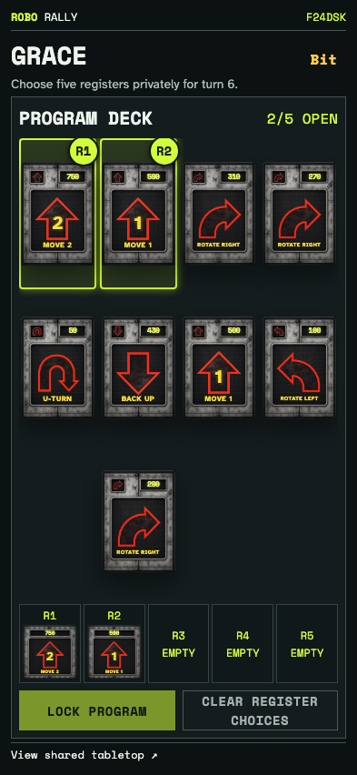

**Verifications:**

- [x] Turn 6 Register 2 visibly contains move-1 priority 590, with the complete hand still inside the phone viewport

## Grace chooses Register 3: rotate-right priority 310

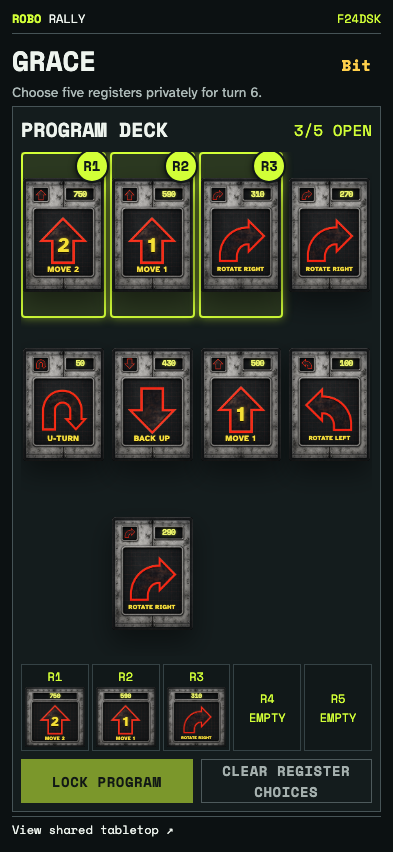

**Verifications:**

- [x] Turn 6 Register 3 visibly contains rotate-right priority 310, with the complete hand still inside the phone viewport

## Grace chooses Register 4: rotate-right priority 270

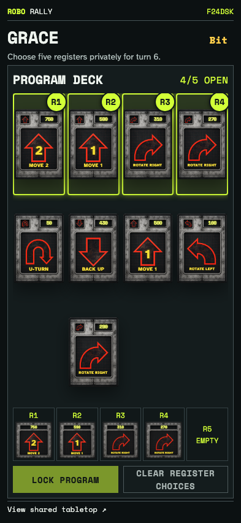

**Verifications:**

- [x] Turn 6 Register 4 visibly contains rotate-right priority 270, with the complete hand still inside the phone viewport

## Grace chooses Register 5: u-turn priority 50

**Verifications:**

- [x] Turn 6 Register 5 visibly contains u-turn priority 50, with the complete hand still inside the phone viewport

## Grace locks the Turn 6 program

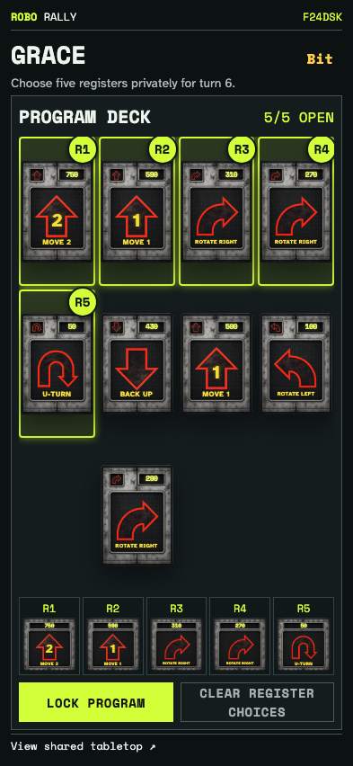

**Verifications:**

- [x] All five Turn 6 registers are visible and the lock action is available without scrolling

## Ada chooses STAY ACTIVE after Turn 6 programming

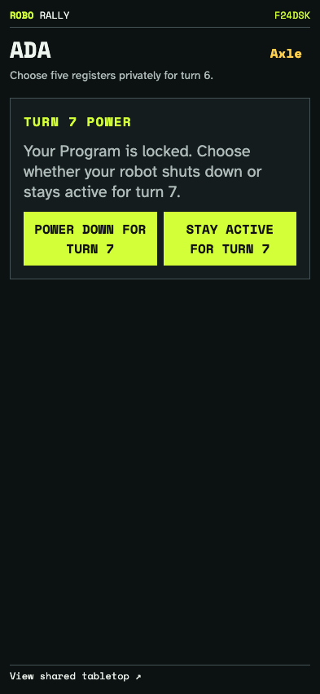

**Verifications:**

- [x] The Turn 6 power choice is legible, unobstructed, and STAY ACTIVE is available

## The tabletop completes Turn 6 playback

**Verifications:**

- [x] The Turn 6 board result and every public player state are visible before Turn 7

## Ada opens the private Turn 7 hand

**Verifications:**

- [x] Turn 7 remains closed until Ada explicitly opens the next private hand

## Grace opens the private Turn 7 hand

**Verifications:**

- [x] Turn 7 remains closed until Grace explicitly opens the next private hand

## Ada chooses Register 1: move-1 priority 660

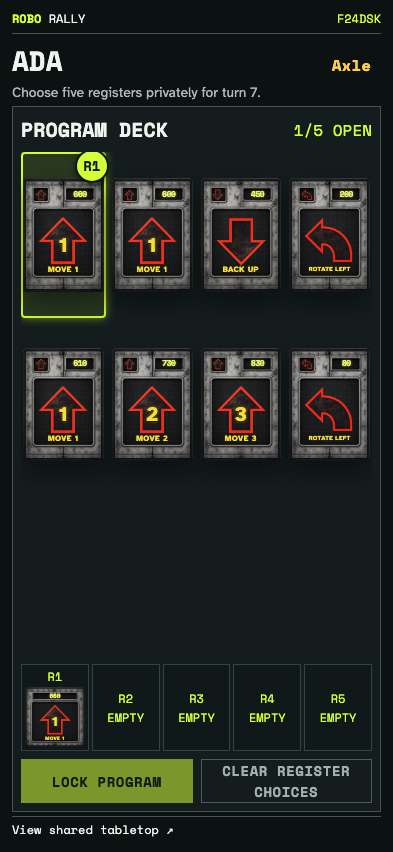

**Verifications:**

- [x] Turn 7 Register 1 visibly contains move-1 priority 660, with the complete hand still inside the phone viewport

## Ada chooses Register 2: rotate-left priority 200

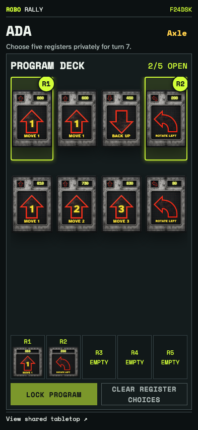

**Verifications:**

- [x] Turn 7 Register 2 visibly contains rotate-left priority 200, with the complete hand still inside the phone viewport

## Ada chooses Register 3: move-3 priority 830

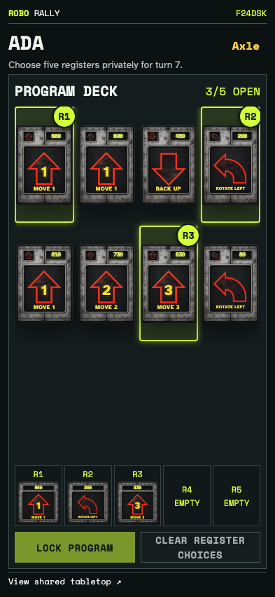

**Verifications:**

- [x] Turn 7 Register 3 visibly contains move-3 priority 830, with the complete hand still inside the phone viewport

## Ada chooses Register 4: rotate-left priority 80

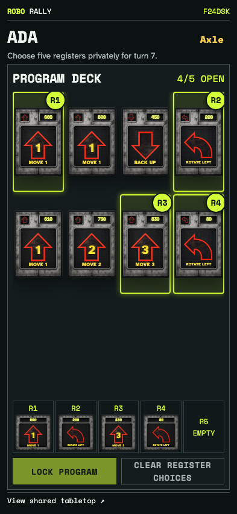

**Verifications:**

- [x] Turn 7 Register 4 visibly contains rotate-left priority 80, with the complete hand still inside the phone viewport

## Ada chooses Register 5: back-up priority 450

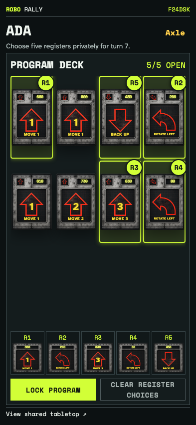

**Verifications:**

- [x] Turn 7 Register 5 visibly contains back-up priority 450, with the complete hand still inside the phone viewport

## Ada locks the Turn 7 program

**Verifications:**

- [x] All five Turn 7 registers are visible and the lock action is available without scrolling

## Grace chooses Register 1: rotate-left priority 220

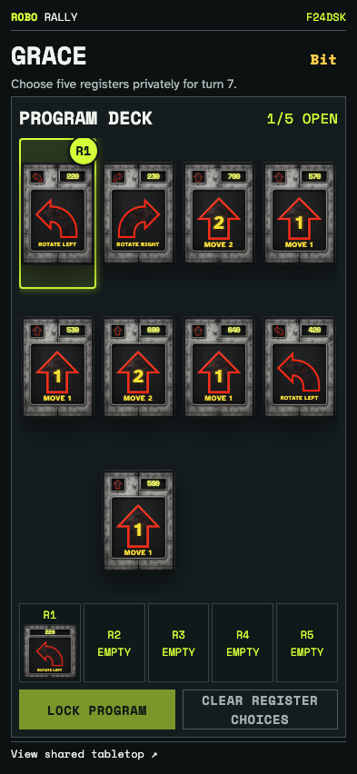

**Verifications:**

- [x] Turn 7 Register 1 visibly contains rotate-left priority 220, with the complete hand still inside the phone viewport

## Grace chooses Register 2: rotate-right priority 230

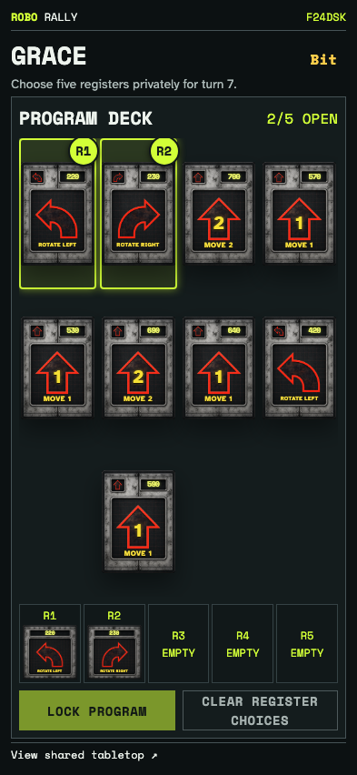

**Verifications:**

- [x] Turn 7 Register 2 visibly contains rotate-right priority 230, with the complete hand still inside the phone viewport

## Grace chooses Register 3: move-2 priority 700

**Verifications:**

- [x] Turn 7 Register 3 visibly contains move-2 priority 700, with the complete hand still inside the phone viewport

## Grace chooses Register 4: move-1 priority 570

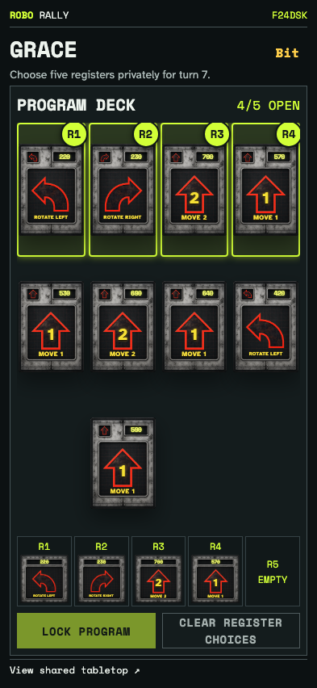

**Verifications:**

- [x] Turn 7 Register 4 visibly contains move-1 priority 570, with the complete hand still inside the phone viewport

## Grace chooses Register 5: move-1 priority 530

**Verifications:**

- [x] Turn 7 Register 5 visibly contains move-1 priority 530, with the complete hand still inside the phone viewport

## Grace locks the Turn 7 program

**Verifications:**

- [x] All five Turn 7 registers are visible and the lock action is available without scrolling

## Ada chooses STAY ACTIVE after Turn 7 programming

**Verifications:**

- [x] The Turn 7 power choice is legible, unobstructed, and STAY ACTIVE is available

## The tabletop completes Turn 7 playback

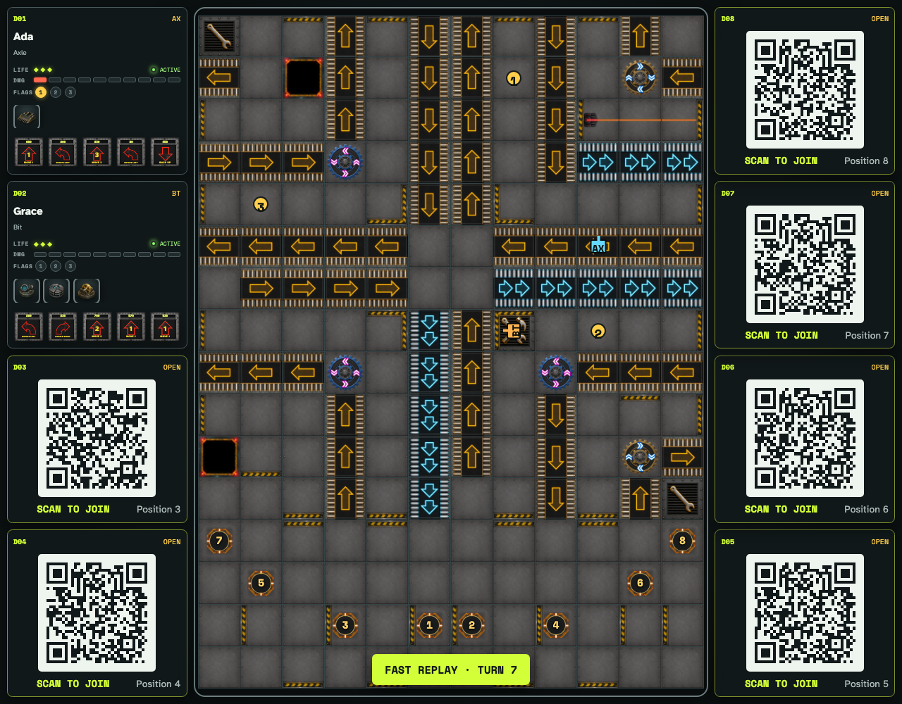

**Verifications:**

- [x] The Turn 7 board result and every public player state are visible before Turn 8

## Ada opens the private Turn 8 hand

**Verifications:**

- [x] Turn 8 remains closed until Ada explicitly opens the next private hand

## Grace opens the private Turn 8 hand

**Verifications:**

- [x] Turn 8 remains closed until Grace explicitly opens the next private hand

## Ada chooses Register 1: rotate-right priority 150

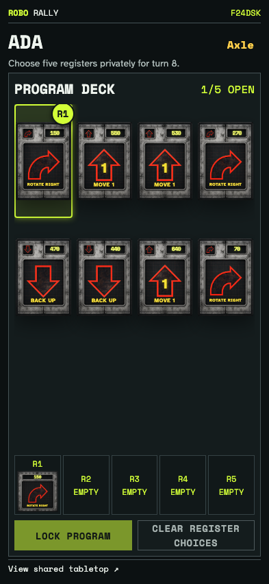

**Verifications:**

- [x] Turn 8 Register 1 visibly contains rotate-right priority 150, with the complete hand still inside the phone viewport

## Ada chooses Register 2: rotate-right priority 270

**Verifications:**

- [x] Turn 8 Register 2 visibly contains rotate-right priority 270, with the complete hand still inside the phone viewport

## Ada chooses Register 3: move-1 priority 550

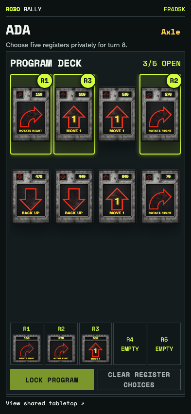

**Verifications:**

- [x] Turn 8 Register 3 visibly contains move-1 priority 550, with the complete hand still inside the phone viewport

## Ada chooses Register 4: move-1 priority 530

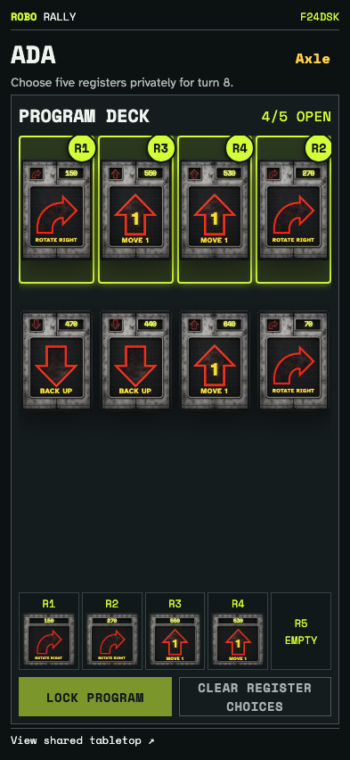

**Verifications:**

- [x] Turn 8 Register 4 visibly contains move-1 priority 530, with the complete hand still inside the phone viewport

## Ada chooses Register 5: move-1 priority 640

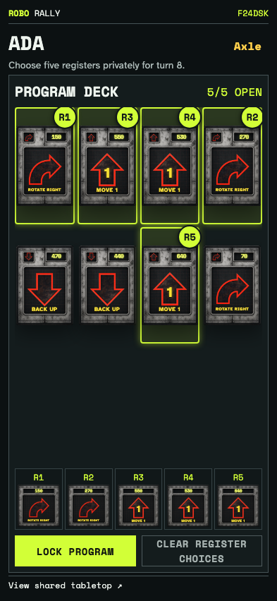

**Verifications:**

- [x] Turn 8 Register 5 visibly contains move-1 priority 640, with the complete hand still inside the phone viewport

## Ada locks the Turn 8 program

**Verifications:**

- [x] All five Turn 8 registers are visible and the lock action is available without scrolling

## Grace chooses Register 1: rotate-right priority 230

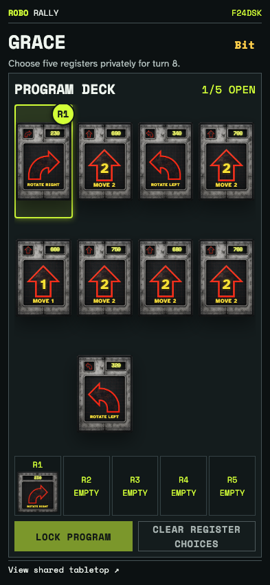

**Verifications:**

- [x] Turn 8 Register 1 visibly contains rotate-right priority 230, with the complete hand still inside the phone viewport

## Grace chooses Register 2: move-2 priority 690

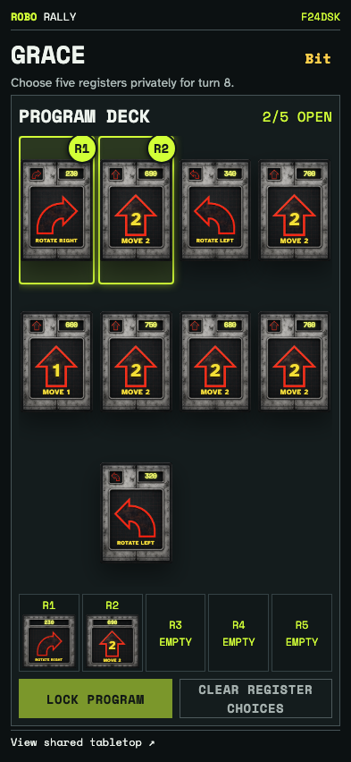

**Verifications:**

- [x] Turn 8 Register 2 visibly contains move-2 priority 690, with the complete hand still inside the phone viewport

## Grace chooses Register 3: rotate-left priority 340

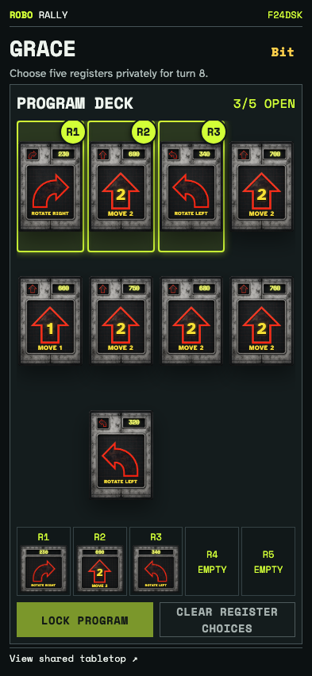

**Verifications:**

- [x] Turn 8 Register 3 visibly contains rotate-left priority 340, with the complete hand still inside the phone viewport

## Grace chooses Register 4: move-2 priority 700

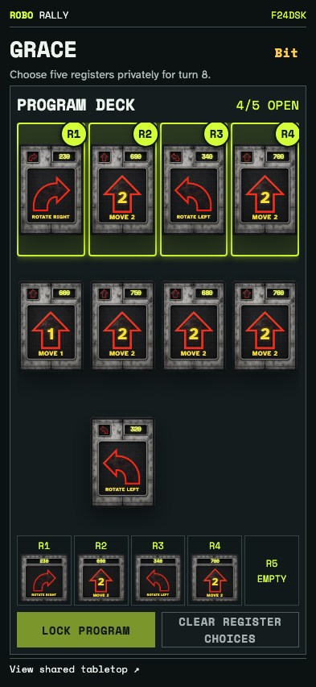

**Verifications:**

- [x] Turn 8 Register 4 visibly contains move-2 priority 700, with the complete hand still inside the phone viewport

## Grace chooses Register 5: move-1 priority 660

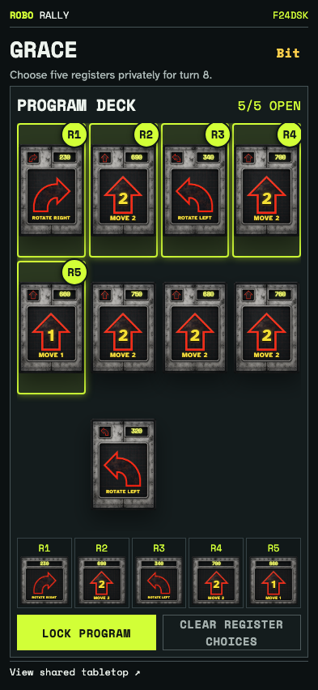

**Verifications:**

- [x] Turn 8 Register 5 visibly contains move-1 priority 660, with the complete hand still inside the phone viewport

## Grace locks the Turn 8 program

**Verifications:**

- [x] All five Turn 8 registers are visible and the lock action is available without scrolling

## Ada chooses STAY ACTIVE after Turn 8 programming

**Verifications:**

- [x] The Turn 8 power choice is legible, unobstructed, and STAY ACTIVE is available

## Grace answers the Option decision with Store no card

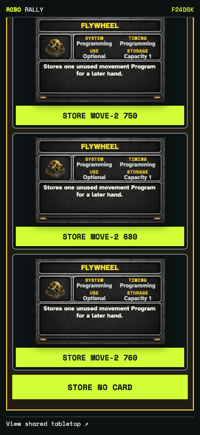

**Verifications:**

- [x] The execution-time Option prompt, its card choices, and the selected response are fully visible

## The tabletop completes Turn 8 playback

**Verifications:**

- [x] The Turn 8 board result and every public player state are visible before Turn 9

## Ada opens the private Turn 9 hand

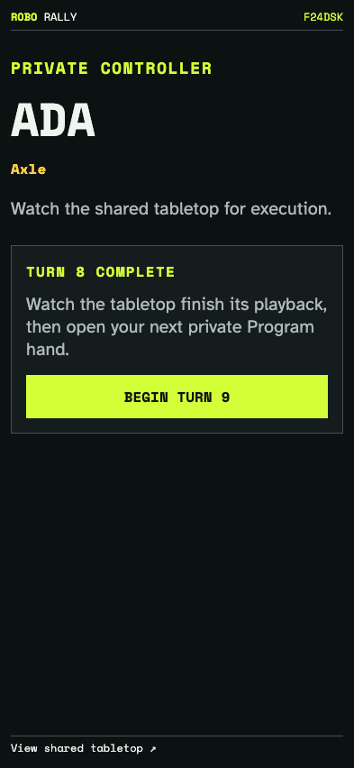

**Verifications:**

- [x] Turn 9 remains closed until Ada explicitly opens the next private hand

## Grace opens the private Turn 9 hand

**Verifications:**

- [x] Turn 9 remains closed until Grace explicitly opens the next private hand

## Ada chooses Register 1: move-1 priority 560

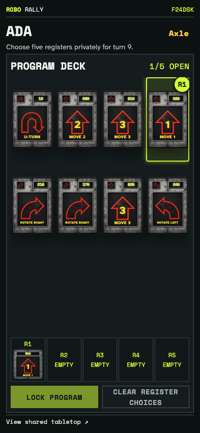

**Verifications:**

- [x] Turn 9 Register 1 visibly contains move-1 priority 560, with the complete hand still inside the phone viewport

## Ada chooses Register 2: move-3 priority 810

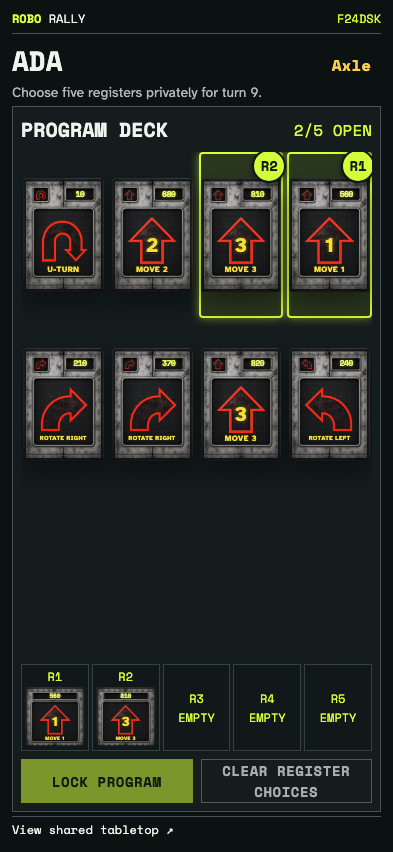

**Verifications:**

- [x] Turn 9 Register 2 visibly contains move-3 priority 810, with the complete hand still inside the phone viewport

## Ada chooses Register 3: rotate-left priority 240

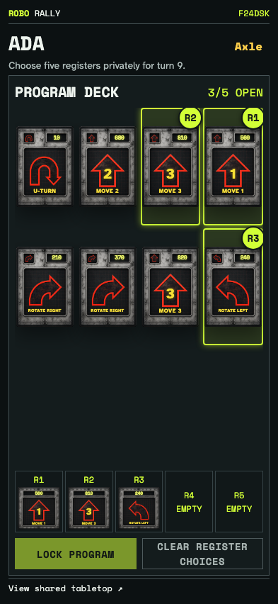

**Verifications:**

- [x] Turn 9 Register 3 visibly contains rotate-left priority 240, with the complete hand still inside the phone viewport

## Ada chooses Register 4: move-3 priority 820

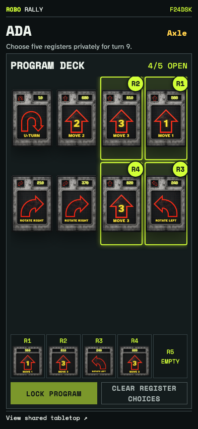

**Verifications:**

- [x] Turn 9 Register 4 visibly contains move-3 priority 820, with the complete hand still inside the phone viewport

## Ada chooses Register 5: u-turn priority 10

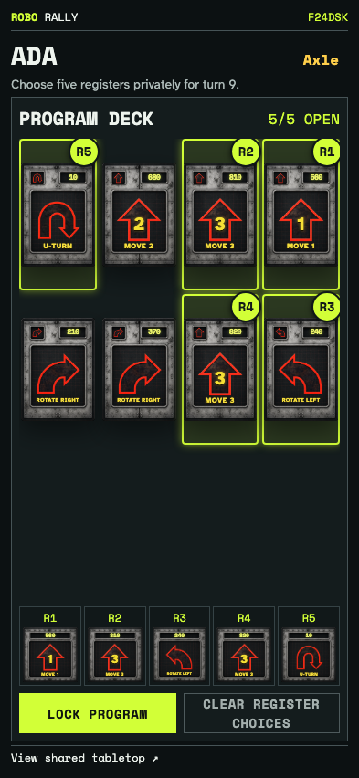

**Verifications:**

- [x] Turn 9 Register 5 visibly contains u-turn priority 10, with the complete hand still inside the phone viewport

## Ada locks the Turn 9 program

**Verifications:**

- [x] All five Turn 9 registers are visible and the lock action is available without scrolling

## Grace chooses Register 1: move-1 priority 520

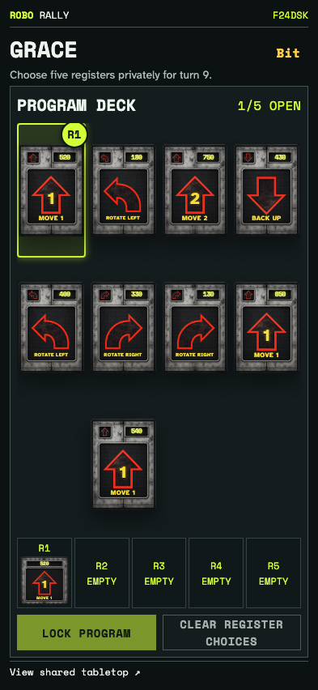

**Verifications:**

- [x] Turn 9 Register 1 visibly contains move-1 priority 520, with the complete hand still inside the phone viewport

## Grace chooses Register 2: rotate-left priority 180

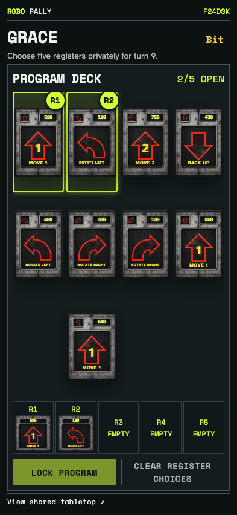

**Verifications:**

- [x] Turn 9 Register 2 visibly contains rotate-left priority 180, with the complete hand still inside the phone viewport

## Grace chooses Register 3: move-2 priority 750

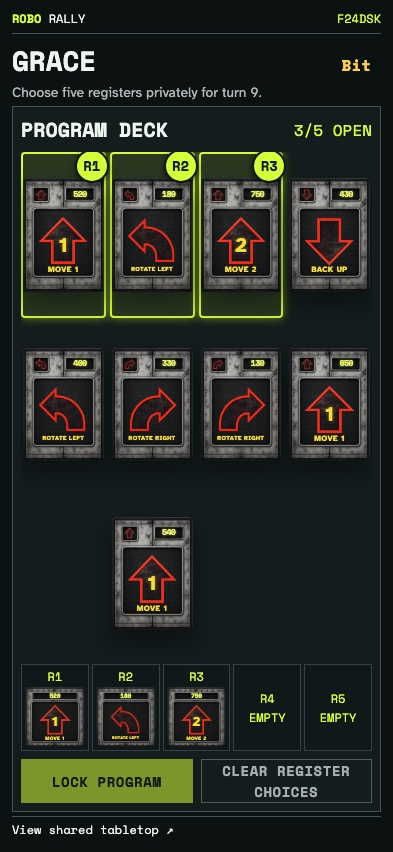

**Verifications:**

- [x] Turn 9 Register 3 visibly contains move-2 priority 750, with the complete hand still inside the phone viewport

## Grace chooses Register 4: back-up priority 430

**Verifications:**

- [x] Turn 9 Register 4 visibly contains back-up priority 430, with the complete hand still inside the phone viewport

## Grace chooses Register 5: rotate-left priority 400

**Verifications:**

- [x] Turn 9 Register 5 visibly contains rotate-left priority 400, with the complete hand still inside the phone viewport

## Grace locks the Turn 9 program

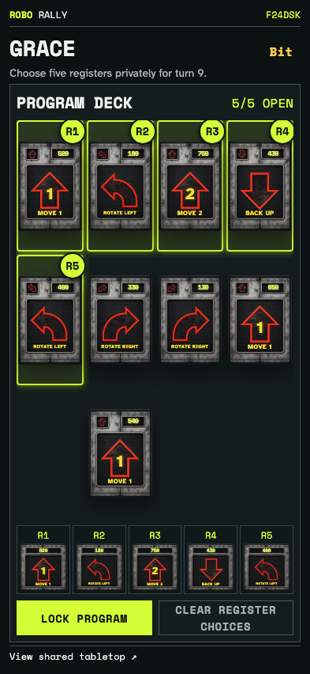

**Verifications:**

- [x] All five Turn 9 registers are visible and the lock action is available without scrolling

## Ada chooses POWER DOWN after Turn 9 programming

**Verifications:**

- [x] The Turn 9 power choice is legible, unobstructed, and POWER DOWN is available

## Grace answers the Option decision with Store no card

**Verifications:**

- [x] The execution-time Option prompt, its card choices, and the selected response are fully visible

## The tabletop completes Turn 9 playback

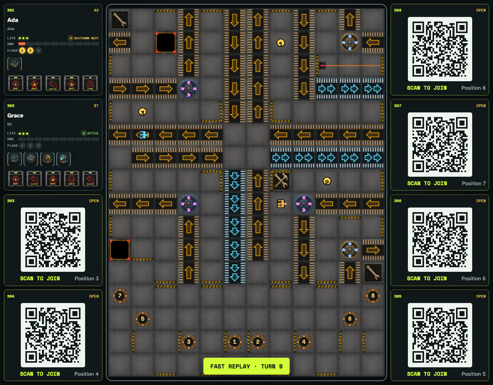

**Verifications:**

- [x] The Turn 9 board result and every public player state are visible before Turn 10

## Ada opens the private Turn 10 hand

**Verifications:**

- [x] Turn 10 remains closed until Ada explicitly opens the next private hand

## Grace opens the private Turn 10 hand

**Verifications:**

- [x] Turn 10 remains closed until Grace explicitly opens the next private hand

## Ada remains powered down during Turn 10 programming

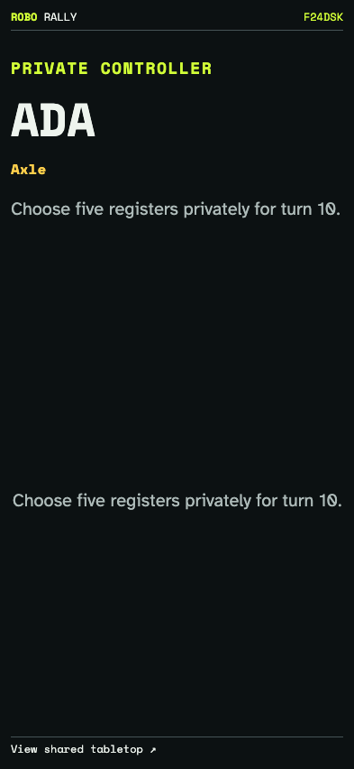

**Verifications:**

- [x] A powered-down racer receives no private Program hand while the active opponent can still program

## Grace chooses Register 1: u-turn priority 20

**Verifications:**

- [x] Turn 10 Register 1 visibly contains u-turn priority 20, with the complete hand still inside the phone viewport

## Grace chooses Register 2: move-1 priority 530

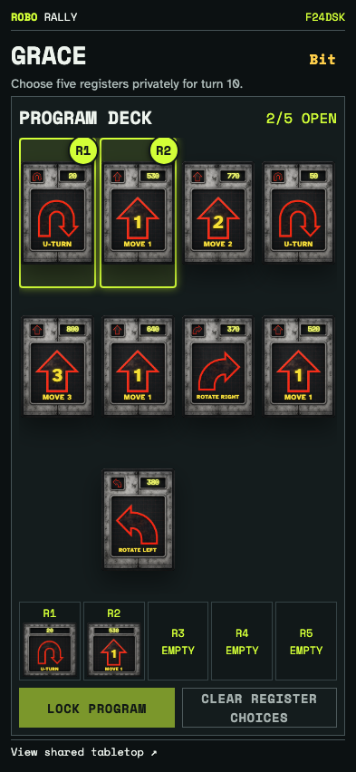

**Verifications:**

- [x] Turn 10 Register 2 visibly contains move-1 priority 530, with the complete hand still inside the phone viewport

## Grace chooses Register 3: move-2 priority 770

**Verifications:**

- [x] Turn 10 Register 3 visibly contains move-2 priority 770, with the complete hand still inside the phone viewport

## Grace chooses Register 4: u-turn priority 50

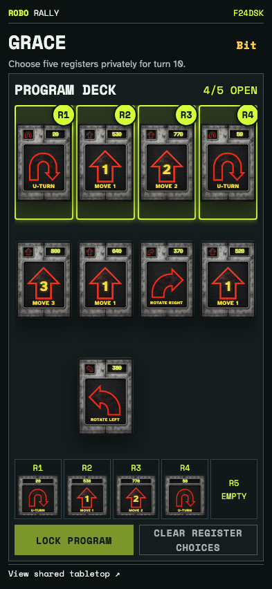

**Verifications:**

- [x] Turn 10 Register 4 visibly contains u-turn priority 50, with the complete hand still inside the phone viewport

## Grace chooses Register 5: move-3 priority 800

**Verifications:**

- [x] Turn 10 Register 5 visibly contains move-3 priority 800, with the complete hand still inside the phone viewport

## Grace locks the Turn 10 program

**Verifications:**

- [x] All five Turn 10 registers are visible and the lock action is available without scrolling

## Ada chooses STAY ACTIVE after Turn 10 programming

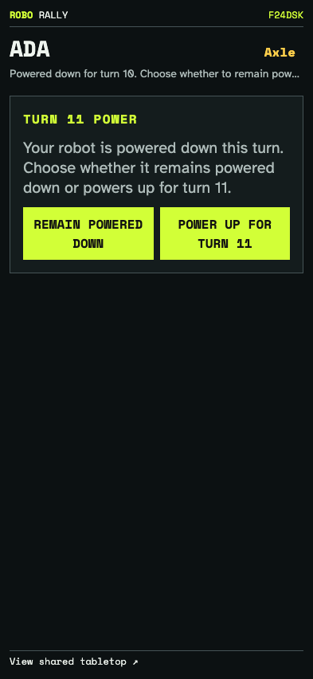

**Verifications:**

- [x] The Turn 10 power choice is legible, unobstructed, and STAY ACTIVE is available

## Grace answers the Option decision with Store no card

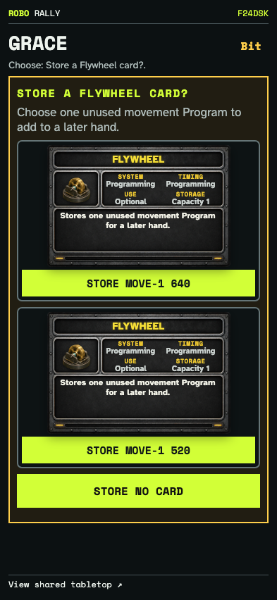

**Verifications:**

- [x] The execution-time Option prompt, its card choices, and the selected response are fully visible

## Ada chooses Discard Ramming Gear

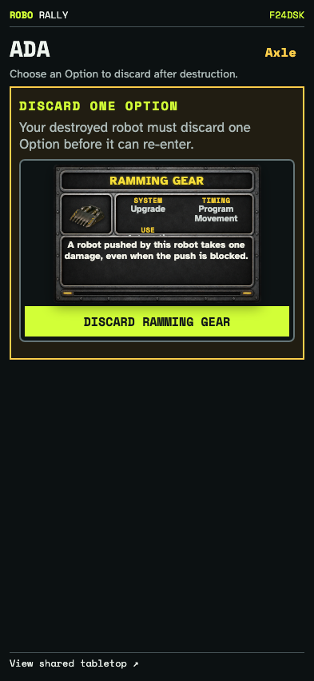

**Verifications:**

- [x] Every discardable Option and the selected destruction penalty are visible on the private controller

## Ada selects re-entry facing north

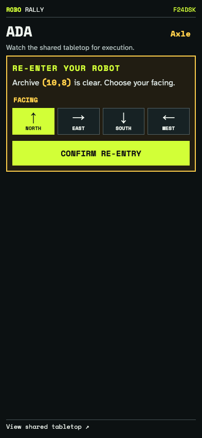

**Verifications:**

- [x] The archive placement and selected re-entry facing are visible

## Ada confirms re-entry

**Verifications:**

- [x] The chosen placement, facing, and confirmation action fit without scrolling

## The tabletop completes Turn 10 playback

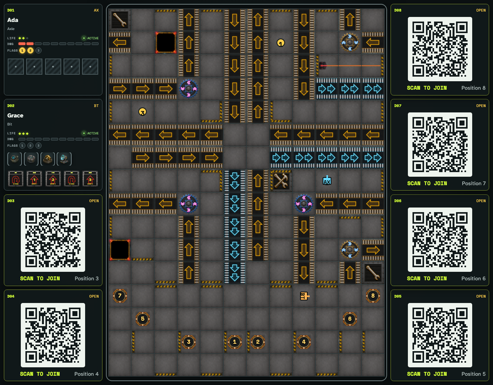

**Verifications:**

- [x] The Turn 10 board result and every public player state are visible before Turn 11

## Ada opens the private Turn 11 hand

**Verifications:**

- [x] Turn 11 remains closed until Ada explicitly opens the next private hand

## Grace opens the private Turn 11 hand

**Verifications:**

- [x] Turn 11 remains closed until Grace explicitly opens the next private hand

## Ada chooses Register 1: move-2 priority 750

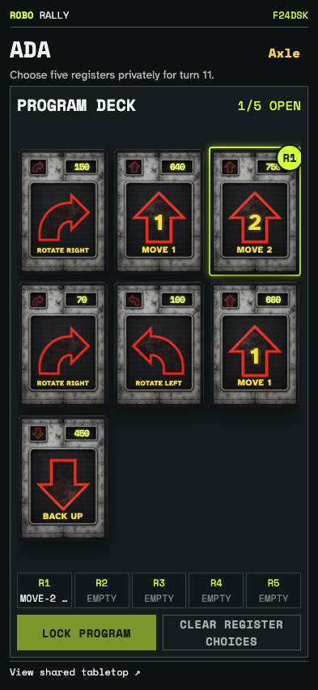

**Verifications:**

- [x] Turn 11 Register 1 visibly contains move-2 priority 750, with the complete hand still inside the phone viewport

## Ada chooses Register 2: rotate-right priority 150

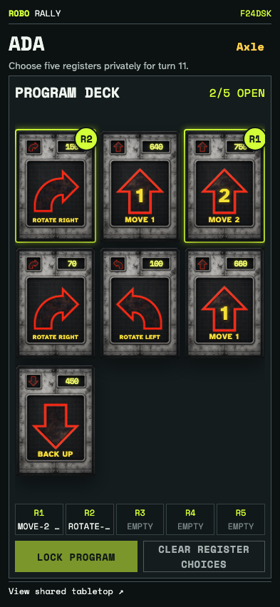

**Verifications:**

- [x] Turn 11 Register 2 visibly contains rotate-right priority 150, with the complete hand still inside the phone viewport

## Ada chooses Register 3: rotate-right priority 70

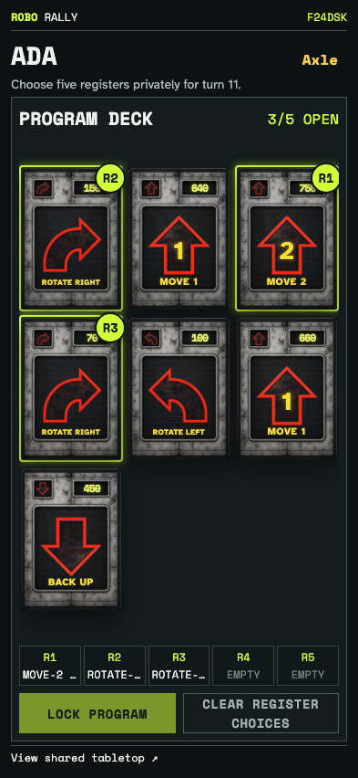

**Verifications:**

- [x] Turn 11 Register 3 visibly contains rotate-right priority 70, with the complete hand still inside the phone viewport

## Ada chooses Register 4: rotate-left priority 100

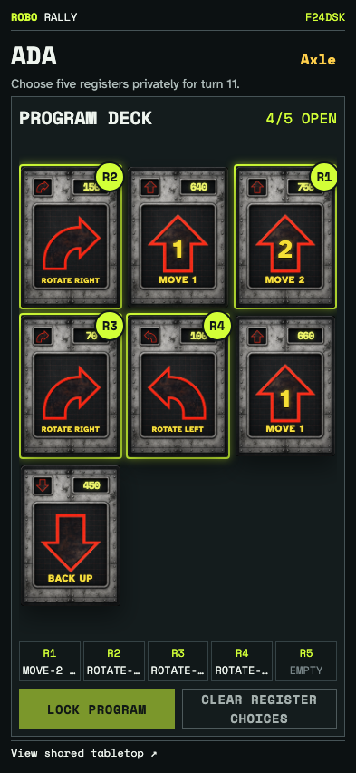

**Verifications:**

- [x] Turn 11 Register 4 visibly contains rotate-left priority 100, with the complete hand still inside the phone viewport

## Ada chooses Register 5: back-up priority 450

**Verifications:**

- [x] Turn 11 Register 5 visibly contains back-up priority 450, with the complete hand still inside the phone viewport

## Ada locks the Turn 11 program

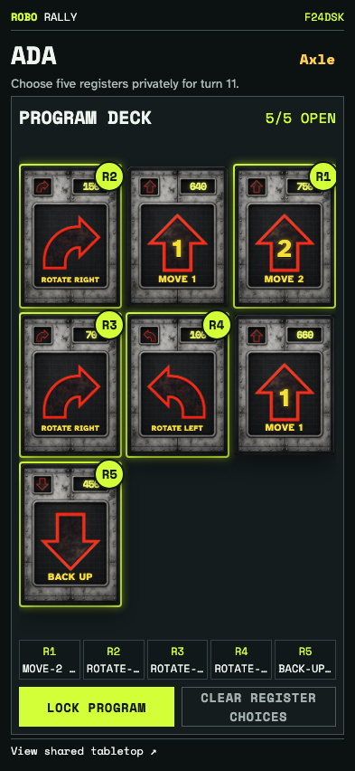

**Verifications:**

- [x] All five Turn 11 registers are visible and the lock action is available without scrolling

## Grace chooses Register 1: move-1 priority 630

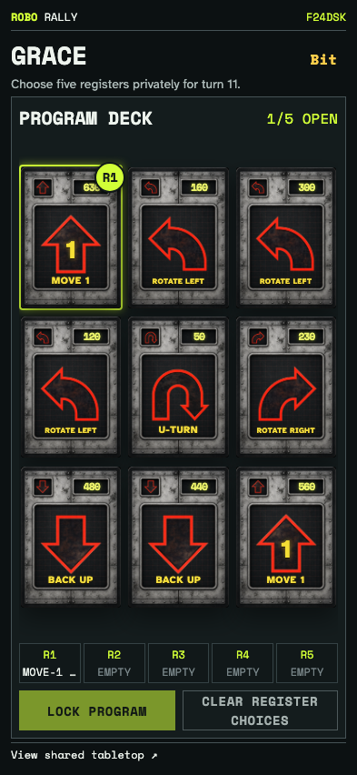

**Verifications:**

- [x] Turn 11 Register 1 visibly contains move-1 priority 630, with the complete hand still inside the phone viewport

## Grace chooses Register 2: rotate-left priority 160

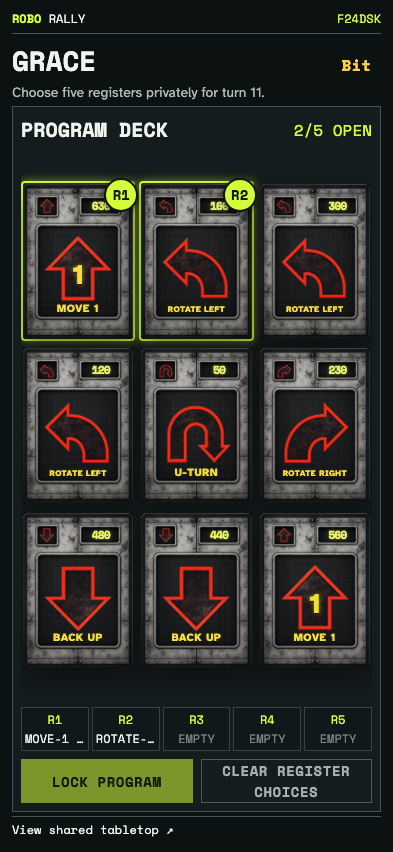

**Verifications:**

- [x] Turn 11 Register 2 visibly contains rotate-left priority 160, with the complete hand still inside the phone viewport

## Grace chooses Register 3: rotate-left priority 300

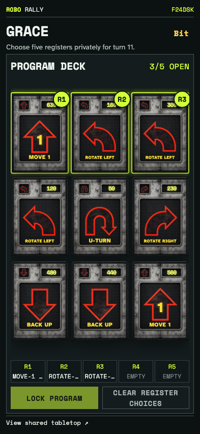

**Verifications:**

- [x] Turn 11 Register 3 visibly contains rotate-left priority 300, with the complete hand still inside the phone viewport

## Grace chooses Register 4: rotate-left priority 120

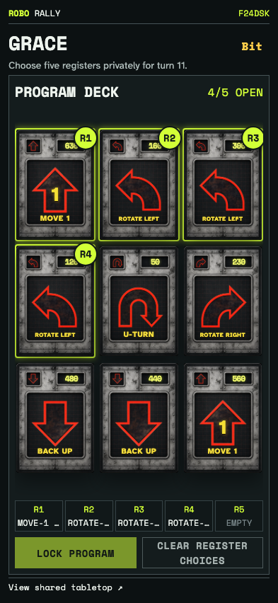

**Verifications:**

- [x] Turn 11 Register 4 visibly contains rotate-left priority 120, with the complete hand still inside the phone viewport

## Grace chooses Register 5: u-turn priority 50

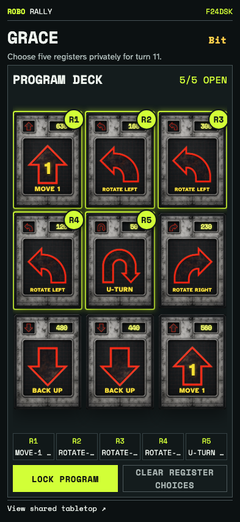

**Verifications:**

- [x] Turn 11 Register 5 visibly contains u-turn priority 50, with the complete hand still inside the phone viewport

## Grace locks the Turn 11 program

**Verifications:**

- [x] All five Turn 11 registers are visible and the lock action is available without scrolling

## Ada chooses STAY ACTIVE after Turn 11 programming

**Verifications:**

- [x] The Turn 11 power choice is legible, unobstructed, and STAY ACTIVE is available

## Grace answers the Option decision with Store no card

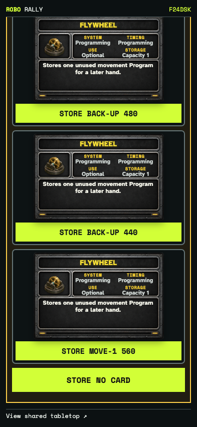

**Verifications:**

- [x] The execution-time Option prompt, its card choices, and the selected response are fully visible

## The tabletop completes Turn 11 playback

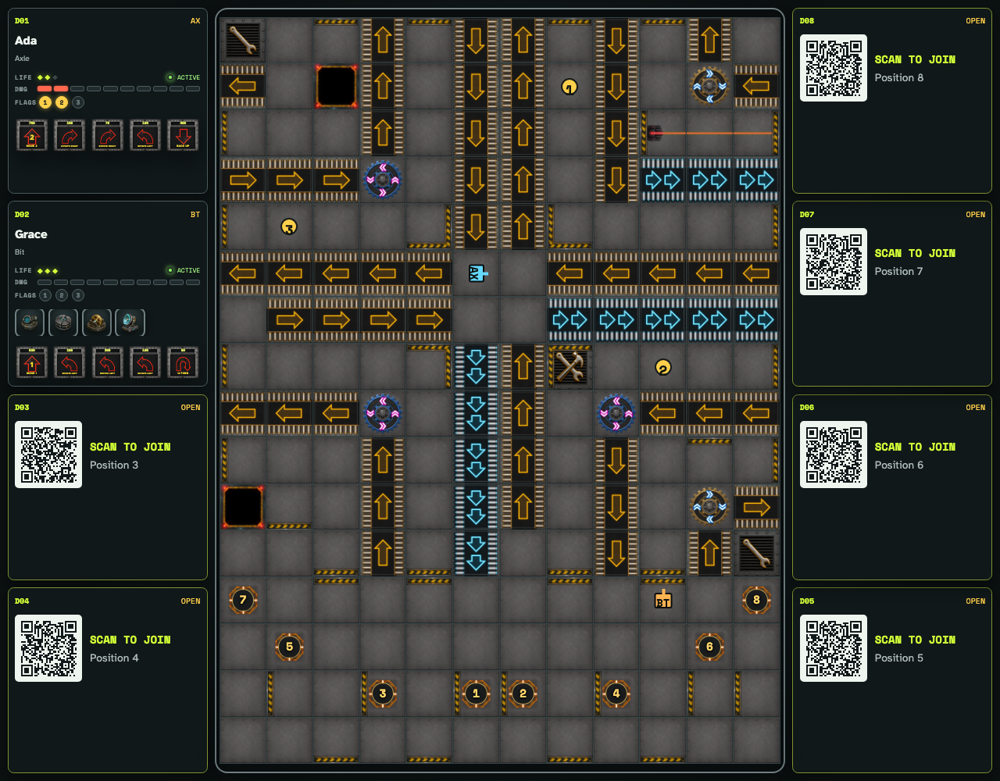

**Verifications:**

- [x] The Turn 11 board result and every public player state are visible before Turn 12

## Ada opens the private Turn 12 hand

**Verifications:**

- [x] Turn 12 remains closed until Ada explicitly opens the next private hand

## Grace opens the private Turn 12 hand

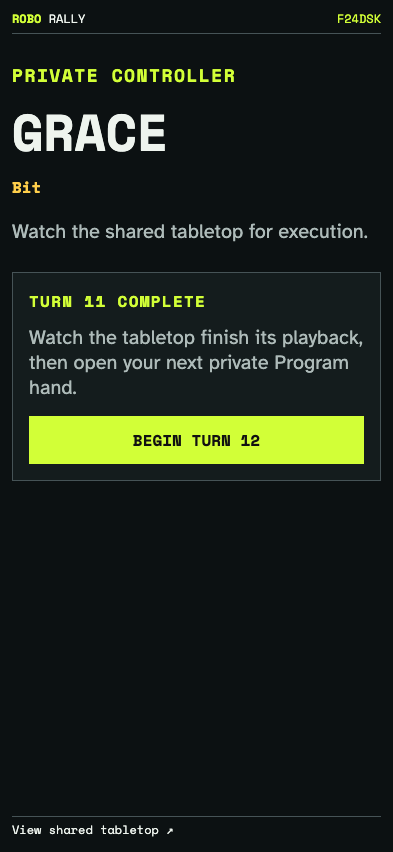

**Verifications:**

- [x] Turn 12 remains closed until Grace explicitly opens the next private hand

## Ada chooses Register 1: move-1 priority 500

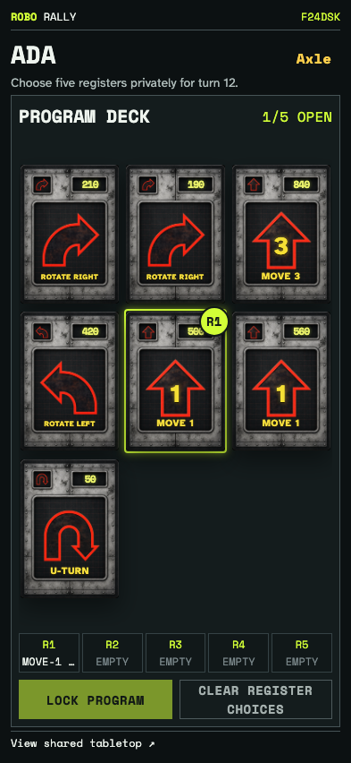

**Verifications:**

- [x] Turn 12 Register 1 visibly contains move-1 priority 500, with the complete hand still inside the phone viewport

## Ada chooses Register 2: u-turn priority 50

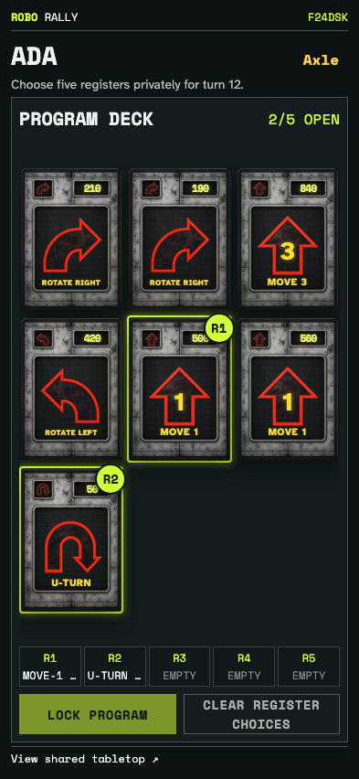

**Verifications:**

- [x] Turn 12 Register 2 visibly contains u-turn priority 50, with the complete hand still inside the phone viewport

## Ada chooses Register 3: move-3 priority 840

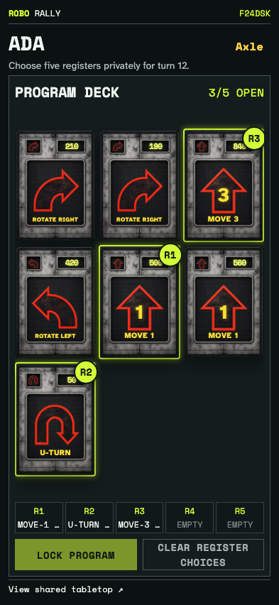

**Verifications:**

- [x] Turn 12 Register 3 visibly contains move-3 priority 840, with the complete hand still inside the phone viewport

## Ada chooses Register 4: rotate-right priority 210

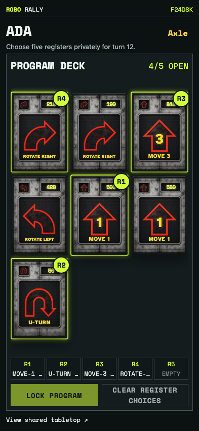

**Verifications:**

- [x] Turn 12 Register 4 visibly contains rotate-right priority 210, with the complete hand still inside the phone viewport

## Ada chooses Register 5: move-1 priority 560

**Verifications:**

- [x] Turn 12 Register 5 visibly contains move-1 priority 560, with the complete hand still inside the phone viewport

## Ada locks the Turn 12 program

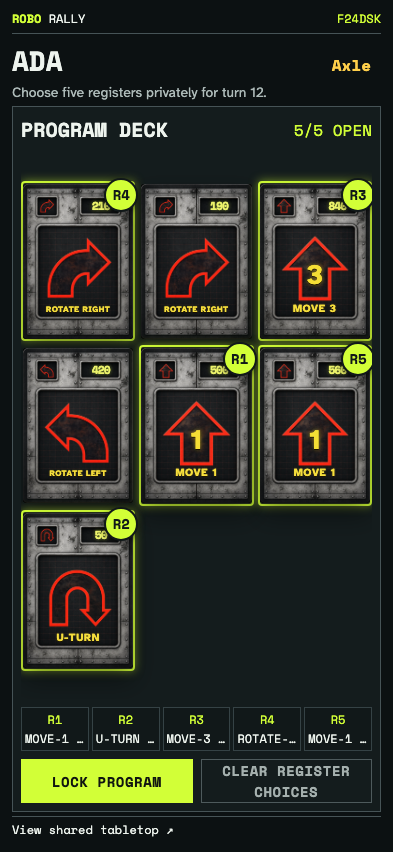

**Verifications:**

- [x] All five Turn 12 registers are visible and the lock action is available without scrolling

## Grace chooses Register 1: move-1 priority 530

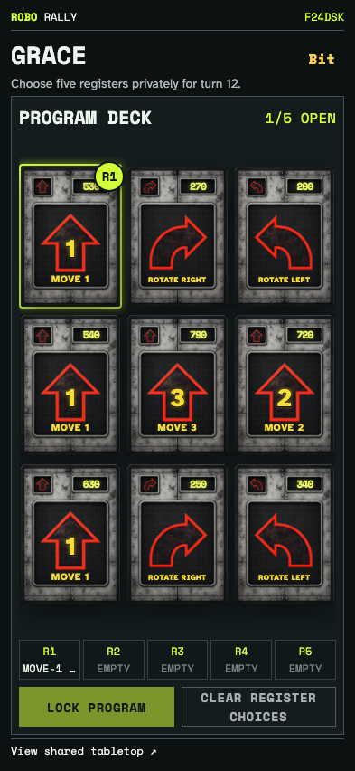

**Verifications:**

- [x] Turn 12 Register 1 visibly contains move-1 priority 530, with the complete hand still inside the phone viewport

## Grace chooses Register 2: rotate-right priority 270

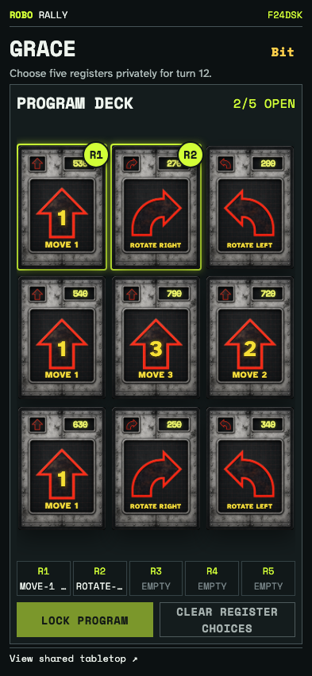

**Verifications:**

- [x] Turn 12 Register 2 visibly contains rotate-right priority 270, with the complete hand still inside the phone viewport

## Grace chooses Register 3: rotate-left priority 200

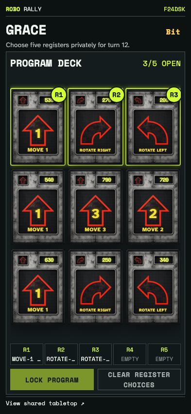

**Verifications:**

- [x] Turn 12 Register 3 visibly contains rotate-left priority 200, with the complete hand still inside the phone viewport

## Grace chooses Register 4: move-1 priority 540

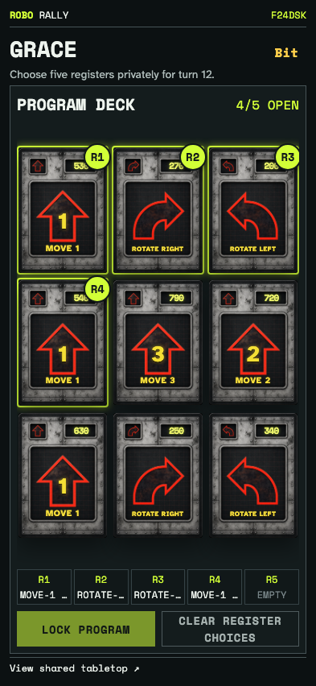

**Verifications:**

- [x] Turn 12 Register 4 visibly contains move-1 priority 540, with the complete hand still inside the phone viewport

## Grace chooses Register 5: move-3 priority 790

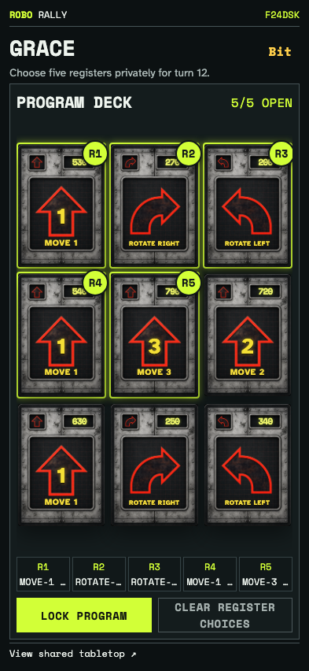

**Verifications:**

- [x] Turn 12 Register 5 visibly contains move-3 priority 790, with the complete hand still inside the phone viewport

## Grace locks the Turn 12 program

**Verifications:**

- [x] All five Turn 12 registers are visible and the lock action is available without scrolling

## Ada chooses STAY ACTIVE after Turn 12 programming

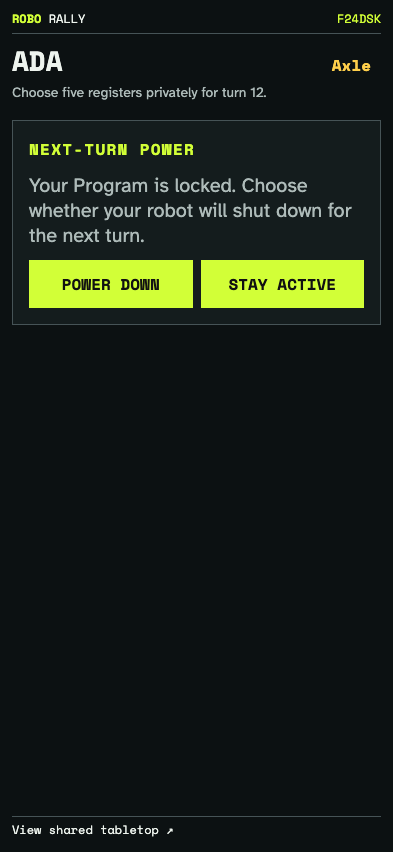

**Verifications:**

- [x] The Turn 12 power choice is legible, unobstructed, and STAY ACTIVE is available

## Grace answers the Option decision with Store no card

**Verifications:**

- [x] The execution-time Option prompt, its card choices, and the selected response are fully visible

## The tabletop announces the winner after Turn 12

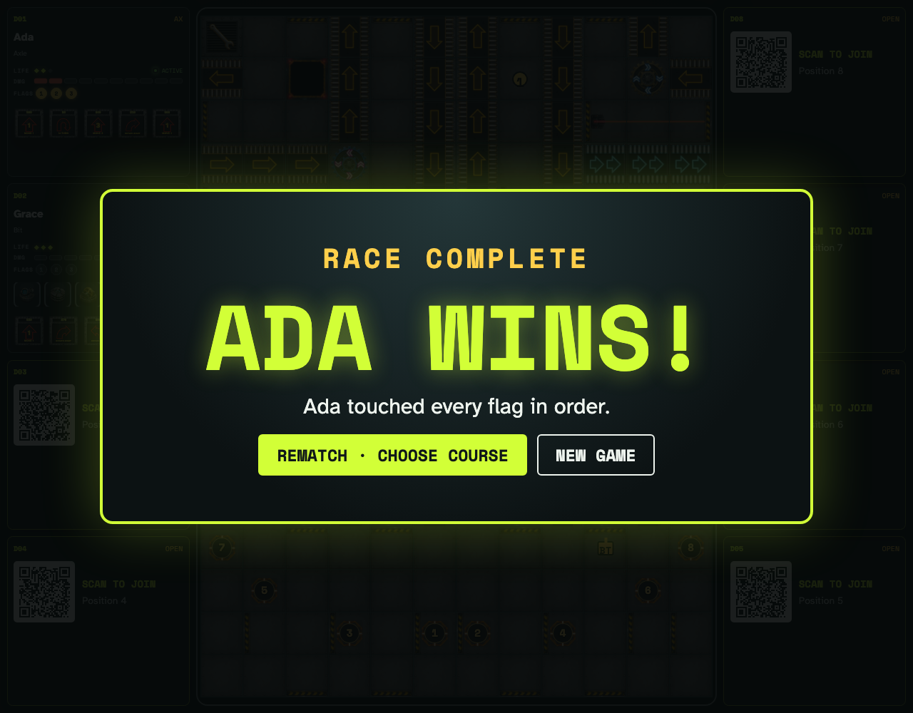

**Verifications:**

- [x] The shared tabletop shows Ada as the winner after all three flags are touched in order
