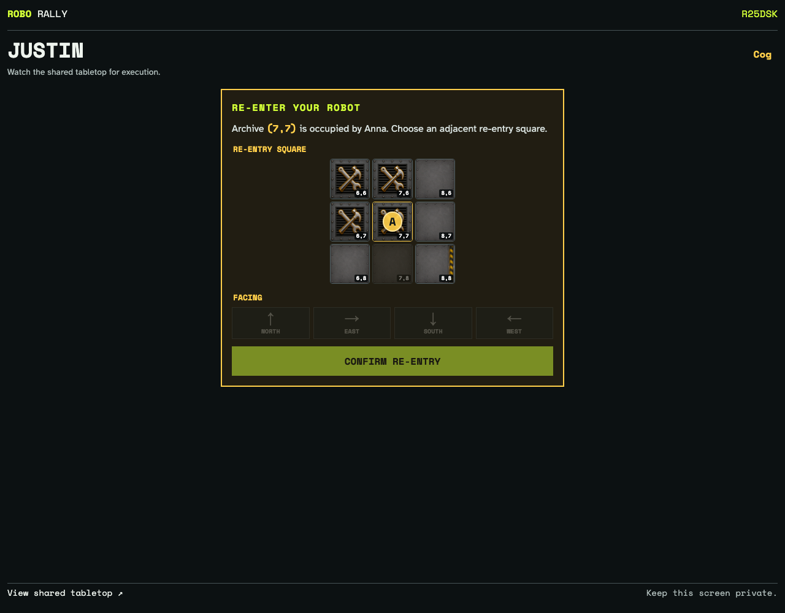
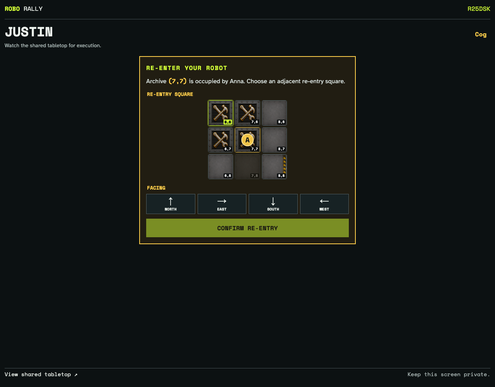
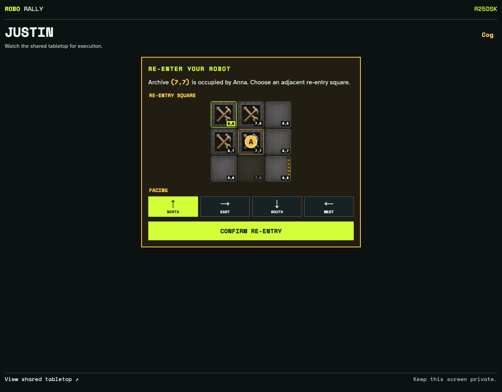
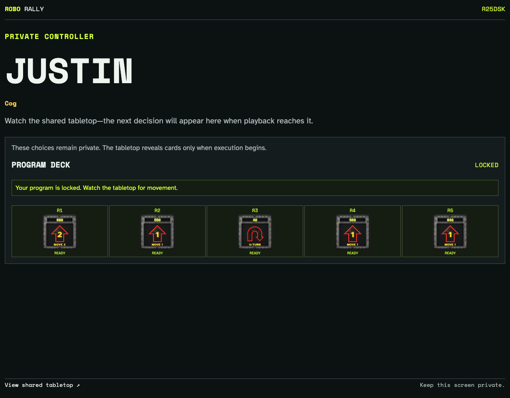

# Occupied archive re-entry

The LB49CR turn-five state is replayed with Anna occupying Justin’s current archive. The private controller presents seven spatial placement choices before the legal facing choices, then accepts Justin’s recorded placement.

## Justin sees the occupied archive and seven nearby legal squares

**Verifications:**

- [x] The archive identifies Anna as its occupant and is not selectable
- [x] Seven square choices replace the former 23-item cell-and-facing menu
- [x] The picker reproduces the actual Option World floor, repair sites, and walls

## Justin selects the legal square at (6,6)

**Verifications:**

- [x] The selected square is visibly highlighted before facing is chosen

## Justin selects north from the legal facings for (6,6)

**Verifications:**

- [x] The north arrow is visibly selected and confirmation becomes available

## The recorded LB49CR placement completes cleanup

**Verifications:**

- [x] The controller advances instead of remaining stuck on a rejected re-entry event
