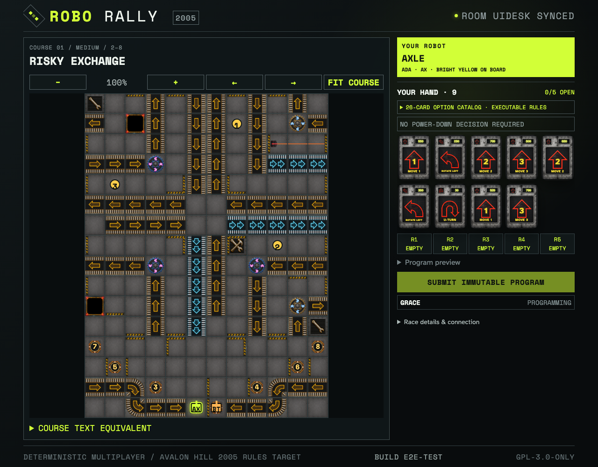
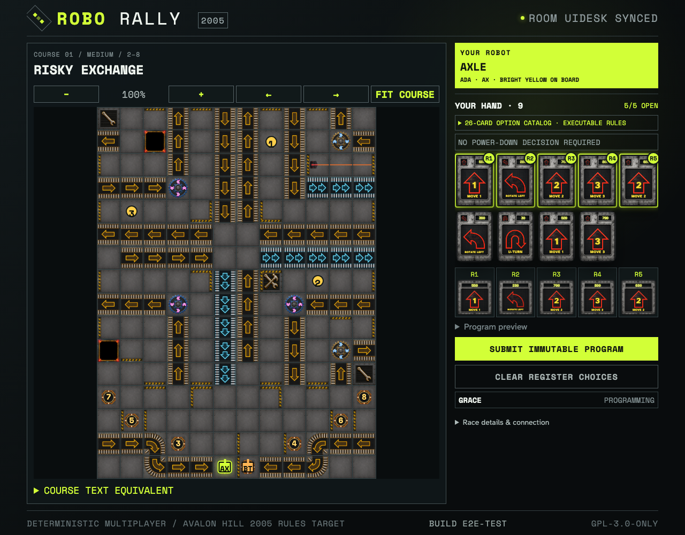
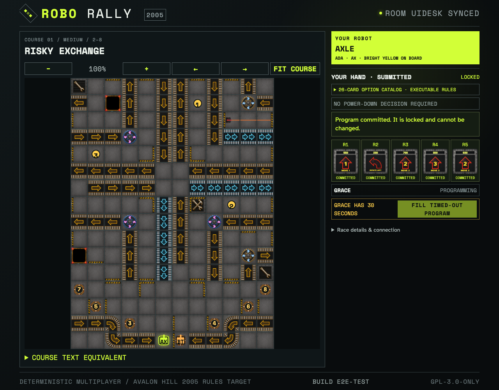

# Board-first web play and shared graphical registers

A real two-player deal keeps the board visible while graphical cards move into registers. Desktop, phone, landscape and tablet layouts retain the same controls.

## The course stays visible while the player programs

**Verifications:**

- [x] The board has square cells, remains visible on phones, and receives most desktop width

## Chosen registers show the same artwork as the hand and tabletop display

**Verifications:**

- [x] All five chosen cards retain graphical commands, priorities and accessible register labels

## Committed cards remain inspectable while the opponent sees a masked program

**Verifications:**

- [x] The owner sees five graphical locked registers and the observer sees only card backs
