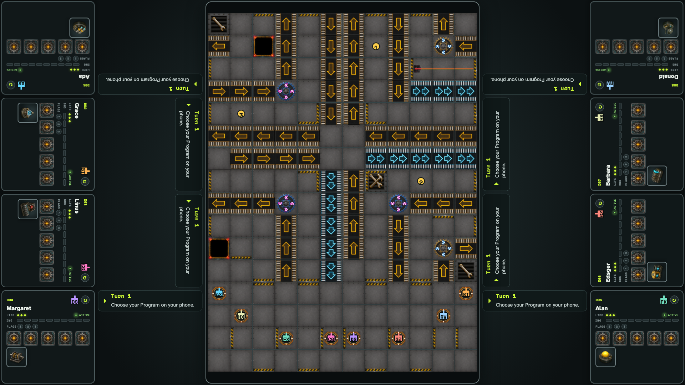
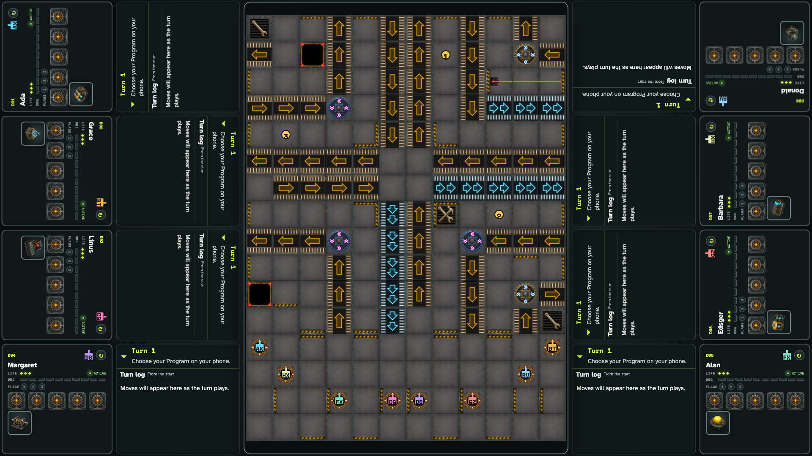

# Tabletop mats and personal logs

Eight ordinary phone joins start an Option Lab race. Every player has a square rotating mat, face-down registers, Options below the registers, and an independently expandable log filling the space beside the board.

## Each seat has a face-down Program, an Option, and a collapsed current-action log

**Verifications:**

- [x] Eight mats retain private registers, hide unused joins, and put Options after registers

## All logs can open independently and remain aligned after rotating a player mat

**Verifications:**

- [x] Expanded logs use every available horizontal pixel while leaving the board clear
