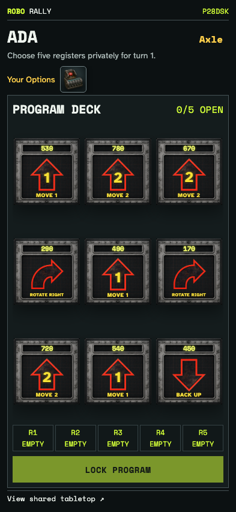
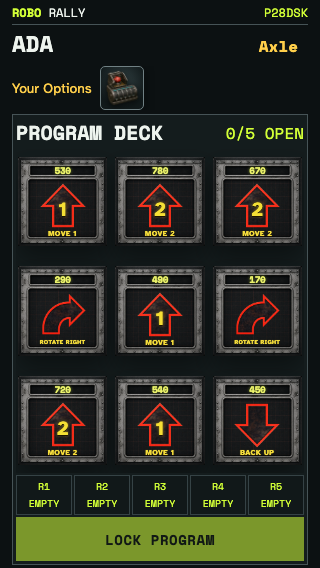
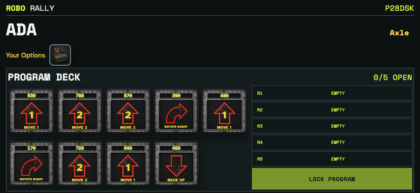
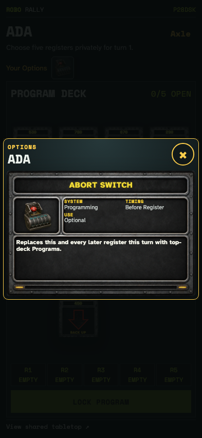
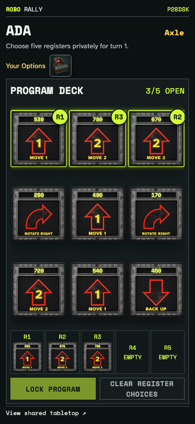
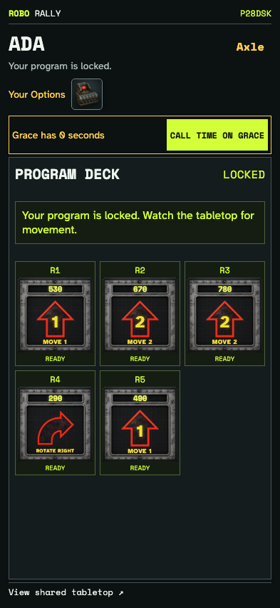

# Graphical private programming and shared countdown

Two phones use square graphical cards, tap and touch-drag into registers, inspect owned Options, and observe the same deadline. A submitted player calls time after expiry, preserving the other player’s chosen registers.

## Square cards and owned Options fit a 393 × 852 phone

**Verifications:**

- [x] Graphical cards are square, visible, and accompanied by inspectable Options

## Square cards and owned Options fit a 320 × 568 phone

**Verifications:**

- [x] Graphical cards are square, visible, and accompanied by inspectable Options

## Square cards and owned Options fit a 852 × 393 phone

**Verifications:**

- [x] Graphical cards are square, visible, and accompanied by inspectable Options

## The phone opens the shared graphical Option viewer

**Verifications:**

- [x] The owner can read the Option and close its dialog

## Tapped and dragged cards occupy their chosen registers without revealing the other phone’s program

**Verifications:**

- [x] Three registers retain graphical cards and reduced motion skips the flight

## A player who has locked their program can call time after the shared countdown expires

**Verifications:**

- [x] Both phones show zero and only the other player can call time
