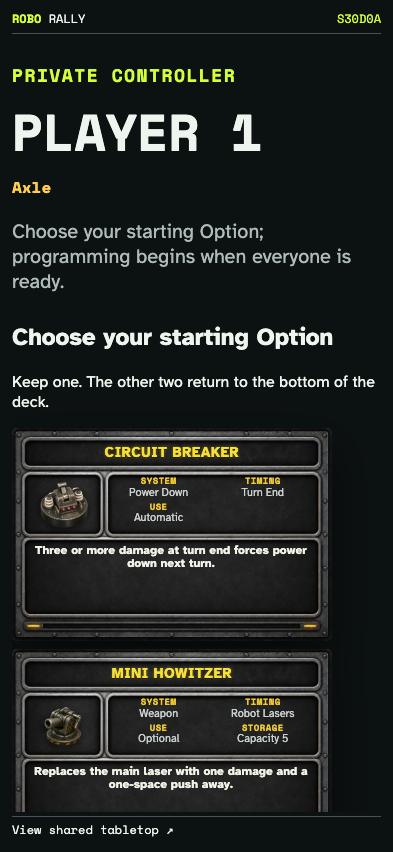
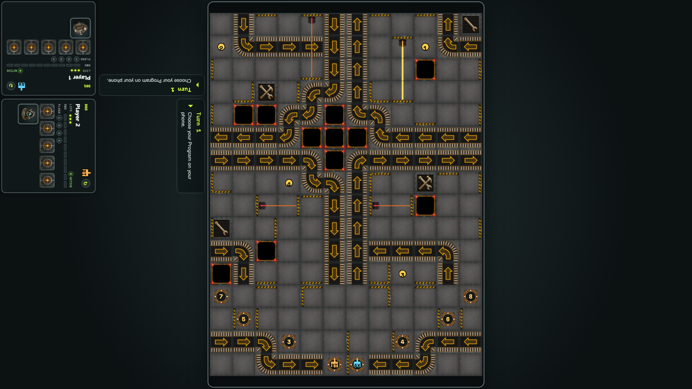
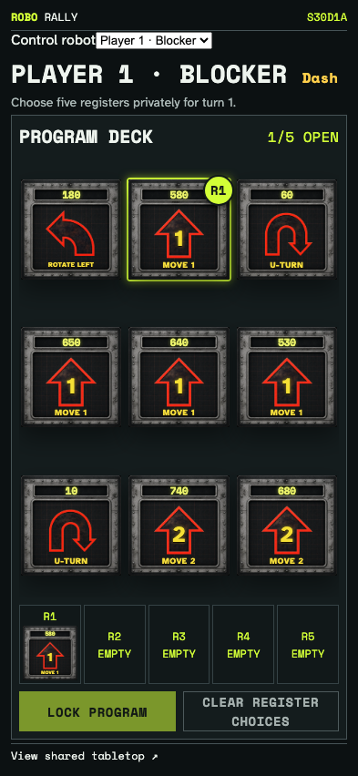
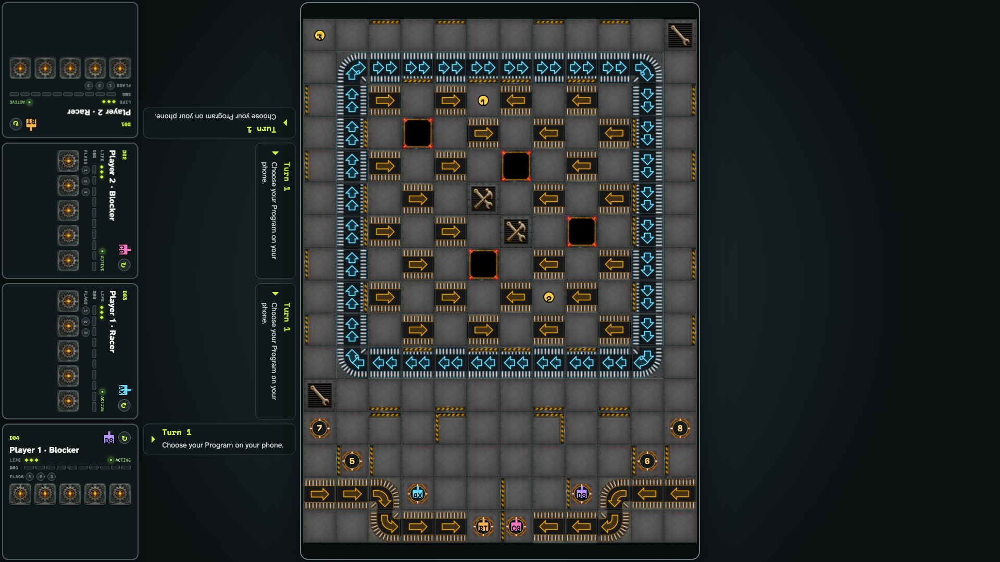
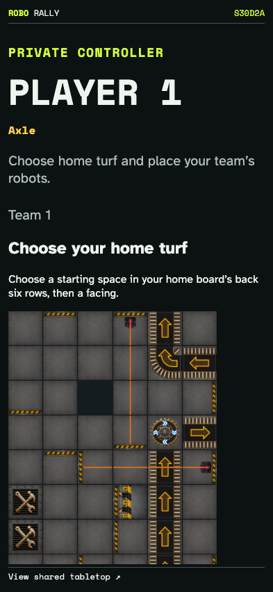
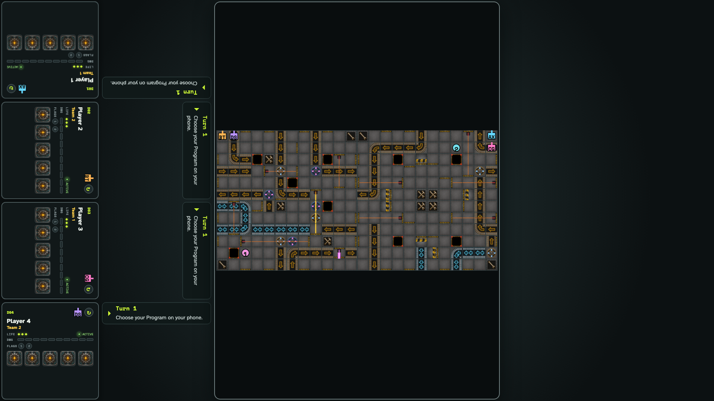

# Published scenarios on the tabletop and phones

Real private controllers choose starting Options, keep separate Interference hands, and deploy Capture the Flag robots while the tabletop displays the public board.

## Each phone receives its own three graphical starting Options

**Verifications:**

- [x] Three choices appear privately, while the table waits without showing them

## tricksy: the public table is ready for programming

**Verifications:**

- [x] Every robot has a board marker and private cards remain face down

## The owner programs a separate blocker hand

**Verifications:**

- [x] The blocker has a selected card and the table has four robot mats

## interference: the public table is ready for programming

**Verifications:**

- [x] Every robot has a board marker and private cards remain face down

## A phone chooses a legal home-board space and starting direction

**Verifications:**

- [x] A selected safe space enables placement

## capture-the-flag: the public table is ready for programming

**Verifications:**

- [x] Every robot has a board marker and private cards remain face down
