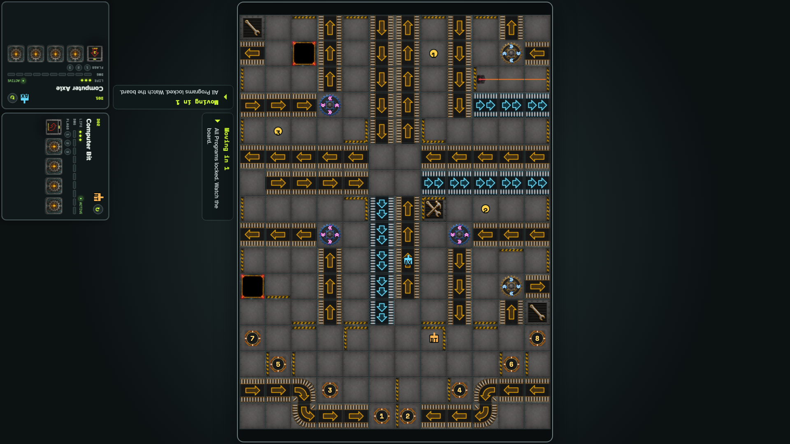

# Computer players on the tabletop

Two computers independently ready and program; the host advances normal playback, reloads, and receives both next-turn programs.

## Both computers continue playing after reloading the tabletop

**Verifications:**

- [x] Two occupied mats remain and both turn-two programs are persisted
