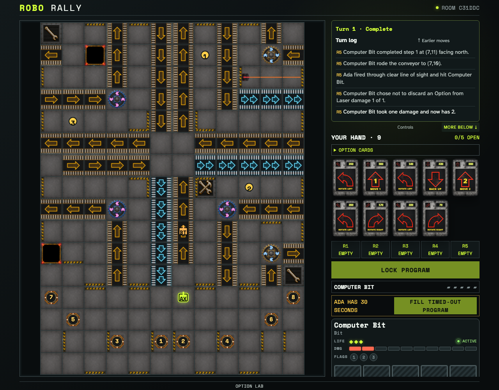

# Computer decisions during web playback

A computer waits until web playback reaches its laser damage decision, then answers without requiring a tabletop checkpoint.

## Computer Bit resolves its damage choice and web playback finishes the turn

**Verifications:**

- [x] The bot answered its own decision and the race is no longer waiting for it
