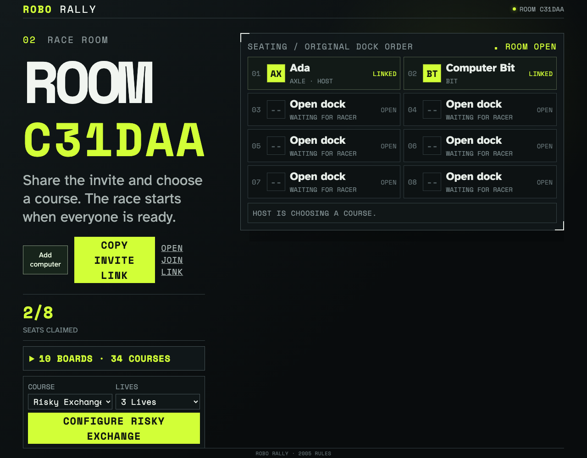
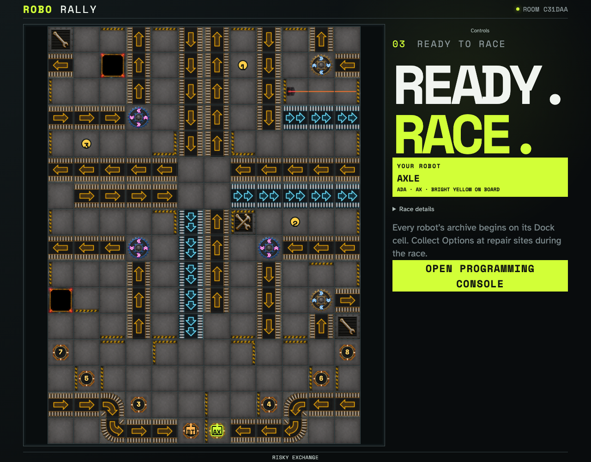

# Race a simple computer

A host adds a computer with its own identity, configures a race, and receives its automatically submitted program. Reloading the host keeps that computer connected.

## The host adds a computer to the race without opening another phone

**Verifications:**

- [x] The lobby identifies the computer and allows course configuration

## The computer chooses and locks its own five cards while Ada is still programming

**Verifications:**

- [x] The board contains both racers and the human can open their own hand
